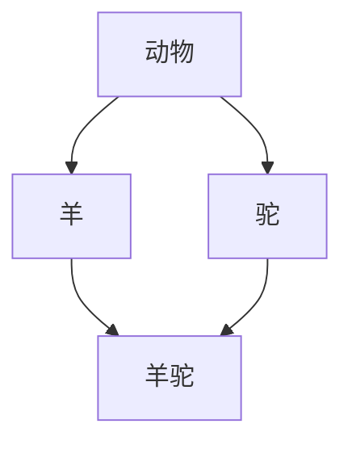

# C++基础入门

### 数据类型

**1.字符串型**

**作用：**用于表示一串字符

**两种风格**

1. C风格字符串：`char 变量名[] = "字符串值"`

```c++
char str[] = "hello world"
```

2. C++风格字符串：`string 变量名 = "字符串值"`

包含头文件: `#include <string>`

```c++
string str = "hello world"
```

**2.bool类型**

- true  真 1
- false 假 0

==bool类型只占一个字节==

```c++
bool flag = true;
flag = false;
```

### 数据的输入和输出

```c++
cin >>     #输入
cout <<　　 #输出
```

- 读入字符串类型

```
string str = "hello";
cin >> str;
```

### 三目运算符

> C++中三目运算符返回的是变量，可以继续赋值

```c++
int a = 10, b = 20, c;
(a > b ? a : b) = 100;//返回变量为b

cout << "a = " << a << endl;//输出结果为10
cout << "b = " << b << endl;//输出结果为100
```

### goto跳转语句

- 作用：可以无条件跳转语句
- 语法：`goto`标记
- 解释：如果标记的名称存在，执行到goto语句时，会跳转到标记的位置

==不推荐使用，可读性差==

示例：

```c++
#include <iostream>
using namespace std;

int main() {
    cout << "1.xxxx" << endl;
    cout << "2.xxxx" << endl;
    goto FLAG;//去到标记的位置
    cout << "3.xxxx" << endl;
    cout << "4.xxxx" << endl;
    FLAG: //定义一个标记
    cout << "5.xxxx" << endl;
    return 0;
}

[Out]:
	1.xxxx
    2.xxxx
    5.xxxx
```

### 二维数组

- 定义方式

```c++
int arr[2][3] = {1, 2, 3, 4, 5, 6};
int arr[2][3] = {{1, 2, 3}, {4, 5, 6}};
```

- 输出行数和列数

```c++
cout << "row = " << sizeof(arr) / sizeof(arr[0]) << endl;
cout << "col = " << sizeof(arr) / sizeof(arr[1]) << endl;
```

- 二维数组的首地址和第一行首地址和第二行首地址

```c++
cout << "first address" << (int)arr << endl;
cout << "first row address" << (int)arr[0] << endl;
cout << "second row addess" << (int)arr[1] << endl;
```

> 第一行和第二行首地址相差第一行所有数据所占的字节数

- 查看第一个元素的首地址

```c++
cout << "first element address" << (int)&arr[0][0] << endl;
```

> 访问元素地址需要加取址符＆


### 指针
##### 空指针和野指针

- 空指针：

  指针变量指向内存中编号为0的空间

用途：初始化指针变量

注意：空指针指向的内存是不可以访问的，0~255之间的内存编号是系统占用的，因此不可以访问

```c++
int *p = NULL;
```

- 野指针

  指针变量指向非法的内存空间
  
    应尽量避免出现野指针

##### const修饰指针

const修饰指针有三种情况：

1. const修饰指针 ---常量指针

   特点：指针的指向可以修改，但是指针指向的值不可以改

```c++
const int *p = &a;
*p = 20; //错误，指针指向的值不可以改
p = &b; //正确，指针的指向可以改
```

2. const修饰常量 ---指针常量

特点：指针的指向不可以改，指向指向的值可以改

```c++
int *　const p = &a;
*p = 20; //正确，指针指向的值可以改
p = &b; //不正确，指针的指向不可以改
```

3. const既修饰指针又修饰常量

   特点：指针的指向和指针指向的值均不可以改

```c++
const int *　const p = &a;
*p = 20; //不正确，指针指向的值不可以改
p = &b; //不正确，指针的指向不可以改
```

### 结构体

> 通过操作符`.`访问结构体属性

##### 结构体数组

可以通过一个数组来包含多个结构体

```c++
struct Student {
	string name;
	int name;
	int score;
};

struct StuArray[3] {
	{"lls", 23, 100},
	{"pjy", 22, 90},
	{"lfh", 23, 80}
};

//访问：stuArray[2].score = 90;
```

##### 结构体指针

> 通过操作符`->`访问结构体属性

```c++
struct Student {
	string name;
	int age;
	int score;
} s;

student *p = &s;
s->name;
s->age;
s->score;
```

##### 结构体嵌套结构体

```c++
struct Student {
	string name;
	int age;
	int score;
};

struct Teacher {
	int indl; //教师编号
	string name;
	int age;
	struct Student stu;
};

Teacher t;
t.name = "lj";
t.stu.name = "lls";
```

##### 结构体做函数参数

作用：将结构体作为参数向函数中传递

传递方式有两种：

1. 值传递

```c++
void printStudent(struct Student s) {
	cout << s.name <<...
}

struct Student s;
printStudent(s);
```

值传递只在函数中发生改变，实参不会改变

2. 地址传递

将函数中形参改为指针可以减少内存空间，而且不会复制新的副本出来

```c++
void printStudent(struct Student * s) {
	cout << s->name << ...
}

struct Student s;
printStudent(&s);
```

地址传递函数体里外均会发生改变

##### 结构体中的const使用场景

作用：防止误操作

```c++
void printStudent(const Student * s) {//这样则不允许在函数中改变s的值
	cout << s->name << ...
}

struct Student s;
printStudent(&s);
```

# C++核心编程

### 内存分区模型

C++程序在执行时，将内存大致划分为4个区域

- 代码区：存放函数体的二进制代码，由操作系统进行管理
- 全局区：存放全局变量和静态变量`static`以及全局常量`const`
- 栈区：由编译器自动分配释放，存放函数的参数值，局部变量等
- 堆区：由程序员分配和释放，若程序员不释放，程序结束时由操作系统回收

内存四区的意义：不同区域存放的数据，赋予不同的生命周期，给我们更大的灵活编程

**程序运行前**

- 代码区：

  存放CPU的机器指令

  代码区是共享的，只读的

- 全局区：

  该区域的数据在程序结束后由操作系统释放

**程序运行后**

- 栈区

  不要返回局部变量的地址，栈区开辟的数据由编译器自动释放

  不要在函数中返回局部变量的地址，因为局部变量保存在栈区，函数执行完后会自动释放

- 堆区

  在C++中主要利用new在堆区开辟内存

  如果是在堆区开辟的数据，则可以返回函数中局部变量的地址

  ```c++
  int * func() {
  	int *p = new int(10);
  	return p;
  }
  ```

  - new

    C++利用`new`操作符在堆区开辟数据

    堆区开辟的数据，由程序员手动开辟，手动释放，释放利用操作符`delete`

    语法：`new 数据类型`

    利用new创建的数据类型，会==返回该数据对应的类型的指针==

    ```c++
    int * func() {
    	int *p = new int(10);
    	return p;
    }
    
    void test0() { //在堆区创建数
    	int *p = func();
    	cout << *p << endl;
    	delete p;//释放
    	cout << *p << endl;//非法操作
    }
    
    void test1() {//在堆区创建数组
    	int *arr = new int[10];
    }
    delete [] arr; //释放数组 
    ```

### 引用

- 基本使用

  - 作用：给变量起别名
  - 语法：`数据类型 &别名 = 原名`
  - 特点：操作同一块内存

  - 示例：

  ```c++
  int a = 10;
  int &b = a;
  b = 20;
  cout << a << endl; //20
  ```

- 引用注意事项

  - 引用必须初始化

  ```c++
  int &b;//错误
  ```

  - 引用在初始化后不能改变

- 引用做函数参数

  - 作用：函数传参时，可以利用引用的技术让形参修饰实参
  - 优点：可以简化指针修改实参
  - 示例：

  ```c++
  void swap(int &a, int &b) {
  	int temp = a;
	a = b; b = temp;
  } //可以达到和指针一样的效果
  ```
  
- 引用做函数的返回值

  - 作用：可以作为函数的返回值存在
  - 注意：不要返回局部变量引用
  - 用法：函数调用作为左值

  ```c++
  //错误示范，不能返回局部变量的引用
  int& test() {
  	int a = 10;//局部变量，存放在栈区，会在函数结束后释放
  	return a;
  }
  //正确示范
  int& test() {
  	static int a = 10;//静态变量，存放在全局区，全局区上的数据在程序结束后系统释放
  	return a;
  }
  
  int main() {
      int &ref = test();
      test() = 100;//函数调用作为左值
      return 0;
  }
  ```

- 引用的本质

  - 本质：引用的本质在C++内部实现是一个指针常量

    指针的指向不可以修改，指针指向的值可以更改

  ```c++
  int &ref = a;
  //相当于
  int * const ref = &a;
  ```

- 常量引用

  - 作用：常量引用主要来修饰形参，防止误操作

  在函数形参列表中，可以const修饰形参，防止形参改变实参

  ```c++
  int &ref = 10;//错误
  const int & ref = 10;//正确
  //相当于
  int temp = 10;
  const int &ref = temp;
  ```


### 函数高级

- 函数的默认参数

如果我们自己传入了数据，就用自己的数据，如果没有就用默认值

若果某个位置有默认参数，那么从这个位置往后到末尾都应有默认参数

如果声明有默认参数，定义就不应该有默认参数，声明和定义只能有一个有默认参数

```c++
int func(int a, int b = 10, int c = 20) {
	return a + b + c;
}

int main() {
    cout << func(10) << endl; // Out:40
    return 0;
}
```

- 函数占位参数

C++中函数的形参列表里可以有占位参数，用来做占位，调用函数时必须填补该位置

语法：`返回值类型 函数名 (数据类型){}`

```c++
void func(int a, int) {

}

int main() {
    func(10, 6);
    return 0;
}
```

- 函数重载

作用：函数名可以相同，提高复用性

函数重载满足条件：

1. 同一个作用域下，都是全局作用域

2. 函数名称相同
3. 函数参数类型不同或个数不同或顺序不同

```c++
#include <iostream>
using namespace std;

void func() {
    cout << "func" << endl;
}

void func(int a) {
    cout << "func(int a)" << endl;
}

void func(double a) {
    cout << "func(double a)" << endl;
}

int main() {
    func(10);//调用第二个函数
    func();  //调用第一个函数
    func(3.14); //调用第三个函数
    return 0;
}
```

注意事项：函数的返回值不可以作为函数重载的条件

- 函数重载注意事项

  - 引用作为重载条件

  - 函数重载碰到函数默认参数

    当函数重载碰到默认参数，出现奇异，尽量避免这种情况

### 类和对象

C++面向对象的三大特性：封装、继承、多态

- 对象具有属性和行为
- 实例化：通过一个类来创建对象的过程
- 语法：`class 类名{权限：属性;方法;};`

####  封装

- 封装的意义（一）

  - 将属性和行为作为一个整体，表现事物
  - 将属性和行为加以权限控制

- 封装的意义（二）

  - 类在设计时，可以把属性和方法放在不同的权限下，加以控制
  - 访问权限有三种：
    1. public 公共权限
    
       成员 类内可以访问，类外也可以访问
  
    2. protected 保护权限
    
       成员 类内可以访问，类外不可以访问  继承中儿子可以访问父亲的保护内容
    
    3. private 私有权限
    
       成员 类内可以访问，类外不可以访问 继承中儿子不可以访问父亲的私有内容
  
  **class默认权限是私有，struct默认权限是公共**
  
- 成员属性私有化

优点1：将所有成员属性设置为私有，可以自己控制读写权限

优点2：对于写权限，我们可以检查数据的有效性

##### 工程文件

- 主体写在主函数中

- 将声明和成员属性放到.h文件中

```cpp
#ifndef _POINT_H
#define _POINT_H
#include <iostream>
using namespace std;
class Point {
public:
    void setX(int x);
    int getX();
    void setY(int y);
    int getY();
private:
    int m_X;
    int m_Y;
};
#endif
```

- 将函数的定义放到.cpp文件中

```cpp
#ifndef _POINT_H
#define _POINT_H
#include <iostream>
using namespace std;
class Point {
public:
    void setX(int x);
    int getX();
    void setY(int y);
    int getY();
private:
    int m_X;
    int m_Y;
};
#endif
```

- 编译后链接所有对象文件

```shell
g++ -c -I./ *.cpp
g++ *.o
./a.out
```

##### 构造函数和析构函数

- 构造函数：主要作用在于创建对象时为对象的成员属性赋值，构造函数由编译器自动调用，无需手动调用。
- 析构函数：主要作用在于对象销毁前系统自动调用，执行一些清理工作。将堆区开辟的数据做释放操作。

构造函数语法：`类名(){}`可以传参

析构函数语法：`~类名(){}`不能传参

1. 构造函数的分类

   - 无参构造函数

   ```c++
   Person() {}
   ```

   - 有参构造函数

   ```c++
   Person(int a){}
   ```

   - 拷贝构造函数

   ```c++
   Person(const Person &p) {}
   ```

2. 构造函数的调用

   - 括号法

   ```c++
   Person p1;//调用无参构造函数
   Person p2(10);//调用有参构造函数
   Person p3(p2);//拷贝构造函数
   ```

   - 显示法

   ```c++
   Person p1;
   Person p2 = Person(10);
   Person p3 = Person(p2);
   ```

   - 隐式替换法

   ```c++
   Person p1 = 10;
   Person p2 = p1;
   ```

3. 构造函数调用规则：

   - 系统会默认为我们提供无参，有参，拷贝构造函数。
   - 当我们自己写了有参构造函数，系统不再为我们提供无参构造函数
   - 当我们写了拷贝构造函数，系统不再为我们提供无参和有参构造函数

##### 深拷贝与浅拷贝

- 浅拷贝：简单的赋值拷贝操作，编译器默认为我们提供的拷贝构造函数为浅拷贝。

  引起的问题：执行拷贝构造函数，析构时浅拷贝会引起的问题是堆区内存重复释放，利用深拷贝来解决。

  若原对象中包含一个由堆区开辟的数据（指针类型），当进行浅拷贝，新对象会将地址原封不动的复制过来，即原对象和新对象指向一片堆区数据。析构时，新的对象时会将堆区的数据进行释放，接着在原对象释放堆区数据时，这时就会发生重复释放堆区数据。

- 深拷贝：在堆区重新申请空间，进行拷贝操作

  在进行深拷贝时，如果原对象有堆区开辟的数据，新对象会重新开辟一片堆区，将数据拷贝至新的堆区空间。这样，在析构时，新对象和原对象则分别进行释放自身堆空间，不会发生重复释放。

- **总结：**如果属性有在堆区开辟的，一定要自己提供拷贝构造函数（深拷贝），防止浅拷贝带来的问题。

```c++
#include <iostream>
using namespace std;

class Person {
public:
    Person() {//默认构造函数
        cout << "Person 无参构造函数的调用" << endl;
    }
    Person(int a, int height) {//有参构造函数
        m_Age = a;
        m_Height = new int(height);
        cout << "Person 有参构造函数的调用" << endl;
    }
    Person(const Person &p) {//深拷贝
        m_Height = new int(*p.m_Height);
        cout << "Person 拷贝构造函数的调用" << endl;
    }
    ~Person() {
        if (m_Height != NULL) {//析构代码，对堆区开辟的数据进行释放
            delete m_Height;
            m_Height = NULL;
        }
        cout << "Person 析构函数的调用" << endl;
    }
    int m_Age;
    int *m_Height;
};

void test01() {
    Person p1(18, 160);
    cout << "p1的年龄为：" << p1.m_Age << "p1的身高为：" << *p1.m_Height << endl;
    Person p2(p1); 
    cout << "p2的年龄为：" << p2.m_Age << "p2的身高为：" << *p2.m_Height << endl;
}

int main() {
    test01();
    return 0;
}
```

##### 初始化列表

**作用：**C++提供了初始化列表语法，用来初始化属性

**语法：**`构造函数():属性1(值1),属性2(值2)...{}`

```c++
#include <iostream>
using namespace std;

class Person {
public:
    Person(int a, int b, int c):m_a(a),m_b(b),m_c(c) {}

    int m_a;
    int m_b;
    int m_c;
};

void test01() {
    Person p(10, 20, 30);
    cout << "m_a = " << p.m_a << endl;
    cout << "m_b = " << p.m_b << endl;
    cout << "m_c = " << p.m_c << endl;
}

int main() {
    test01();
    return 0;
}
```

##### 静态成员

静态成员就是在成员变量加上关键字`static`，称为静态成员

静态成员分为：

- 静态成员变量
  - 所有对象共享同一份数据
  - 在编译阶段分配内存
  - 类内声明，类外初始化
- 静态成员函数
  - 所有对象共享一个函数
  - 静态成员函数只能访问静态成员变量

```c++
#include <iostream>
using namespace std;

class Person {
public:
    static int m_A;
};

int Person::m_A = 100;//类外初始化

void test01() {
    Person p;
    cout << p.m_A << endl;
    Person p2;
    p2.m_A = 200;
    cout << p.m_A << endl;
    cout << Person::m_A << endl;//直接通过类名访问
}

int main() {
    test01();
    return 0;
}
```

```c++
#include <iostream>
using namespace std;

class Person {
public:
    static void func() {
        m_A = 100;
        cout << "func 调用" << endl;
    }
    static int m_A;
    int m_B;//func不能访问m_B
};

int Person::m_A = 0;

void test01() {
    Person p;
    p.func();
    Person::func();
}

int main() {
    test01();
    return 0;
}
```

##### this指针

作用：

- 解决名称冲突
- 返回对象本身用*this

```c++
class Person {
public:
	Person(int age) {
		this->age = age;
	}
    Person& PersonAddAge(Person &p) {
        this->age += p.age;
        return *this;
    }
	int age;
}

void test() {
    Person p1(10);
    Person p2(10);
    p2.PersonAddAge(p1).PersonAddAge(p1).PersonAddAge(p1);
    cout << "p2's age = " << p2.age << endl; //40链式编程思想
}
```

##### const修饰成员函数

**常函数：**

- 成员函数后加const后我们称这个函数为常函数
- 常函数内不可以修改成员属性
- 成员属性声明时加关键字mutable后，在常函数中依然可以修改

**常对象：**

- 声明对象前加const称对象为常对象
- 常对象只能调用常函数

**示例代码：**

```c++
#include <iostream>
using namespace std;

class Person {
public:
    void showPerson()  const {
        //this = NULL;//this指针是指针常量，this指针不可以修改指针的指向的
        //this->m_A = 100;//常函数中,指针指向的值不可以修改   
        this->m_B = 100;//加mutable关键字的变量，即使在常函数中也可以修改
    }

    int m_A;
    mutable int m_B;
};

void test01() {
    Person p;
    p.showPerson();
}

void test02() {
    const Person p;//常对象
    //p.m_A = 100;//常对象中不可以改
    p.m_B = 100;//常对象中也可以改
    p.showPerson();//常对象只能调用常函数
}

int main() {
    test01();
    test02();
    return 0;
}
```

##### 友元

友元的目的就是让一个函数或者类 访问另一个类中的私有成员

友元的三种实现

- 全局函数做友元
- 类做友元
- 成员函数做友元

**全局函数做友元**

```c++
#include <iostream>
#include <string>
using namespace std;

//建筑物
class Building {
    friend void goodGay(Building *building);//在类的最前面声明友元
public:
    Building() {
        m_SittingRoom = "客厅";
        m_BedRoom = "卧室";
    }
public:
    string m_SittingRoom;
    
private:
    string m_BedRoom;
};

//全局函数
void goodGay(Building *building) {
    cout << "正在访问：" << building->m_SittingRoom << endl;
    cout << "正在访问：" << building->m_BedRoom << endl;
}

void test01() {
    Building building;
    goodGay(&building);
}

int main() {
    test01();
    return 0;
}
```

**类做友元**

```c++
#include <iostream>
#include <string>
using namespace std;

class Building;
class GoodGay {
public:
    GoodGay();
    void visit();
    Building * building;
};

class Building {
    friend class GoodGay; //Goodgay是本类的好朋友，可以访问本类中的私有函数
public:
    Building();
public:
    string m_SittingRoom;
private:
    string m_BedRoom;
};

Building::Building() {
    this->m_SittingRoom = "客厅";
    this->m_BedRoom = "卧室";
}

GoodGay::GoodGay() {
    building = new Building;
}

void GoodGay::visit() {
    cout << "正在访问：" << building->m_SittingRoom << endl;
    cout << "正在访问：" << building->m_BedRoom << endl;
}

void test01() {
    GoodGay gg;
    gg.visit();
}

int main() {
    test01();
    return 0;
}
```

**成员函数做友元**

```c++
#include <iostream>
#include <string>
using namespace std;

class Building;
class GoodGay {
public:
    GoodGay();
    void visit(); //让visit函数可以访问Building中的私有函数
    void visit2(); //让visit2函数不可以访问
    Building * building;
};

class Building {
    friend void GoodGay::visit();
    //告诉编译器，GoodGay类下的visit成员函数作为本类的好朋友，可以访问私有成员
public:
    Building();
public:
    string m_SittingRoom;
private:
    string m_BedRoom;
};

GoodGay::GoodGay() {
    building = new Building;
}

Building::Building() {
    m_SittingRoom = "客厅";
    m_BedRoom = "卧室";
}

void GoodGay::visit() {
    cout << "visit 正在访问:" << building->m_SittingRoom << endl;
    cout << "visit 正在访问:" << building->m_BedRoom << endl;
}
void GoodGay::visit2() {
    cout << "visit2正在访问:" << building->m_SittingRoom << endl;
    //cout << "visit 正在访问:" << building->m_BedRoom << endl;
}

void test01() {
    GoodGay gg;
    gg.visit();
    gg.visit2();
}

int main() {
    test01();
    return 0;
}
```

##### 运算符重载

概念：对已有的运算符重新进行定义，赋予其另一种功能，以适应不同的数据类型

- 加号运算符重载

```c++
#include <iostream>
using namespace std;

class Person {
public:
    int m_A;
    int m_B; 
    //成员函数重载+运算符
    Person operator+(Person &p1) {
        Person temp;
        temp.m_A = this->m_A + p1.m_A;
        temp.m_B = this->m_A + p1.m_B;
        return temp;
    }
    //结构体中元素与整数做加法
    Person operator+(int num) {
        Person temp;
        temp.m_A = this->m_A + num;
        temp.m_B = this->m_B + num;
        return temp;
    }
};

/*
//全局函数重载+运算符
Person operator+(Person &p1,  Person &p2) {
    Person temp;
    temp.m_A = p1.m_A + p2.m_A;
    temp.m_B = p1.m_B + p2.m_B;
    return temp;
}*/

void test01() {
    Person p1;
    p1.m_A = 10;
    p1.m_B = 10;
    Person p2;
    p2.m_A = 10;
    p2.m_B = 10;
    Person p3 = p1 + p2;
    //Person p3 = operator+(p1, p2);
    //Person p3 = p1.operator+(p2);
    int num = 100;
    Person p4 = p1 + num;
    cout << "p3.m_A = " << p3.m_A << endl;
    cout << "p3.m_B = " << p3.m_B << endl;
    cout << "p4.m_A = " << p4.m_A << endl;
    cout << "p4.m_B = " << p4.m_B << endl;
}

int main() {
    test01();
    return 0;
}
```

- 左移运算符重载

作用：可以输出自定义数据类型

```c++
#include <iostream>
using namespace std;

class Person {
    friend ostream & operator<<(ostream &cout, Person &p);
public:
    Person(int a, int b) {
        m_A = a;
        m_B = b;
    }
private:
    int m_A;
    int m_B;
};

ostream & operator<<(ostream &cout, Person &p) {
    cout << "m_A = " << p.m_A << " m_B = " << p.m_B;
}

void test() {
    Person p(10, 10);
    cout << p << endl;
}

int main() {
    test();
    return 0;
}
```

- 递增运算符重载

前置递增返回的是引用，后置递增返回的是值

```c++
#include <iostream>
using namespace std;

class Myint {
    friend ostream & operator<<(ostream &cout, Myint myint);
public:
    Myint() {
        m_num = 0;
    }
    //重载前置++
    Myint& operator++() {//返回引用为了一直对一个数据进行递增操作
        m_num++;
        return *this;
    }
    //重载后置++
    Myint operator++(int) {
        Myint temp = *this;
        m_num++;
        return temp;
    }
private:
    int m_num;
};

ostream & operator<<(ostream &cout, Myint myint) {
    cout << myint.m_num << endl;
}

void test() {
    Myint myint;
    cout << ++(++myint) << endl;
    cout << myint << endl;
}

void test01() {
    Myint myint;
    cout << myint++ << endl;
    cout << myint << endl;
}

int main() {
    test01();
    return 0;
}
```

- 赋值运算符重载

```c++
#include <iostream>
using namespace std;

class Person {
public:
    Person(int age) {
        m_Age = new int(age);
    }
    
    int *m_Age;
    ~Person() {
        if (m_Age != NULL) {
            delete m_Age;
            m_Age = NULL;
        }
    }

    Person & operator=(Person &p) {
        if (m_Age != NULL) {
            delete m_Age;
            m_Age = NULL;
        }
        m_Age = new int(*p.m_Age);
        return *this;
    }
};

void test01() {
    Person p1(18);
    Person p2(20);
    Person p3(30);
    p3 = p2 = p1;
    cout << "p1的年龄为：" << *p1.m_Age << endl;
    cout << "p2的年龄为：" << *p2.m_Age << endl;
    cout << "p3的年龄为：" << *p3.m_Age << endl;
}

int main() {
    test01();
    return 0;
}
```

- 关系运算符重载

```c++
#include <iostream>
#include <string>
using namespace std;

class Person {
public:
    Person(string name, int age) {
        m_Name = name;
        m_Age = age;
    }

    bool operator==(Person &p1) {
        return (this->m_Age == p1.m_Age) && 
            (this->m_Name == p1.m_Name);
    }

    bool operator!=(Person &p1) {
        return (this->m_Age != p1.m_Age) ||
            (this->m_Name != p1.m_Name);
    }

    string m_Name;
    int m_Age;
};

void test01() {
    Person p1("Tom", 18);
    Person p2("Jerry", 18);
    if (p1 != p2) {
        cout << "p1 和 p2 是不相等的！" << endl;
    } else {
        cout << "相等！" << endl;
    }
}

int main() {
    test01();
    return 0;
}
```

- 函数调用运算符重载

> 由于重载后使用的方式非常像函数的调用，因此称为仿函数
>
> 仿函数没有固定写法，非常灵活

```c++
#include <iostream>
#include <string>
using namespace std;

class MyPrint {
public:
    void operator()(string test) {
        cout << test << endl;
    }
};

class MyAdd {
public:
    int operator()(int num1, int num2) {
        return num1 + num2;
    }
};

void test01() {
    MyPrint myprint;
    myprint("hello world!");
    MyAdd myadd;
    int res = myadd(100, 50);
    cout << res << endl;
    cout << MyAdd()(100, 100) << endl;//匿名函数
}

int main() {
    test01();
    return 0;
}
```

#### 继承

作用：减少重复的内容

语法：class 子类 ： 继承方式 父类

子类也称为派生类，父类也成为基类

```c++
#include <iostream>
using namespace std;

class BasePage {
public:
    void header() {
        cout << "(公共头部)" << endl;
    }
    void footer() {
        cout << "(公共底部)" << endl;
    }
    void left() {
        cout << "(公共分类列表)" << endl;
    }
};

//Java
class Java : public BasePage {
public:
    void content() {
        cout << "Java学科视频" << endl;
    }  
};

class Python : public BasePage {
public:
    void content() {
        cout << "Python学科视频" << endl;
    }  
};


class CPP : public BasePage {
public:
    void content() {
        cout << "C++学科视频" << endl;
    }  
};

void test01() {
    cout << "Java" << endl;
    Java ja;
    ja.header();
    ja.footer();
    ja.left();
    ja.content();
    cout << "---------------" << endl;
    cout << "Python" << endl;
    Python py;
    py.header();
    py.footer();
    py.left();
    py.content();
    cout << "---------------" << endl; 
    cout << "CPP" << endl;
    CPP cpp;
    cpp.header();
    cpp.footer();
    cpp.left();
    cpp.content();
 }
 
 int main() {
    test01();
    return 0;
}
```

##### 继承方式

- 公共继承
- 保护继承
- 私有继承

父类中私有的内容，任何继承方式子类中都访问不到

公共继承中，父类中的公共和保护权限在子类中仍然是公共权限和保护权限

保护继承中，父类中的公共和保护权限在子类中均为保护权限

私有继承中，父类中的公共和保护权限在子类中均为私有权限

##### 继承中的对象模型

问题：从父类继承过来的成员，哪些属于子类对象中？

父类中所有非静态成员属性都会被子类继承下去

##### 析构和析构顺序

继承中的构造和析构顺序如下：

先构造父类，再构造子类，析构时先析构子类再析构父类

##### 继承中的同名成员处理方式

子类与父类出现同名的成员，如何通过子类对象，访问到子类或父类中的同名数据？

- 访问子类同名成员，直接访问即可
- 访问父类同名成员，需要加作用域

```c++
#include <iostream>
using namespace std;

class Base {
public:
    Base() {
        m_A = 10;
    }
    void func() {
        cout << "Base func " << endl;
    }
    int m_A;
};

class Son :public Base {
public:
    Son() {
        m_A = 200;
    }
    void func() {
        cout << "Son func" << endl;
    }
    int m_A;
};

void test01() {//同名成员属性
    Son s;
    cout << "Son 的 m_A = " << s.m_A << endl;
    cout << "Base 的 m_A = " << s.Base::m_A << endl;
}

void test02() {//同名成员函数
    Son s;
    s.func();
    s.Base::func();
}

int main() {
    test01();
    test02();
    return 0;
}
```

##### 继承同名静态成员处理方式

继承中同名的静态成员在子类对象中如何进行访问

静态成员和非静态成员出现同名，处理方式一致

- 访问子类同名成员 直接访问即可
- 访问父类同名成员 加作用域即可

##### 多继承语法

C++允许一个类继承多个类

语法：`class 子类 ： 继承方式 父类1, 继承方式 父类2...`

多继承可能会引发父类中有同名成员出现，需要加作用域区分

C++实际开发中不建议用多继承

```c++
#include <iostream>
using namespace std;

class Base1 {
public:
    Base1() {
        m_A = 100;
    }
    int m_A;
};

class Base2 {
public:
    Base2() {
        m_A = 200;
    }
    int m_A;
};

class Son: public Base1, public Base2 {
public:
    Son() {
        m_C = 300;
        m_D = 400;
    }
    int m_C;  
    int m_D;
};

void test01() {
    Son s;
    cout << "sizeof Son = " << sizeof(Son) << endl;
    cout << "Base1 m_A = " << s.Base1::m_A << endl;
    cout << "Base2 m_A = " << s.Base2::m_A << endl;
}

int main() {
    test01();
    return 0;
}
```

##### 菱形继承

> 概念：
>
> ​	两个派生类继承同一个基类
>
> ​	又有某个类同时继承两个派生类
>
> ​	这种继承称为菱形继承，又称为钻石继承




- 菱形继承导致继承的数据有两份，但需要一份就可以了，导致资源浪费
- 利用需继承解决菱形继承的问题

虚继承语法：`class Son : virtual public Base`

这时最大的继承类被称为虚基类

```c++
#include <iostream>
using namespace std;

class Animal {
public:
    int m_Age;
};

class Sheep : virtual public Animal {
    
};

class Tuo : virtual public Animal {
    
};

class sheepTuo : public Sheep, public Tuo {
    
};

void test01() {
    sheepTuo st;
    st.Sheep::m_Age = 18;
    st.Tuo::m_Age = 28;
    cout << "st.Sheep m_Age = " << st.Sheep::m_Age << endl;
    cout << "st.Tuo m_Age = " << st.Tuo::m_Age << endl;
    cout << "st.Tuo m_Age = " << st.m_Age << endl;
}

int main() {
    test01();
    return 0;
}
```

#### 多态

多态分为两类

- 静态多类：函数重载和运算符重载属于静态多态，复用函数名
- 动态多态：派生类和虚函数实现运行时多态

静态多态和动态多态的区别：

- 静态多态的函数地址早绑定 - 编译阶段确定函数地址
- 动态多态的函数地址晚绑定 - 运行阶段确定函数地址

动态多态满足的条件：

- 有继承关系
- 子类重写父类的虚函数

动态多态的使用

- 父类的指针或引用执行子类对象

##### 多态案例-计算器类

> 案例描述：利用多态技术，实现两个数进行运算的计算器类

多态的优点：

- 代码组织结构清晰
- 可读性强
- 利于前期和后期的扩展以及维护

```c++
#include <iostream>
#include <string>
using namespace std;

//普通实现
class Calculator {
public:
    int getresult(string oper) {
        if (oper == "+") {
            return m_num1 + m_num2;
        } else if (oper == "-") {
            return m_num1 - m_num2;
        } else if (oper == "*") {
            return m_num1 * m_num2;
        }
        //如果需要扩展新的功能，需要修改源码
        //在真实的开发中 提倡开闭原则
        //开闭原则：对扩展进行开放 对修改进行关闭
    }
    int m_num1;
    int m_num2;
};

//利用多态实现计算器
//实现计算器的抽象类
class AbstractCalculator {
public:
    virtual int getresult() {
        return 0;
    }
    int m_num1;
    int m_num2;
};

//加法计算器类
class AddCaculator : public AbstractCalculator {
public:
    int getresult() {
        return m_num1 + m_num2;
    }
};

//减法计算器类
class SubCaculator : public AbstractCalculator {
public:
    int getresult() {
        return m_num1 - m_num2;
    }
};


//乘法计算器类
class MulCaculator : public AbstractCalculator {
public:
    int getresult() {
        return m_num1 * m_num2;
    }
};

//除法计算器类
class DelCaculator : public AbstractCalculator {
public:
    int getresult() {
        return m_num1 / m_num2;
    }
};

void test01() {
    Calculator c;
    c.m_num1 = 10;
    c.m_num2 = 10;
    cout << c.m_num1 << " + " << c.m_num2 << " = " << c.getresult("+") << endl;
    cout << c.m_num1 << " - " << c.m_num2 << " = " << c.getresult("-") << endl;
    cout << c.m_num1 << " * " << c.m_num2 << " = " << c.getresult("*") << endl;
}

void test02() {
    //多态使用条件，父类指针或者引用指向子类对象
    //加法运算
    AbstractCalculator * abc = new AddCaculator;
    abc->m_num1 = 20;
    abc->m_num2 = 10;
    cout << abc->m_num1 << " + " << abc->m_num2 << " = " << abc->getresult() << endl;
    delete abc;
    //减法运算
    abc = new SubCaculator;
    abc->m_num1 = 20;
    abc->m_num2 = 10;
    cout << abc->m_num1 << " - " << abc->m_num2 << " = " << abc->getresult() << endl;
    delete abc;
    //乘法运算
    abc = new MulCaculator;
    abc->m_num1 = 20;
    abc->m_num2 = 10;
    cout << abc->m_num1 << " * " << abc->m_num2 << " = " << abc->getresult() << endl;
    delete abc;
    //除法运算
    abc = new DelCaculator;
    abc->m_num1 = 20;
    abc->m_num2 = 10;
    cout << abc->m_num1 << " / " << abc->m_num2 << " = " << abc->getresult() << endl;
    delete abc;
}

int main() {
    test02();
    return 0;
}
```

##### 纯虚数和抽象类

在多态中，通常父类中虚函数的实现是毫无意义的，主要都是调用子类重写的内容

虚函数占四个字节，因为其内部有一个`vfptr`虚函数指针，指针指向一个虚函数表(vftable)，表内部记录虚函数地址。

子类在继承父类的时候也继承了父类的虚函数指针，当子类重写虚函数后，还是会继承父类的虚指针，但是指针指向的数据被覆盖掉了，变为子类中的内容。

> v - virtual
>
> f - function
>
> ptr - pointer

因此可以将虚函数改为**纯虚函数**

纯虚函数语法：`virtual 返回值类型 函数名 (参数列表) = 0;`

当类中有了纯虚函数，这个类称为**抽象类**

抽象类特点：

- 无法实例化对象
- 子类必须重写抽象类中的纯虚函数，否则也属于抽象类

```c++
#include <iostream>
using namespace std;

class Base {
public:
    //纯虚函数
    //只有一个纯虚函数，这个类称为抽象类
    //抽象类特点：
    //1.无法实例化特点
    //2.抽象类的子类，必须重写父类中的纯虚函数，否则也属于抽象类
    virtual void func() = 0;
};

class Son:public Base {
public:
    virtual void func() {
        cout << "func 调用" << endl;
    };
};

void test01() {
    Base * base = NULL;
    base = new Son;
    base->func();
    delete base;
}

int main() {
    test01();
    return 0;
}
```

##### 多态案例-制作饮品

> 案例描述：制作饮品的大致流程为：煮水 - 冲泡 - 倒入杯中 - 加入辅料

利用多态技术实现本案例，提供抽象制作饮品基类，提供子类制作咖啡和茶叶

```c++
#include <iostream>
using namespace std;

class AbstractDrinking {
public:
    //煮水
    virtual void Boil() = 0;
    //冲泡
    virtual void Brew() = 0;
    //倒入杯中
    virtual void PourInCup() = 0;
    //加入辅料
    virtual void PutSomething() = 0;
    //制作饮品
    void makeDrink() {
        Boil();
        Brew();
        PourInCup();
        PutSomething();
    }
};

//制作咖啡
class Coffe : public AbstractDrinking {    
public:
    //煮水
    virtual void Boil() {
        cout << "煮水" << endl;
    }
    //冲泡
    virtual void Brew() {
        cout << "冲泡咖啡" << endl;
    }
    //倒入杯中
    virtual void PourInCup() {
        cout << "倒入杯中" << endl;
    }
    //加入辅料
    virtual void PutSomething() {
        cout << "加入糖和牛奶" << endl;
    }
    //制作饮品
    void makeDrink() {
        Boil();
        Brew();
        PourInCup();
        PutSomething();
    }
};

class Tea : public AbstractDrinking {    
public:
    //煮水
    virtual void Boil() {
        cout << "煮水" << endl;
    }
    //冲泡
    virtual void Brew() {
        cout << "冲泡茶叶" << endl;
    }
    //倒入杯中
    virtual void PourInCup() {
        cout << "倒入杯中" << endl;
    }
    //加入辅料
    virtual void PutSomething() {
        cout << "加入柠檬" << endl;
    }
    //制作饮品
    void makeDrink() {
        Boil();
        Brew();
        PourInCup();
        PutSomething();
    }
};

void doWork(AbstractDrinking * abs) {
    abs->makeDrink();
    delete abs;
}

void test01() {
    doWork(new Coffe);
    cout << "-----------------" << endl;
    doWork(new Tea);
}

int main() {
    test01();
    return 0;
}
```

##### 虚析构和纯虚析构

多态使用时，如果子类中有属性开辟到堆区，那么父类指针在释放时无法调用到子类的析构函数

解决方法：将父类中的析构函数改为`虚析构`或者`纯虚析构`

虚析构和纯虚析构共性：

- 可以解决父类指针释放子类对象
- 都需要有具体的函数实现

虚析构和纯析构区别：

- 如果是纯虚析构，该类属于抽象类，无法实例化对象

析构函数语法：`virtual ~类名() {}`

纯虚析构函数语法：`virtual ~类名() = 0;`

​			   					`类名::类名() {}`

总结：

1. 虚析构和纯虚析构都是用来解决通过父类指针释放子类对象
2. 如果子类中 没有堆区数据，可以不写虚析构和纯虚析构
3. 拥有纯虚析构函数的类也属于抽象类

# C++提高编程

### 模板

#### 模板基本概念

泛型编程利用的主要技术就是模板

C++提供两种模板机制：函数模板和类模板

模板就是建立通用的模具，大大提高复用性

>  语法：`template<typename T>`
>
> 解释：
>
> ​	template --- 声明创建模板
>
> ​	typename --- 表明其后面的符号是一种数据类型，可以用class代替
>
> ​	T --- 通用的数据类型，名称可以替换，通常为大写字母

#### 函数模板

注意事项：使用模板时必须确定出通用数据类型T，并且能够推导出一致的类型

- 自动类型推导不会发生隐式函数转换


- 显示指定类型，会发生隐式类型转换

```c++
template<class T>
void myAdd(T a, T b) {
    return a + b;
}
int a = 10;
char c = 'c'; //ASII-99
myAdd(a, c); //出错 //自动类型推导
myAdd<int>(a, c); //不会出错，转换成int进行计算 //显示指定类型
```
##### 数组排序案例

```c++
#include <iostream>
using namespace std;

template<class T>
void mySwap(T&a, T&b) {
    T temp = a;
    a = b;
    b = temp;
}

template<class T> 
void mySort(T arr[], int len) {
    for (int i = 0; i < len; i++) {
        int max = i;
        for (int j = i + 1; j < len; j++) {
            if (arr[max] < arr[j]) {
                max = j;
            }
        }
        if (max != i) {
            mySwap(arr[max], arr[i]);
        }
    }
}

template<class T>
void printArray(T arr[], int len) {
    for (int i = 0; i < len; i++) {
        cout << arr[i] << " ";
    }
    cout << endl;
}

void test01() {
    char charArr[] = "bfjab";
    int arr_len = sizeof(charArr) / sizeof(char);
    mySort(charArr, arr_len);
    printArray(charArr, arr_len);
    int num[] = {34, 2, 3, 45, 12};
    mySort(num, 5);
    printArray(num, 5);
}

int main() {
    test01();
    return 0;
}
```

##### 普通函数和函数模板的调用规则

调用规则如下：

1. 函数模板和普通函数都可以实现，优先调用普通函数
2. 可以通过空模板参数列表来强制调用函数模板
3. 函数模板可以发生重载
4. 函数模板也可以发生重载
5. 如果函数模板可以产生更好的匹配，优先调用函数模板

注意：既然提供了函数模板，最好就不需要提供普通函数，否则容易出现二次性。

```c++
#include <iostream>
using namespace std;

void myprint(int a, int b) {
    cout << "普通函数" << endl;
}

template<class T>
void myprint(T a, T b) {
    cout << "模板" << endl;
} 

template<class T>
void myprint(T a, T b, T c) {
    cout << "重载的模板" << endl;
}

void test01() {
    int a = 10;
    int b = 20;
    myprint(a, b);
    //通过空模板列表强制调用函数模板
    myprint<>(a, b);

    myprint<>(a, b, 100);

    //如果函数模板产生更好的匹配，优先调用函数模板
    char c1 = 'a';
    char c2 = 'b';
    myprint(c1, c2);
}

int main() {
    test01();
    return 0;
}
```

##### 模板的局限性

局限性：模板通用性不是万能的

解决方法：

- 利用具体化的模板，可以解决自定义类型的通用化
- 学习模板不是为了写模板，而是在STL能够运用系统提供的模板

```c++
#include <iostream>
using namespace std;

class Person {
public:
    Person(string name, int age) {
        this->m_Name = name;
        this->m_Age = age;
    }
    string m_Name;
    int m_Age;
};

template<class T>
bool myCompare(T &a, T&b) {
    if (a == b) {
        return true;
    } else {
        return false;
    }
}

template<> bool myCompare(Person &p1, Person &p2) {
    if (p1.m_Name == p2.m_Name && p1.m_Age == p2.m_Age) {
        return true;
    } else {
        return false;
    }
}

void test01() {
    int a = 10;
    int b = 20;
    bool ret = myCompare(a, b);
    if (ret) {
        cout << "a == b" << endl;
    } else {
        cout << "a != b" << endl;
    }
}

void test02() {
    Person p1("Tom", 10);
    Person p2("Tom", 11);
    bool ret = myCompare(p1, p2);
    if (ret) {
        cout << "p1 == p2" << endl;
    } else {
        cout << "p1 != p2" << endl;
    }
}

int main() {
    test02();
    return 0;
}
```

#### 类模板

##### 类模板语法

作用：建立一个通用的类，类中的成员数据类型可以不具体制定，用一个虚拟的类型来代表

注意：

​	类模板没有自动类型推导使用方式，只能用显示指定类型

​	类模板在模板参数列表中可以有默认参数，只有类模板可以这么做

​	类模板中的成员函数不是一开始就创建的，在调用函数时才去创建

```c++
#include <iostream>
#include <string>
using namespace std;

template<class NameType, class AgeType = int>
class Person {
public:
    Person(NameType name, AgeType age) {
        this->m_Name = name;
        this->m_Age = age;
    }
    void showPerson() {
        cout << "Name : " << m_Name << endl;
        cout << "Age : " << m_Age << endl;
    }
    NameType m_Name;
    AgeType m_Age;
};

void test01() {
    Person<string, int> p1("Tom", 18);
    Person<string> p2("Penny", 18);
    p1.showPerson();
    p2.showPerson();
}

int main() {
    test01();
    return 0;
}
```

##### 类模板对象做函数参数

> 学习目标：类模板实例化出的对象，向函数传参的方式

共有三种传入方式：

- 指定传入的类型---直接显示对象的数据类型（常用）
- 参数模板化---将对象中的参数变为模板进行传递
- 整个类模板化---将这个对象类型模板化进行传递

```c++
#include <iostream>
#include <string>
#include <typeinfo>
using namespace std;

template<class T1, class T2> 
class Person {
public:
    Person(T1 name, T2 age) {
        this->m_Name = name;
        this->m_Age = age;
    }
    void showPerson() {
        cout << "Name : " << m_Name << " Age : " << m_Age << endl; 
    }
    T1 m_Name;
    T2 m_Age;
};

//1.指定传入类型
void printPerson1(Person<string, int>&p) {
    p.showPerson();
}

void test01() {
    Person<string, int>p("Tom", 100);
    printPerson1(p);
}

//2.参数模板化
template<class T1, class T2>
void printPerson2(Person<T1, T2>&p) {
    p.showPerson();
    cout << "T1的类型为" << typeid(T1).name() << endl;
    cout << "T2的类型为" << typeid(T2).name() << endl;
}

void test02() {
    Person<string, int>p("penny", 18);
    printPerson2(p);
}

//3.将整个类模板化
template<class T>
void printPerson3(T &p) {
    p.showPerson();
    cout << "T的数据类型为" << typeid(T).name() << endl;
}

void test03() {
    Person<string, int>p("lls", 20);
    printPerson3(p);
}

int main() {
    test03();
    return 0;
}
```

##### 类模板与继承

当模板碰到继承时，需要注意一下几点：

- 当子类继承的父类是一个类模板时，子类在声明的时候，要指出父类中的类型
- 如果不指定，编译器无法给予子类分配内存
- 如果想灵活指出父类中T的类型，子类也需要变为类模板

```c++
#include <iostream>
#include <typeinfo>
using namespace std;

template<class T>
class Base {
    T m;
};

//必须要直到父类中的T类型，才能继承给子类
class Son : public Base <int>{
    
};

//如果想灵活指定父类中T类型，子类也需要变类模板
template<class T1, class T2>
class Son2 : public Base <T2> {
public:
    Son2() {
        cout << "T1的数据类型为：" << typeid(T1).name() << endl;
        cout << "T2的数据类型为：" << typeid(T2).name() << endl;
    }
    T1 obj;
};

void test01() {
    Son s1;
}

void test02() {
    Son2<int, char> s2;
}

int main() {
    test01();
    return 0;
}
```

##### 类模板成员函数类外实现

类模板中成员函数类外实现时，需要加上模板参数列表

```c++
#include <iostream>
#include <string>
using namespace std;

template<class T1, class T2>
class Person {
public:
    Person(T1 name, T2 age); 
    void showPerson();

    T1 m_Name;
    T2 m_Age;
};

//类外实现
template<class T1, class T2>
Person<T1, T2>::Person(T1 name, T2 age) {
    this->m_Name = name;
    this->m_Age = age;
}
//类外实现
template<class T1, class T2>
void Person<T1, T2>::showPerson() {
    cout << "Name : " << this->m_Name << " Age : " << this->m_Age << endl;
}

void test01() {
    Person<string, int>p("Tom", 18);
    p.showPerson();
}

int main() {
    test01();
    return 0;
}
```

##### 类模板份文件编写

> 学习目标：掌握类模板成员函数分文件编写产生的问题以及解决办法

问题：

- 类模板中成员函数创建时机是在调用阶段，导致分文件编写时链接不到

解决：

- 方式１：直接包含.cpp源文件

main.cpp

```c++
#include <iostream>
#include <string>
#include "person.cpp"
using namespace std;

void test01() {
    Person<string, int>p("Tom", 18);
    p.showPerson();
}

int main() {
    test01();
    return 0;
}
```

person.cpp

```c++
#include "person.h"

template<class T1, class T2>
Person<T1, T2>::Person(T1 name, T2 age) {
    this->m_Name = name;
    this->m_Age = age;
}

template<class T1, class T2>
void Person<T1, T2>::showPerson() {
    cout << "Name : " << this->m_Name << " Age : " << this->m_Age << endl;
}
```

person.h

```c++
#ifndef _PERSON_H
#define _PERSON_H
#include <iostream>
using namespace std;
#include <string>
template<class T1, class T2>
class Person {
public:
    Person(T1 name, T2 age); 
    void showPerson();

    T1 m_Name;
    T2 m_Age;
};
#endif
```

- 方式２：将声明.h和实现.cpp写到同一个文件中，并改后缀名为.hpp，hpp是约定的名称，并不是强制(主流)

main.cpp

```c++
#include <iostream>
#include <string>
#include "person.cpp"
using namespace std;

void test01() {
    Person<string, int>p("Tom", 18);
    p.showPerson();
}

int main() {
    test01();
    return 0;
}
```

person.hpp

```c++
#ifndef _PERSON_H
#define _PERSON_H
#include <iostream>
using namespace std;
#include <string>
template<class T1, class T2>
class Person {
public:
    Person(T1 name, T2 age); 
    void showPerson();

    T1 m_Name;
    T2 m_Age;
};

template<class T1, class T2>
Person<T1, T2>::Person(T1 name, T2 age) {
    this->m_Name = name;
    this->m_Age = age;
}

template<class T1, class T2>
void Person<T1, T2>::showPerson() {
    cout << "Name : " << this->m_Name << " Age : " << this->m_Age << endl;
}
#endif
```

##### 类模板与友元

> 学习目标：掌握类模板配合友元函数的类内和类外实现

全局函数类内实现 - 直接在类内声明友元即可

全局函数类外实现　－　需要提前让编译器知道全局函数的存在

- 类内实现

```c++
#include <iostream>
#include <string>
using namespace std;

//通过全局函数打印person信息
template<class T1, class T2>
class Person {
    //全局函数类内实现
    friend void printPerson(Person<T1, T2> p) {
        cout << "Name : " << p.m_Name << " Age : " << p.m_Age << endl;
    }
public:
    Person(T1 name, T2 age) {
        this->m_Name = name;
        this->m_Age = age;
    }
private:
    T1 m_Name;
    T2 m_Age;
};

void test01() {
    Person<string, int>p("Tom", 18);
    printPerson(p);
}

int main() {
    test01();
    return 0;
}
```

### STL容器

#### 基本概念

STL六大组件：容器，算法，迭代器，仿函数，适配器，空间配置器

1. 容器：各种数据结构，如vector、list、deque、set、map等，用来存放数据
2. 算法：各种常用的算法，如sort，find，copy，for_each等
3. 迭代器：扮演了容器与算法之间的胶合剂，可以看做是指针操作
4. 仿函数：行为类似函数，可作为算法的某种策略
5. 适配器：一种用来修饰容器或者仿函数或迭代器接口的东西
6. 空间配置器：负责空间的配置与管理

#### vector示例

- 容器元素的插入与遍历

```c++
#include <iostream>
#include <vector>
#include <algorithm>
using namespace std;

void print(int val) {
    cout << val << endl;
}

void test01() {
    vector<int> v;
    v.push_back(10);  
    v.push_back(20);  
    v.push_back(30);  
    v.push_back(40);  
    v.push_back(50);

    vector<int>::iterator itBegin = v.begin();//起始迭代器，指向容器中的第一个元素
    vector<int>::iterator itEnd = v.end();//结束迭代器，指向容器结束位置的下一个元素

    //第一种遍历方式
    /*while (itBegin != itEnd) {
        cout << *itBegin << endl;
        itBegin++;
    }
    //第二种遍历方式
    for (vector<int>::iterator it = v.begin(); it != v.end(); it++) {
        cout << *it << endl;
    }*/
    //第三种遍历方式
    for_each(v.begin(), v.end(), print);
}

int main() {
    test01();
    return 0;
}
```

- 存放自定义数据类型并打印输出

```c++
#include <iostream>
#include <vector>
#include <algorithm>
using namespace std;

class Person {
public:
    Person(string name, int age) {
        this->m_Name = name;
        this->m_Age = age;
    }
    string m_Name;
    int m_Age;
};

void print(Person p) {
    cout << p.m_Name << " " << p.m_Age << endl;
}

void test01() {
    vector<Person> v;
    Person p1("aaa", 10);
    Person p2("bbb", 20);
    Person p3("ccc", 30);
    Person p4("ddd", 40);
    Person p5("eee", 50);
    //存放数据
    v.push_back(p1);
    v.push_back(p2);
    v.push_back(p3);
    v.push_back(p4);
    v.push_back(p5);

    vector<Person>::iterator itBegin = v.begin();//可以看做是指针
    vector<Person>::iterator itEnd = v.end();
    //for_each(v.begin(), v.end(), print);
    for (vector<Person>::iterator it = v.begin(); it != v.end(); it++) {
        cout << "name:" << (*it).m_Name << " age:" << (*it).m_Age << endl;//<>里的数据类型就是解引用出的数据类型
        //cout << "name:" << it->m_Name << " age:" << it->m_Age << endl;
    }
}

void test02() { 
    vector<Person*> v;
    Person p1("aaa", 10);
    Person p2("bbb", 20);
    Person p3("ccc", 30);
    Person p4("ddd", 40);
    Person p5("eee", 50);
    //存放数据
    v.push_back(&p1);
    v.push_back(&p2);
    v.push_back(&p3);
    v.push_back(&p4);
    v.push_back(&p5);

    for (vector<Person*>::iterator it = v.begin(); it != v.end(); it++) {
        //cout << "name:" << (*it)->m_Name << " age:" << (*it)->m_Age << endl;
        cout << "name:" << (*it)->m_Name << " age:" << (*it)->m_Age << endl;
    }
}

int main() {
    test02();
    return 0;
}
```

- vector容器嵌套容器

容器中嵌套容器，将所有数据进行遍历输出

```c++
#include <iostream>
#include <vector>
using namespace std;

void test01() {
    vector<vector<int> > v;

    vector<int> v1;
    vector<int> v2;
    vector<int> v3;
    vector<int> v4;
    vector<int> v5;

    for (int i = 0; i < 4; i++) {
        v1.push_back(i + 1);
        v2.push_back(i + 2);
        v3.push_back(i + 3);
        v4.push_back(i + 4);
        v5.push_back(i + 5);
    }

    v.push_back(v1);
    v.push_back(v2);
    v.push_back(v3);
    v.push_back(v4);
    v.push_back(v5);

    for (vector< vector<int> >::iterator it = v.begin(); it != v.end(); it++) {
        for (vector<int>::iterator vit = (*it).begin(); vit != (*it).end(); vit++) {
            cout << *vit << " ";
        }
        cout << endl;
    }
}

int main() {
    test01();
    return 0;
}
```

#### string

本质上是一个类

**string与char *的区别：**

- char *是一个指针
- string 是一个类，类内部封装了char *，管理这个字符串，是一个char *型的容器

**特点：**

- string类内部封装很多成员方法

例如：查找find，拷贝copy，删除delete，替换replace，插入insert

string管理char *所分配的内存，不用担心复制越界和取值越界等，由类内部进行负责

**构造函数：**

```c++
#include <iostream>
#include <string>
using namespace std;

void test01() {
    string s1;
    const char *str = "hello world!";
    string s2(str);
    cout << "s2 = " << s2 << endl;
    string s3(s2);
    cout << "s3 = " << s3 << endl;

    string s4(10, 'a');
    cout << "s4 = " << s4 << endl;
}

int main() {
    test01();
    return 0;
}
```

- 赋值操作

```c++
#include <iostream>
#include <string>
using namespace std;

void test01() {
    string s1;
    s1 = "hello world!";
    cout << s1 << endl;

    string s2;
    s2 = s1;
    cout << s2 << endl;

    string s3;
    s3 = 'a';
    cout << s3 << endl;

    string s4;
    s4.assign("hello C++");
    cout << s4 << endl;

    string s5;
    s5.assign("hello world!", 5); //输出前5个字符
    cout << s5 << endl;

    string s6;
    s6.assign(s5);
    cout << s6 << endl;
    
    string s7;
    s7.assign(10, 'l');
    cout << s7 << endl;
}


int main() {
    test01();
    return 0;
}
```

- 字符串拼接

功能描述：实现在字符串末尾拼接字符串

```c++
#include <iostream>
#include <string>
using namespace std;

void test01() {
    string s1 = "我";
    s1 += "爱番茄";
    cout << "s1 = " << s1 << endl;

    s1 += '!';
    cout << "s1 = " << s1 << endl;
    
    string s2 = "花生";
    s2 += s1;
    cout << s2 << endl;

    string s3 = "I ";
    s3.append("love");
    cout << "s3 = " << s3 << endl;

    s3.append(" pjy! nakjnkajn", 5);
    cout << "s3 = " << s3 << endl;

    string s = "hsandjy";
    //s3.append(s2);
    s3.append(s, 0, 2);//从s的0位置开始截取2个字符
    cout << "s3 = " << s3 << endl;

}

int main() {
    test01();
    return 0;
}
```

- 字符串查找和替换

**查找：**查找指定字符串是否存在

**替换：**在指定的位置替换字符串

```c++
#include <iostream>
#include <string>
using namespace std;

//查找
void test01() {
    string s1 = "abcdefgde";
    int pos = s1.find("de");
    if (pos == -1) {
        cout << "not find" << endl;
    } else {
        cout << "pos = " << pos << endl;
    }

    //rfind rfind是从右向左查找，find是从左向右查找
    pos = s1.rfind("de");
    cout << "pos = " << pos << endl;
}

//替换
void test02() {
    string str1 = "abcdefg";
    str1.replace(1, 3, "1111");//从1开始的3个字符替换为1111
    cout << "str1 = " << str1 << endl;
}

int main() {
    test01();
    test02();
    return 0;
}
```

- 字符串比较

**比较方式：**按照ASII码进行对比，主要比较两个字符串是否相等

> = 返回0
>
> \> 返回1
>
> < 返回-1

```c++
#include <iostream>
#include <string>
using namespace std;

void test01() {
    string s1 = "helxo";
    string s2 = "hexlo";

    if (s1.compare(s2) == 0) {
        cout << "s1 = s2" << endl;
    } else if (s1.compare(s2) > 0) {
        cout << "s1 > s2" << endl;
    } else {
        cout << "s1 < s2" << endl;
    }
}

int main() {
    test01();
    return 0;
}
```

- 字符存取

```c++
#include <iostream>
#include <string>
using namespace std;

void test01() {
    //读单个字符
    string s = "hello";
    //通过中括号访问单个字符
    for (int i = 0; i < s.size(); i++) {
        cout << s[i] << " ";
    }
    cout << endl;
    //通过at方式访问单个字符
    for (int i = 0; s[i]; i++) {
        cout << s.at(i) << " ";
    }
    cout << endl;

    //修改单个字符
    s[0] = 'i';
    cout << "s = " << s << endl;
    s.at(1) = 'p';
    cout << "s = " << s << endl;
}

int main() {
    test01();
    return 0;
}
```

- 字符串插入和删除

对string字符串进行插入和删除操作

```c++
#include <iostream>
#include <string>
using namespace std;

void test01() {
    string s = "hello";

    //插入
    s.insert(1, "111");
    cout << "s = " << s << endl;
    
    //删除
    s.erase(1, 3);
    cout << "s = " << s << endl;
}

int main() {
    test01();
    return 0;
}
```

- string子串

从字符串中获取想要的子串

> string substr(int pos = 0, int n = npos) const; //返回由pos开始的n个字符组成的字符串
>
> 如果没有指定个数，则一直延续到末尾s.substr(pos);

```c++
#include <iostream>
#include <string>
using namespace std;

void test01() {
    string s = "abcdef";
    string subStr = s.substr(1, 3);
    cout << "subStr = " << subStr << endl; 
}

void test02() {
    string email = "lls@163.com";
    //由邮件地址中获取用户名信息
    int pos = email.find("@");
    string name = email.substr(0, pos);
    cout << "name = " << name << endl;
}

int main() {
    test02();
    return 0;
}
```

#### vector

功能：单端数组，和普通数组区别，普通数组是静态空间，而vector可以动态扩展

动态扩展：并不是在原空间之后链接新空间，而是找更大的空间，然后将原数据拷贝到新空间，释放原空间

- 构造函数

创建vector容器

- `vector<T> v;`		//采用模板实现类实现，默认构造函数
- `vector(v.begin(), v.end());`		//包括v.begin()，不包括v.end()
- `vector(n, elem)`								//构造函数将n个elem拷贝给本身
- `vector(const vector &vec)`			//拷贝构造函数

```c++
#include <iostream>
#include <vector>
using namespace std;

void printvector(vector<int> v1) {
    for (vector<int>::iterator it = v1.begin(); it != v1.end(); it++) {
        cout << *it << " ";
    }
    cout << endl;
}

void test01() {
    vector<int>v1;//默认构造 无参构造
    for (int i = 0; i < 10; i++) {
        v1.push_back(i);
    }
    printvector(v1);
    //通过区间方式进行构造
    vector<int>v2(v1.begin(), v1.end());
    printvector(v2);
    //n个elem方式进行构造
    vector<int>v3(10, 100);
    printvector(v3);
    //拷贝构造
    vector<int>v4(v3);
    printvector(v4);
}

int main() {
    test01();
    return 0;
}
```

- vector赋值操作

```c++
#include <iostream>
#include <vector>
using namespace std;

void printvector(vector<int>& v) {
    for (vector<int>::iterator it = v.begin(); it != v.end(); it++) {
        cout << *it << " ";
    }
    cout << endl;
}

void test01() {
    vector<int>v1;
    for (int i = 0; i < 10; i++) {
        v1.push_back(i);
    }
    printvector(v1);

    //赋值
    vector<int>v2;
    v2 = v1;
    printvector(v2);
    //assign赋值
    vector<int>v3; 
    v3.assign(v1.begin(), v1.end());
    printvector(v3);
    //n个elem
    vector<int>v4;
    v4.assign(10, 100);
    printvector(v4);
}

int main() {
    test01();
    return 0;
}
```

- vector的容量和大小

> empty();			//判断容器是否为空
>
> capacity();		//容器的容量
>
> size();				//返回容器中元素的个数
>
> resize(int num);	//重新指定容器的长度为num，若容器变长，则以默认值填充新位置，若容器变短，超出容器长度的元素被删除
>
> resize(int num, elem);	//重新指定容器的长度为num，若容器变长，则以elem填充新位置，若容器变短，超出容器长度的元素被删除	

```c++
#include <iostream>
#include <vector>
using namespace std;

void printvector(vector<int>& v) {
    for (vector<int>::iterator it = v.begin(); it != v.end(); it++) {
        cout << *it << " ";
    }
    cout << endl;
}

void test01() {
    vector<int>v1;
    for (int i = 0; i < 10; i++) {
        v1.push_back(i);
    }
    printvector(v1);

    if (v1.empty()) {
        cout << "v1 is empty" << endl;
    } else {
        cout << "v1 is not empty" << endl;
        cout << "容量：" << v1.capacity() << endl;
        cout << "大小：" << v1.size() << endl;
    }
    //resize
    v1.resize(15);
    printvector(v1);
    v1.resize(20, 1);
    printvector(v1);
    v1.resize(10);
    printvector(v1);
}

int main() {
    test01();
    return 0;
}
```

- vector插入和删除

对vector容器进行插入、删除操作

> push_back(ele);		//尾部插入元素ele
>
> pop_back();				//删除最后一个元素
>
> insert(const_iterator pos, ele);	//迭代器指向位置pos插入元素ele
>
> insert(const_iterator pos,int count, ele);	//迭代器指向位置pos插入count个元素ele
>
> insert(v1.end(), v2.begin(), v2.end());	//将v2全部追加到v1的结尾
>
> erase(const_iterator pos);			//删除迭代器指向的元素
>
> erase(const_iterator start, const_iterator end);	//删除迭代器从start到end之间的元素
>
> clear();						//删除容器中所有元素

**emplace_back()和push_back()的区别**

emplace_back() 和 push_back() 的区别，就在于底层实现的机制不同。push_back() 向容器尾部添加元素时，首先会创建这个元素，然后再将这个元素拷贝或者移动到容器中（如果是拷贝的话，事后会自行销毁先前创建的这个元素）；而 emplace_back() 在实现时，则是直接在容器尾部创建这个元素，省去了拷贝或移动元素的过程。

```c++
#include <iostream>
#include <vector>
using namespace std;

void printvector(vector<int>& v) {
    for (vector<int>::iterator it = v.begin(); it != v.end(); it++) {
        cout << *it << " ";
    }
    cout << endl;
}

void test01() {
    //尾插
    vector<int>v1;
    for (int i = 0; i < 10; i++) {
        v1.push_back(i);
    }
    printvector(v1);
    
    //尾删
    for (int i = 0; i < 5; i++) v1.pop_back();
    printvector(v1);

    //插入
    v1.insert(v1.begin(), 100);
    printvector(v1);

    v1.insert(v1.begin(), 2, 1000);
    printvector(v1);

    //删除
    v1.erase(v1.begin());
    printvector(v1);
    
    //清空v1.clear()
    v1.erase(v1.begin(), v1.end() - 2);
    printvector(v1);
}

int main() {
    test01();
    return 0;
}
```

- 数据存取

> at(int idx);		//返回索引idx所指的数据
>
> operator[];	  //返回索引idx所指的数据
>
> front();			//返回容器中的第一个数据元素
>
> back();			//返回容器中的最后一个元素数据

```c++
#include <iostream>
#include <vector>
using namespace std;

void test01() {
    vector<int>v1;
    for (int i = 0; i < 10; i++) {
        v1.push_back(i);
    }
    //利用中括号的方式访问数组元素
    for (int i = 0; i < v1.size(); i++) {
        cout << v1[i] << " ";
    }
    cout << endl;
    //利用at方式访问数组元素
    for (int i = 0; i < v1.size(); i++) {
        cout << v1.at(i) << " ";
    }
    cout << endl;
    //获取第一个元素
    cout << "The first element: " << v1.front() << endl;
    //获取最后一个元素
    cout << "The last element: " << v1.back() << endl;
}

int main() {
    test01();
    return 0;
}
```

- 互换容器

> swap(vec);		//将vec与本身的元素互换

```c++
#include <iostream>
#include <vector>
using namespace std;

void printvector(vector<int>& v) {
    for (vector<int>::iterator it = v.begin(); it != v.end(); it++) {
        cout << *it << " ";
    }
    cout << endl;
}

//基本使用
void test01() {
    vector<int>v1;
    cout << "交换前" << endl;
    for (int i = 0; i < 10; i++) {
        v1.push_back(i);
    }
    printvector(v1);

    vector<int> v2;
    for (int i = 10; i > 0; i--) {
        v2.push_back(i);
    }
    printvector(v2);
    
    //交换后
    v1.swap(v2);
    cout << "交换后" << endl;
    printvector(v1);
    printvector(v2);
}

//实际用途
//巧用swap可以收缩内存空间
void test02() {
    vector<int>v;
    for (int i = 0; i < 100000; i++) {
        v.push_back(i);
    }
    v.resize(3);
    cout << "v的容量:" << v.capacity() << endl;
    cout << "v的大小:" << v.size() << endl;
    //巧用swap收缩空间
    vector<int>(v).swap(v);
    cout << "v的容量:" << v.capacity() << endl;
    cout << "v的大小:" << v.size() << endl;
}

int main() {
    test02();
    return 0;
}
```

- vector预留空间

减少vector在动态扩展容量时的扩展次数

函数原则:`vector(int len);`  //容器预留len个元素长度，预留位置不初始化,元素不可访问

可以事先预留出一定的空间，避免因为开辟的容量不够大而重复的开辟空间

```c++
#include <iostream>
#include <vector>
using namespace std;

void test01() {
    vector<int>v;
    v.reserve(100000);
    int num = 0;
    int *p = NULL;
    for (int i = 0; i < 100000; i++) {
        v.push_back(i);
        if (p != &v[0]) {//记录首地址发生变化的次数
            p = &v[0];
            num++;
        }
    }
    cout << "num = " << num << endl;
}

int main() {
    test01();
    return 0;
}
```

****

#### deque

**功能：**双端数组，可以对头端进行插入删除操作

deque与vector的区别

- vector对于头部的插入删除效率低，数据量越大，效率越低
- deque相对而言，对头部的插入删除速度会比vector快
- vector访问元素的速度会比deque快，这和两者内部实现有关


1. deque构造函数

和vector操作一致

```c++
#include <iostream>
#include <deque>
using namespace std;

void printdeque(const deque<int>& d) {//限制容器中的元素不能更改，迭代器需要是只读迭代器
    //容器中的元素不能修改
    for (deque<int>::const_iterator it = d.begin(); it != d.end(); it++) {
        cout << *it << " ";
    }
    cout << endl;
}

void print(const deque<int>& d) {
    for (int i = 0; i < d.size(); i++) {
        cout << d[i] << " ";
    }
    cout << endl;
}

void test01() {
    deque<int>d1;
    for (int i = 0; i < 10; i++) {
        d1.push_back(i);
    }
    printdeque(d1);

    deque<int>d2(d1.begin(), d1.end());
    print(d2);

    deque<int>d3(10, 100);
    printdeque(d3);

    deque<int>d4(d3);
    printdeque(d4);
}

int main() {
    test01();
    return 0;
}
```


2. 赋值操作

和vector一致

```c++
#include <iostream>
#include <deque>
using namespace std;

void printdeque(deque<int>& d) {
    for (deque<int>::iterator it = d.begin(); it != d.end(); it++) {
        cout << *it << " ";
    }
    cout << endl;
}

void test01() {
    deque<int>d1;
    for (int i = 0; i < 10; i++) {
        d1.push_back(i);
    }
    printdeque(d1);
    deque<int>d2 = d1;
    printdeque(d2);

    deque<int>v3;
    v3.assign(10, 100);
    printdeque(v3);

    deque<int>v4;
    v4.assign(v3.begin(), v3.end());
    printdeque(v4);
}

int main() {
    test01();
    return 0;
}
```


3. 容量大小操作

和vector一致，没有容量的限制

```c++
#include <iostream>
#include <deque>
using namespace std;

void printdeque(const deque<int>& d) {
    for (deque<int>::const_iterator it = d.begin(); it != d.end(); it++) {
        cout << *it << " ";
    }
    cout << endl;
} 

void test01() {
    deque<int>d1;
    for (int i = 0; i < 10; i++) {
        d1.push_back(i);
    }
    printdeque(d1);

    if (d1.empty()) {
        cout << "d1 is empty" << endl;
    } else {
        cout << "d1 is not empty" << endl;
        cout << d1.size() << endl;
    }

    d1.resize(15, 1);
    printdeque(d1);
    d1.resize(5);
    printdeque(d1);
}

int main() {
    test01();
    return 0;
}
```


4. 插入和删除

- 函数原型

注意：插入和删除提供的位置都是迭代器

> - 两端插入操作
>
> `push_back(elem);`		//尾部插入一个数据
>
> `push_front(elem);`	 //头部插入一个数据
>
> `pop_back();`				 //删除容器最后一个元素
>
> `pop_front();`				//删除容器第一个元素
>
> - 指定位置插入删除
>
> `insert(pos, elem);`	//pos位置插入elem元素
>
> `insert(pos, n, elem);`	//在pos位置插入n个elem数据
>
> `insert(pos,beg,end);`	 //在pos位置插入[beg, end]区间的数据
>
> `clear();`							//清空容器中的所有数据
>
> `erase(beg, end);`			//删除[beg,end]区间的数据，返回一个数据的位置
>
> `erase(pos);`						//删除pos位置的数据，返回一个数据的位置	

```c++
#include <iostream>
#include <deque>
using namespace std;

void printdeque(const deque<int>& d) {
    for (int i = 0; i < d.size(); i++) {
        cout << d[i] << " ";
    }
    cout << endl;
}

void test01() {
    deque<int>d1;

    d1.push_back(10);
    d1.push_back(20);
    
    d1.push_front(100);
    d1.push_front(200);

    printdeque(d1);

    d1.pop_back();
    d1.pop_front();
    printdeque(d1);
}

void test02() {
    deque<int>d1;
    d1.push_back(10);
    d1.push_back(20);
    d1.push_front(100);
    d1.push_front(200);
    printdeque(d1);
    //指定位置插入删除
    d1.insert(d1.begin(), 1000);
    printdeque(d1);
    d1.insert(d1.begin(), 2, 2000);
    printdeque(d1);
    //按照区间进行插入
    deque<int>d2;
    d2.push_back(1);
    d2.push_back(2);
    d2.push_back(3);
    d1.insert(d1.begin(), d2.begin(), d2.end());
    printdeque(d1);
    
    //删除
    d1.erase(d1.begin(), d1.end() - 2);
    printdeque(d1);
    d1.erase(d1.begin());
    printdeque(d1);
    d1.clear();
    printdeque(d1);
}

int main() {
    test02();
    return 0;
}
```


5. 数据存取

- 函数原型

> `at(int idx);`	//返回索引idx指向的数据
>
> `operator[];`	  //同上
>
> `front();`			//返回容器第一个元素
>
> `back();`			 //返回容器最后一个元素


6. 排序

> 对于支持随机访问的迭代器的容器，都可以利用sort算法直接对其进行排序

- 函数原型

`sort(d.begin(), d.end());`

```c++
#include <iostream>
#include <deque>
#include <algorithm>
using namespace std;

void printdeque(const deque<int>& d) {
    //容器中的元素不能修改
    for (deque<int>::const_iterator it = d.begin(); it != d.end(); it++) {
        cout << *it << " ";
    }
    cout << endl;
}

void test01() {
    deque<int>d1;
    for (int i = 10; i >= 1; i--) {
        d1.push_back(i);
    }
    printdeque(d1);
    sort(d1.begin(), d1.end());
    printdeque(d1);
}

int main() {
    test01();
    return 0;
}
```

#### stack

先进后出，栈中只有顶部的元素才可以被外界使用，因此栈不允许有遍历行为

- 常用对外接口

**构造函数：**

`stack<int> s;`

`stack(const stack &s);`

**赋值操作：**

`stack& operator=(const stack &s);`

**数据存取：**

入栈：`push`

出栈：`pop`

栈顶：`top`

**大小操作：**

判空：`empty`

大小：`size`

```c++
#include <iostream>
#include <stack>
using namespace std;

void test01() {
    stack<int>s;

    s.push(10);
    s.push(20);
    s.push(30);
    s.push(40);
    s.push(50);

    while (!s.empty()) {
        cout << s.top() << " ";
        s.pop();
    }
    cout << endl;

    cout << "size: " << s.size() << endl;
}

int main() {
    test01();
    return 0;
}
```

#### queue

先进先出

队列容器允许从一端新增元素，从另一端移除元素

队列中只有队头和队尾被外界使用，因此队列不允许有遍历行为

- 常用接口

**构造函数：**

`queue<T> q;`

`queue(const queue &q);`

**赋值操作：**

`queue& operator=(const queue &q);`

**数据存取：**

入队：`push();`

出队：`pop();`

队尾：`back();`

队首：`front();`

**大小操作：**

判空：`empty();`

尺寸：`size();`

```c++
#include <iostream>
#include <queue>
using namespace std;

class Person {
public:
    Person(string name, int age) {
        this->m_Name = name;
        this->m_Age = age;
    }
    
    string m_Name;
    int m_Age;
};

void test01() {
    queue<Person> q;
    Person p1("唐僧", 30);
    Person p2("悟空", 1000);
    Person p3("八戒", 50);
    Person p4("沙僧", 60);

    q.push(p1);
    q.push(p2);
    q.push(p3);
    q.push(p4);

    cout << q.size() << endl;

    while (!q.empty()) {
        cout << "name: " << q.front().m_Name << " age: " << q.front().m_Age << endl;
        cout << "name: " << q.back().m_Name << " age: " << q.back().m_Age << endl;
        q.pop();
    }

    cout << q.size() << endl;
}

int main() {
    test01();
    return 0;
}
```

#### list

1. **基本概念**

功能：将数据进行链式存储

缺点：容器的遍历速度没有数组快；占用空间（指针域）比数组多

优点：可以对任意位置进行快速的插入和删除；采用动态存储分配，不会造成内存浪费和溢出；插入和删除都不会造成原有迭代器的失效

链表是一种物理单元上的==非连续==的存储结构，数据元素的逻辑顺序是通过链表中的==指针链接==实现的

链表的组成：链表由一系列节点组成

节点组成：数据域与指针域

STL中链表是双向循环链表

2. **构造函数**

- 函数原型

`list<T> l;`

`list(beg, end);`

`list(n, elem);`

`list(const list &l);`

```c++
#include <iostream>
#include <list>
using namespace std;

void printlist(list<int>& l) {
    for (list<int>::iterator it = l.begin(); it != l.end(); it++) {
        cout << *it << " ";
    }
    cout << endl;
} 

void test01() {
    list<int>l;
    for (int i = 0; i < 10; i++) {
        l.push_back(i);
    }
    printlist(l);

    list<int>l1(l.begin(), l.end());
    printlist(l1);

    list<int>l2(10, 100);
    printlist(l2);

    list<int>l3(l2);
    printlist(l3);
}

int main() {
    test01();
    return 0;
}
```

3. **赋值和交换**

- 函数原型

`assign(beg, end);`

`assign(n, elem);`

`list& operator=(const list &l);`

`swap(l);`		//与l本身的元素互换

```c++
#include <iostream>
#include <list>
using namespace std;

void printlist(const list<int>& l) {
    for (list<int>::const_iterator it = l.begin(); it != l.end(); it++) {
        cout << *it << " ";
    }
    cout << endl;
}

void test01() {
    list<int>l;
    l.push_back(10);
    l.push_back(20);
    l.push_back(30);
    l.push_back(40);
    printlist(l);

    list<int>l1 = l;
    printlist(l1);

    list<int>l3;
    l3.assign(l1.begin(), l1.end());
    printlist(l3);

    list<int>l4;
    l4.assign(10, 100);
    printlist(l4);

    l4.swap(l1);
    printlist(l1);
    printlist(l4);
}

int main() {
    test01();
    return 0;
}
```

4. **大小操作**

- 函数原型

  `size();`

  `empty();`

  `resize(num);`

  `resize(num, ele);`

- 示例代码

```c++
#include <iostream>
#include <list>
using namespace std;

void printlist(const list<int>& l) {
    for (list<int>::const_iterator it = l.begin(); it != l.end(); it++) {
        cout << *it << " ";
    }
    cout << endl;
}

void test01() {
    list<int>l;
    l.push_back(10);
    l.push_back(20);
    l.push_back(30);
    l.push_back(40);
    printlist(l);

    if (l.empty()) {
        cout << "l is empty" << endl;
    } else {
        cout << "l is not empty" << endl;
        cout << "size: " << l.size() << endl;
    }

    l.resize(10, 1);
    printlist(l);
    l.resize(3);
    printlist(l);
}

int main() {
    test01();
    return 0;
}
```

5. **插入和删除**

- 函数原型

尾插：`push_back(elem);`

尾删：`pop_back();`

头插：`push_front(ele);`

头删：`pop_front();`

指定位置插入元素，返回元素位置：`insert(pos, ele);`

指定位置插入n个元素，无返回值：`insert(pos, n, ele);`

在pos位置插入[beg, end]区间的数据，无返回值：`insert(pos, beg, end);`

清空：`clear();`

删除指定区间数据：`erase(beg, end);`

删除指定位置数据：`erase(pos);`

删除容器内所有与ele匹配的元素：`remove(ele);`

==注意：所有的位置指的都是迭代器==

- 示例代码

```c++
#include <iostream>
#include <list>
using namespace std;

void printlist(const list<int>& l) {
    for (list<int>::const_iterator it = l.begin(); it != l.end(); it++) {
        cout << *it << " ";
    }
    cout << endl;
}

void test01() {
    list<int>l;
    l.push_back(10);
    l.push_back(20);
    l.push_back(30);
    
    l.push_front(100);
    l.push_front(200);
    l.push_front(300);
    printlist(l);

    l.pop_back();
    l.pop_front();
    printlist(l);
    //insert
    list<int>::iterator it = l.begin();
    l.insert(it, 8);
    l.insert(++it, 3, 6);
    printlist(l);
    //erase
    it = l.begin();
    l.erase(it);
    printlist(l);
    //remove
    l.remove(6);
    printlist(l);
    //clear
    l.clear();
    printlist(l);
}

int main() {
    test01();
    return 0;
}
```

6. **数据存取**

- 函数原型

  `front();`

  `back();`
  
- 示例代码

```c++
#include <iostream>
#include <list>
using namespace std;

void printlist(const list<int>& l) {
    for (list<int>::const_iterator it = l.begin(); it != l.end(); it++) {
        cout << *it << " ";
    }
    cout << endl;
}

void test01() {
    list<int>l;
    l.push_back(10);
    l.push_back(20);
    l.push_back(30);
    l.push_back(40);
    printlist(l);

    cout << l.front() << endl;
    cout << l.back() << endl;

    //验证迭代器
    list<int>::iterator it;
    it++;
    it--;//不报错，支持双向
    it = it + 1; //报错，不支持跳跃
}

int main() {
    test01();
    return 0;
}
```

7. **反转和排序**

- 功能描述

将容器中的元素反转，以及容器中的元素进行排序

- 函数原型

  `reverse();`

  `sort();`

- 示例代码

```c++
#include <iostream>
#include <list>
using namespace std;

void printlist(list<int>& l) {
    for (list<int>::iterator it = l.begin(); it != l.end(); it++) {
        cout << *it << " ";
    }
    cout << endl;
} 

bool myCompare(int v1, int v2) {
    return v1 > v2;
}

void test01() {
    list<int>l;
    l.push_back(20);
    l.push_back(10);
    l.push_back(50);
    l.push_back(40);
    l.push_back(30);
    printlist(l);
   
    l.reverse();
    printlist(l);
    l.sort();
    printlist(l);
    l.sort(myCompare);
    printlist(l);
}

int main() {
    test01();
    return 0;
}
```

- 排序案例

描述：将人先按年龄升序排列，如果年龄相等，按身高降序排列

```c++
#include <iostream>
#include <list>
#include <string>
#include <ctime>
#include <cstdlib>
using namespace std;

class Person {
public:
    Person(string name, int age, int height) {
        this->m_Name = name;
        this->m_Age = age;
        this->m_Height = height;
    }
    string m_Name;
    int m_Age;
    int m_Height;
};

void createperson(list<Person>& l, int n) {
    for (int i = 0; i < n; i++) {
        string name = "选手";
        name = 'A' + i;
        int age = rand() % 10 + 30;
        int height = rand() % 100 + 80;
        Person p(name, age, height);
        l.push_back(p);
    }
}

void printlist(list<Person>& l) {
    for (list<Person>::iterator it = l.begin(); it != l.end(); it++) {
        cout << "name: " << (*it).m_Name << " age: " << (*it).m_Age << " height: " << (*it).m_Height << endl;
    }
}

bool mycompare(Person &p1, Person &p2) {
    return p1.m_Age == p2.m_Age ? (p1.m_Height > p2.m_Height) : (p1.m_Age < p2.m_Age);
}

int main() {
    srand(time(0));
    int n = 5;
    list<Person> l;
    createperson(l, n);
    printlist(l);
    cout << "----------------------------" << endl;
    l.sort(mycompare);
    printlist(l);
    return 0;
}
```

#### set/multiset

1. 基本概念

所有元素在插入时自动被排序

本质：set/multiset属于关联式容器，底层结构是用二叉树实现的

set与multiset区别：

- set不允许容器中有重复元素
- multiset允许容器中有重复元素

2. 构造和赋值

`set<T> s;`

`set(const set &s);`

`set& operator=(const set &s);`

```c++
#include <iostream>
#include <set>
using namespace std;

void printset(const multiset<int>& s) {
    for (set<int>::const_iterator it = s.begin(); it != s.end(); it++) {
        cout << *it << " ";
    }
    cout << endl;
}
/*
void test01() {
    set<int>s;
    //插入只有insert
    s.insert(10);
    s.insert(30);
    s.insert(40);
    s.insert(30);
    s.insert(20);
    printset(s);

    set<int>s1(s);
    printset(s1);

    set<int>s2 = s1;
    printset(s2);

}*/

void test02() {
    multiset<int>s;
    //插入只有insert
    s.insert(10);
    s.insert(30);
    s.insert(40);
    s.insert(30);
    s.insert(20);
    printset(s);

    multiset<int>s1(s);
    printset(s1);

    multiset<int>s2 = s1;
    printset(s2);
}


int main() {
    test02();
    return 0;
}
```

3. 大小和交换

`size();`

`empty();`

`swap(s);`

```c++
#include <iostream>
#include <set>
using namespace std;

void printset(const set<int>& s) {
    for (set<int>::const_iterator it = s.begin(); it != s.end(); it++) {
        cout << *it << " ";
    }
    cout << endl;
}
void test01() {
    set<int>s;
    //插入只有insert
    s.insert(10);
    s.insert(30);
    s.insert(40);
    s.insert(30);
    s.insert(20);
    printset(s);
    
    if (s.empty()) {
        cout << "set is empty" << endl;
    } else {
        cout << "set is not empty" << endl;
        cout << s.size() << endl;
    }
}

void test02() {
    set<int>s1, s2;
    for (int i = 0; i < 10; i++) {
        s1.insert(i);
        s2.insert(i * 10);
    }
    cout << "s1: ";
    printset(s1);
    cout << "s2: ";
    printset(s2);

    s1.swap(s2);
    cout << "s1: ";
    printset(s1);
    cout << "s2: ";
    printset(s2);
}


int main() {
    test02();
    return 0;
}
```

4. 插入和删除

`insert(ele);`

`clear();`

`erase(pos);`

`erase(beg, end);`

`erase(ele);`

```c++
#include <iostream>
#include <set>
using namespace std;

void printset(const set<int>& s) {
    for (set<int>::const_iterator it = s.begin(); it != s.end(); it++) {
        cout << *it << " ";
    }
    cout << endl;
}

void test01() {
    set<int>s;
    //插入只有insert
    s.insert(10);
    s.insert(30);
    s.insert(40);
    s.insert(30);
    s.insert(20);
    printset(s);

    s.erase(s.begin());
    printset(s);
    s.erase(30);
    printset(s);
    s.clear();
    printset(s);
}


int main() {
    test01();
    return 0;
}
```

5. 查找和统计

   `find(key);`		//查找数据key是否存在，返回该键数据对应的迭代器；若不存在，返回set.end();

   `count(key);`	 //统计key的数据个数

   ```c++
   #include <iostream>
   #include <set>
   using namespace std;
   
   void printset(const set<int>& s) {
       for (set<int>::const_iterator it = s.begin(); it != s.end(); it++) {
           cout << *it << " ";
       }
       cout << endl;
   }
   
   void test01() {
       set<int>s;
       //插入只有insert
       s.insert(10);
       s.insert(30);
       s.insert(40);
       s.insert(30);
       s.insert(20);
       printset(s);
       
       set<int>::iterator pos = s.find(30);
       if (pos != s.end()) {
           cout << "find: " <<  *pos << endl;
       } else {
           cout << "not find" << endl;
       }
   
       int num = s.count(30);
       cout << "num(30): " << num << endl;
   }
   
   
   int main() {
       test01();
       return 0;
   }
   ```

6. set和multiset的区别

set的insert操作返回是一个pair类型`pair<set<int>::iterator, bool>`

`pair<set<int>::iterator, bool> ret = s.insert(10);`

通过ret.second可以判断插入返回值是true还是false，当插入重复数字时会返回false,即插入失败

multiset返回是一个迭代器，可以插入重复数字。

- **pair对组**

成对出现的一组数据，利用对组可以返回两个数据

创建方式：

`pair<type, type> p(value1, value2);`

`pair<type, type> p = make_pair(value1, value2);`

```c++
#include <iostream>
using namespace std;

void test01() {
    pair<string, int> p("tom", 18);
    cout << "name: " << p.first << " age: " << p.second << endl;
    pair<string, int> p1 = make_pair("jerry", 30);
    cout << "name: " << p1.first << " age: " << p1.second << endl;
}

int main() {
    test01();
    return 0;
}
```

7. set容器排序

set容器默认排序从小到大，如何改变排序顺序

方法：利用仿函数

**内置数据类型**

```c++
#include <iostream>
#include <set>
using namespace std;

void printset(set<int>& s) {
    for (set<int>::iterator it = s.begin(); it != s.end(); it++) {
        cout << *it << " ";
    }
    cout << endl;
}

class Mycompare { //利用仿函数改变排序规则
public:
    bool operator()(int v1, int v2) {//重载小括号
        return v1 > v2;
    }
};

void test01() {
    set<int>s;
    s.insert(10);
    s.insert(40);
    s.insert(20);
    s.insert(30);
    printset(s);

    //指定排序规则 
    set<int, Mycompare>s1;//传入仿函数重新定义规则
    s1.insert(10);
    s1.insert(40);
    s1.insert(20);
    s1.insert(30);
    for (set<int, Mycompare>::iterator it = s1.begin(); it != s1.end(); it++) {
        cout << *it << " ";
    }
    cout << endl;
}

int main() {
    test01();
    return 0;
}
```

**自定义数据类型**

```c++
#include <iostream>
#include <set>
using namespace std;

class Person {
public:
    Person(string name, int age) {
        this->m_Name = name;
        this->m_Age = age;
    }
    string m_Name;
    int m_Age;
};

class Mycompare {
public:
    bool operator()(const Person &p1, const Person &p2) {
        return p1.m_Age > p2.m_Age;
    }
};

void test01() {
    set<Person, Mycompare>s; //自定义数据类型都要指定排序规则
    Person p1("lls", 23);
    Person p2("pjy", 22);
    Person p3("lfh", 21);
    Person p4("lbh", 30);
    s.insert(p1);
    s.insert(p2);
    s.insert(p3);
    s.insert(p4);

    for (set<Person, Mycompare>::iterator it = s.begin(); it != s.end(); it++) {
        cout << "name: " << (*it).m_Name << " age: " << (*it).m_Age << endl;
    }
}

int main() {
    test01();
    return 0;
}
```

#### map/multimap

==高效率，高性能==

1. **基本概念**

- map中所有数据都是pair
- pair中第一个数据为key（键值），起到索引作用，第二个元素为value（实值）
- 所有元素都会根据元素的键值自动排序

本质：map/multimap属于关联式容器，底层结构是二叉树实现

优点：

- 可以根据key值快速找到value值

map和multimap区别：

- map不允许容器中有重复元素
- multimap允许容器中有重复key值元素

2. **构造和赋值**

`map<T1, T2> m;`

`map(const map &m);`

`map operator=(const map &m);`

```c++
#include <iostream>
#include <map>
using namespace std;

void printmap(map<int, int>& m) {
    for (map<int, int>::iterator it = m.begin(); it != m.end(); it++) {
        cout << "key: " << it->first << " value: " << it->second << endl;
    }
    cout << endl;
}

void test01() {
    map<int, int> m;

    m.insert(pair<int, int>(1, 10));//插入数据使用对组
    m.insert(pair<int, int>(3, 40));
    m.insert(pair<int, int>(2, 20));
    m.insert(pair<int, int>(4, 30));

    printmap(m);

    map<int, int>m1(m);
    printmap(m1);

    map<int, int>m2 = m1;
    printmap(m2);
}

int main() {
    test01();
    return 0;
}
```

2. **大小和交换**

`size();`

`empty();`

`swap(m);`

```c++
#include <iostream>
#include <map>
using namespace std;

void printmap(map<int, int>& m) {
    for (map<int, int>::iterator it = m.begin(); it != m.end(); it++) {
        cout << "key: " << it->first << " value: " << it->second << endl;
    }
    cout << endl;
}

void test01() {
    map<int, int> m;

    m.insert(pair<int, int>(1, 10));
    m.insert(pair<int, int>(3, 40));
    m.insert(pair<int, int>(2, 20));
    m.insert(pair<int, int>(4, 30));
    
    if (m.empty()) {
        cout << "m is empty" << endl;
    } else {
        cout << "m is not empty" << endl;
        cout << "size: " << m.size() << endl;
    }

    map<int, int> m1;
    for (int i = 0; i < 5; i++) {
        m1.insert(pair<int, int>(i, i * 10 + 23));
    }
    cout << "m: " << endl;
    printmap(m);
    cout << "m1: " << endl;
    printmap(m1);

    m1.swap(m);
    cout << "-----------------------" << endl;
    cout << "m: " << endl;
    printmap(m);
    cout <<"m1: " << endl;
    printmap(m1);
}

int main() {
    test01();
    return 0;
}
```

3. **插入和删除**

`insert(pair<int, int>(a, b));`

`insert(make_pair(a, b));`

`clear();`

`erase(pos);`

`erase(beg, end);`

`erase(key);`

```c++
#include <iostream>
#include <map>
using namespace std;

void printmap(map<int, int>& m) {
    for (map<int, int>::iterator it = m.begin(); it != m.end(); it++) {
        cout << "key: " << it->first << " value: " << it->second << endl;
    }
    cout << endl;
}

void test01() {
    map<int, int> m;
    //insert
    m.insert(pair<int, int>(1, 10));
    m.insert(pair<int, int>(4, 30));
    m.insert(make_pair(3, 40));
    m[2] = 20;//也可以用key来访问value;v[key]=value;
    printmap(m);

    //erase
    m.erase(m.begin());
    printmap(m);
    m.erase(3);
    printmap(m);
    m.clear();
    printmap(m);
}

int main() {
    test01();
    return 0;
}
```

4. **查找和统计**

   `find(key);`	//查找key是否存在，返回该键数据的迭代器，不存在则返回map.end();

   `count(key);`	//统计key数据的个数，只能是0或1

   ```c++
   #include <iostream>
   #include <map>
   using namespace std;
   
   void printmap(map<int, int>& m) {
       for (map<int, int>::iterator it = m.begin(); it != m.end(); it++) {
           cout << "key: " << it->first << " value: " << it->second << endl;
       }
       cout << endl;
   }
   
   void test01() {
       map<int, int> m;
   
       m.insert(pair<int, int>(1, 10));
       m.insert(pair<int, int>(3, 40));
       m.insert(pair<int, int>(2, 20));
       m.insert(pair<int, int>(4, 30));
       printmap(m);
       
       //find
       map<int, int>::iterator pos = m.find(3);
       if (pos != m.end()) {
           cout << "find: " << "key: " << pos->first << " value: " << pos->second << endl;
       } else {
           cout << "not find" << endl;
       }
   
   
       int num = m.count(3);
       cout << "num: " << num << endl;
   }
   
   int main() {
       test01();
       return 0;
   }
   ```

5. **map容器排序**

   默认从小到大排列，更改排序规则

   方法：利用仿函数

   ```c++
   #include <iostream>
   #include <map>
   using namespace std;
   
   
   class Mycompare {
   public:
       bool operator()(int v1, int v2) {
           return v1 > v2;
       }
   };
   
   void printmap(map<int, int, Mycompare>& m) {
       for (map<int, int, Mycompare>::iterator it = m.begin(); it != m.end(); it++) {
           cout << "key: " << it->first << " value: " << it->second << endl;
       }
       cout << endl;
   }
   
   void test01() {
       map<int, int, Mycompare> m;
       m.insert(pair<int, int>(1, 10));
       m.insert(pair<int, int>(3, 40));
       m.insert(pair<int, int>(2, 20));
       m.insert(pair<int, int>(4, 30));
       printmap(m);
   }
   
   int main() {
       test01();
       return 0;
   }
   ```

### STL函数对象

#### 函数对象

**概念**

- 重载了操作运算符的类，其对象成为函数对象

- 函数对象使用重载的()时，行为类似函数的调用，也叫仿函数

**本质**

函数对象（仿函数）是一个类，不是一个对象

**函数对象使用**

- 可以像普通函数那样使用，可以有参数和返回值
- 函数对象可以有自己的状态
- 函数对象可以作为参数传参

```c++
#include <iostream>
using namespace std;

class Myadd {
public:
    int operator()(int v1, int v2) {
        return v1 + v2;
    }
};

class Myprint {
public:
    Myprint() {
        this->count = 0;
    }
    void operator()(string test) {
        cout << test << endl;
        this->count++;
    }
    int count;//内部可以自己定义状态
};

void test01() {
    Myadd myadd;//创建函数对象
    cout << myadd(10, 10) << endl;
}

void test02() {
    Myprint myprint;
    myprint("hello world!");
    myprint("hello world!");
    myprint("hello world!");
    myprint("hello world!");
    myprint("hello world!");
    cout << "times: " << myprint.count << endl;
}

void doPrint(Myprint &mp, string test) {
    mp(test);
}

void test03() {
    Myprint myprint;//可以作为参数传递
    doPrint(myprint, "hello world!");
}

int main() {
    test03();
    return 0;
}
```

#### 谓词

**概念**

- 返回bool类型的仿函数称为谓词
- 如果operator()接收一个参数，那么叫做一元谓词
- 如果接收两个参数，叫做二元谓词

1. **一元谓词**

```c++
#include <iostream>
#include <vector>
#include <algorithm>
using namespace std;

class GreaterFive {
public:
    bool operator()(int val) {//返回值为bool类型为谓词，参数有１个为一元谓词
        return val > 5;
    }
};

void test01() {
    vector<int>v;
    for (int i = 0; i < 10; i++) {
        v.push_back(i);
    }

    //查找容器中有没有大于5的数字
    //GreaterFive()为匿名函数对象
    vector<int>::iterator pos = find_if(v.begin(), v.end(), GreaterFive());
    //find_if在指定区间内查看是否存在满足谓词条件的数据，返回迭代器
    if (pos == v.end()) {
        cout << "not find" <<endl;
    } else {
        cout << "find: " << *pos << endl;
    }
}

int main() {
    test01();
    return 0;
}
```

2. 二元谓词

```c++
#include <iostream>
#include <vector>
#include <algorithm>
using namespace std;

class Mycompare {
public:
    bool operator()(int v1, int v2) {
        return v1 > v2;
    }
};

void test01() {
    vector<int>v;
    v.push_back(10);
    v.push_back(30);
    v.push_back(40);
    v.push_back(20);
    v.push_back(50);

    sort(v.begin(), v.end(), Mycompare());
    for (int i = 0; i < v.size(); i++) {
        cout << v.at(i) << " ";
    }
    cout << endl;
}

int main() {
    test01();
    return 0;
}
```

#### 内建函数对象

**概念**：STL内建了一些函数对象

**分类：**

- 算术仿函数
- 关系仿函数
- 逻辑仿函数

**用法：**

- 用法和一般仿函数完全相同
- 使用内建函数对象，需要引用头文件`#include <functional>`

1. **算术仿函数**

**功能描述：**实现四则运算

**原型**

`template<class T> T plus<T>`	//加法

`template<class T> T minus<T>`	//减法

`template<class T> T multiplies<T>`	//乘法

`template<class T> T divides<T>`	//除法

`template<class T> T modulus<T>`	//取余

`template<class T> T negate<T>`	//取反

```c++
#include <iostream>
#include <functional>
using namespace std;

void test01() {
    negate<int>n;
    cout << n(50) << endl;
}

void test02() {
    plus<int>p;
    cout << p(10, 10) << endl;
}

int main() {
    test02();
    return 0;
}
```

2. **关系仿函数**

**功能描述：**实现关系对比

**函数原型**

`template<class T> bool equal_to<T>`	//等于

`template<class T> bool not_equal_to<T>`	//不等于

`template<class T> bool greater<T>`	//大于

`template<class T> bool greater_equal<T>`	//大于等于

`template<class T> bool less<T>`	//小于

`template<class T> bool less_equal<T>`	//小于等于

```c++
#include <iostream>
#include <functional>
#include <vector>
#include <algorithm>
using namespace std;

void test01() {
    vector<int>v;
    v.push_back(10);
    v.push_back(30);
    v.push_back(50);
    v.push_back(40);
    v.push_back(20);

    sort(v.begin(), v.end(), greater<int>());//传入内建仿函数实现降序排列
    for (int i = 0; i < v.size(); i++) {
        cout << v.at(i) << " ";
    }
    cout << endl;
}

int main() {
    test01();
    return 0;
}
```

3. **逻辑仿函数**

**功能描述：**逻辑运算

**函数原型**

`template<class T> bool logical_and<T>`	//与

`template<class T> bool logical_or<T>`	//或

`template<class T> bool logical_not<T>`	//非

```c++
#include <iostream>
#include <functional>
#include <vector>
#include <algorithm>
using namespace std;

void test01() {
    vector<bool>v;
    v.push_back(true);
    v.push_back(false);
    v.push_back(false);
    v.push_back(true);
    v.push_back(true);

    vector<bool> v1;
    v1.resize(v.size());//开辟v1空间
    transform(v.begin(), v.end(), v1.begin(), logical_not<bool>());//将v数据搬到v1空间中

    for (int i = 0; i < v1.size(); i++) {
        cout << v1.at(i) << " ";
    }
    cout << endl;
}

int main() {
    test01();
    return 0;
}
```

### STL常用算法

**概述**

- 算法主要由头文件`<algorithm>` `<functional>` `<numeric>`组成
- `<algorithm>`最大的一个，范围涉及比较，交换，查找，遍历，复制，修改等
-  `<numeric>`，只包含几个在序列上面进行简单数学运算的模板函数
- `<functional>` 定义了一些模板类，用以声明函数对象

#### 常用遍历算法

`for_each(beg, end, 函数名或函数对象)`		//遍历容器

`transform(beg1,end1,beg2,函数名或函数对象)`	//搬运容器到另一个容器中

- for_each

```c++
#include <iostream>
#include <algorithm>
#include <vector>
using namespace std;

void print01(int val) {
    cout << val << " ";
}

class Print {
public:
    void operator()(int val) {
        cout << val << " ";
    }
};

void test01() {
    vector<int>v;
    for (int i = 0; i < 10; i++) {
        v.push_back(i);
    }
    for_each(v.begin(), v.end(), print01);//普通函数放函数名
    cout << endl;

    for_each(v.begin(), v.end(), Print());//仿函数放函数对象
    cout << endl;
}

int main() {
    test01();
    return 0;
}
```

- transform

```c++
#include <iostream>
#include <algorithm>
#include <vector>
using namespace std;

class Print {
public:
    void operator()(int val) {
        cout << val << " ";
    }
};

class Transform {
public:
    int operator()(int v) {
        return v + 100;
    }
};

void test01() {
    vector<int>v;
    for (int i = 0; i < 10; i++) {
        v.push_back(i);
    }
    vector<int>v1;
    v1.resize(v.size());
    transform(v.begin(), v.end(), v1.begin(), Transform());
    
    for_each(v1.begin(), v1.end(), Print());
    cout << endl;
}

int main() {
    test01();
    return 0;
}
```

#### 常用查找算法

`find`							//查找数据

`find_if`					 //按条件查找元素

`adjacent_find`		//查找相邻重复元素

`binary_search`		//二分查找法

`count`						//统计数据个数

`count_if`				  //按条件统计元素个数

1. find

`find(beg, end, value);`

按值查找数据

```c++
#include <iostream>
#include <algorithm>
#include <vector>
using namespace std;

void test01() {
    vector<int>v;
    for (int i = 0; i < 10; i++) {
        v.push_back(i);
    }
    vector<int>::iterator pos = find(v.begin(), v.end(), 5);
    if (pos == v.end()) {
        cout << "not find" << endl;
    } else {
        cout << "find: " << *pos << endl;
    }
}

class Person {
public:
    Person(string name, int age) {
        this->m_Name = name;
        this->m_Age = age;
    }
    //重载==，让底层find知道如何对比Person数据类型
    bool operator==(const Person& p) {
        if (this->m_Name == p.m_Name && this->m_Age == p.m_Age) {
            return true;
        } else {
            return false;
        }
    }
    string m_Name;
    int m_Age;
};

void test02() {
    vector<Person>v;
    Person p1("lls", 24);
    Person p2("pjy", 20);
    Person p3("lfh", 23);
    Person p4("lbh", 30);
    v.push_back(p1);
    v.push_back(p2);
    v.push_back(p3);
    v.push_back(p4);

    Person pp("pjy", 20);
    vector<Person>::iterator pos = find(v.begin(), v.end(), pp);
    if (pos == v.end()) {
        cout << "not find" << endl;
    } else {
        cout << "find: " << "name: " << pos->m_Name << " age: " << pos->m_Age << endl;
    }
}

int main() {
    test02();
    return 0;
}
```

2. find_if

`find_if(beg, end, 函数对象)`

```c++
#include <iostream>
#include <algorithm>
#include <vector>
using namespace std;

class Greaterfive {
public:
    bool operator()(int val) {
        return val > 5;
    }
};

void test01() {
    vector<int>v;
    for (int i = 0; i < 10; i++) {
        v.push_back(i);
    }
    vector<int>::iterator pos = find_if(v.begin(), v.end(), Greaterfive());
    if (pos == v.end()) {
        cout << "not find" << endl;
    } else {
        cout << "find: " << *pos << endl;
    }
}

class Person {
public:
    Person(string name, int age) {
        this->m_Name = name;
        this->m_Age = age;
    }
    //重载==，让底层find知道如何对比Person数据类型
    bool operator==(const Person& p) {
        if (this->m_Name == p.m_Name && this->m_Age == p.m_Age) {
            return true;
        } else {
            return false;
        }
    }
    string m_Name;
    int m_Age;
};

class Mycompare {
public:
    bool operator()(Person& p) {
        return p.m_Age > 20;
    }
};

void test02() {
    vector<Person>v;
    Person p1("lls", 24);
    Person p2("pjy", 20);
    Person p3("lfh", 23);
    Person p4("lbh", 30);
    v.push_back(p1);
    v.push_back(p2);
    v.push_back(p3);
    v.push_back(p4);

    vector<Person>::iterator pos = find_if(v.begin(), v.end(), Mycompare());
    if (pos == v.end()) {
        cout << "not find" << endl;
    } else {
        cout << "find: " << "name: " << pos->m_Name << " age: " << pos->m_Age << endl;
    }
}

int main() {
    test02();
    return 0;
}
```

3. adjacent_find

查找相邻重复元素，若存在，返回第一个重复元素的迭代器，若不存在，返回end迭代器

`adjacent_find(beg, end)`

```c++
#include <iostream>
#include <algorithm>
#include <vector>
using namespace std;

void test01() {
    vector<int>v;
    v.push_back(0);
    v.push_back(1);
    v.push_back(0);
    v.push_back(3);
    v.push_back(2);
    v.push_back(2);
    
    vector<int>::iterator pos = adjacent_find(v.begin(), v.end());
    if (pos == v.end()) {
        cout << "not find" << endl;
    } else {
        cout << "find: " << *pos << endl;
    }
}

int main() {
    test01();
    return 0;
}
```

4. binary_search

==注意：在无序序列中不可以用==

`binary_search(beg, end, value);`返回值类型为bool型

```c++
#include <iostream>
#include <algorithm>
#include <vector>
using namespace std;

void test01() {
    vector<int>v;
    for (int i = 0; i < 10; i++) {
        v.push_back(i);
    }
    bool ret = binary_search(v.begin(), v.end(), 9);
    if (ret) {
        cout << "find it" << endl;
    } else {
        cout << "not find" << endl;
    }
}

int main() {
    test01();
    return 0;
}
```

5. count

`count(iterator beg, iterator end, value)`

```c++
#include <iostream>
#include <algorithm>
#include <vector>
#include <string>
using namespace std;

void test01() {
    vector<int>v;
    v.push_back(10);
    v.push_back(20);
    v.push_back(20);
    v.push_back(30);
    v.push_back(60);

    int num = count(v.begin(), v.end(), 20);
    cout << "num: " << num << endl;
}

class Person {
public:
    Person(string name, int age) {
        this->m_Name = name;
        this->m_Age = age;
    }

    bool operator==(const Person &p) {
        if (this->m_Age == p.m_Age) {
            return true;
        } else {
            return false;
        }
    }

    string m_Name;
    int m_Age;
};

void test02() {
    vector<Person>v;
    Person p1("lls", 23);
    Person p2("pjy", 18);
    Person p3("lfh", 23);
    Person p4("lbh", 30);

    v.push_back(p1);
    v.push_back(p2);
    v.push_back(p3);
    v.push_back(p4);

    Person p("lll", 23);

    int num = count(v.begin(), v.end(), p);　//使用自定义数据类型时需要重载==运算符
    cout << "num: " << num << endl;
}

int main() {
    test01();
    return 0;
}
```

6. count_if

`count_if(beg, end, 函数对象)`

```c++
#include <iostream>
#include <algorithm>
#include <vector>
#include <string>
using namespace std;

class Greater10 {
public:
    bool operator()(int v1) {
        return v1 > 10;
    }
};

void test01() {
    vector<int>v;
    v.push_back(10);
    v.push_back(20);
    v.push_back(20);
    v.push_back(30);
    v.push_back(60);

    int num = count_if(v.begin(), v.end(), Greater10());
    cout << "num: " << num << endl;
}

class Person {
public:
    Person(string name, int age) {
        this->m_Name = name;
        this->m_Age = age;
    }

    bool operator==(const Person &p) {
        if (this->m_Age == p.m_Age) {
            return true;
        } else {
            return false;
        }
    }

    string m_Name;
    int m_Age;
};

class Greater20 {
public:
    bool operator()(Person &p) {
        return p.m_Age > 20;
    }
};

void test02() {
    vector<Person>v;
    Person p1("lls", 23);
    Person p2("pjy", 18);
    Person p3("lfh", 23);
    Person p4("lbh", 30);

    v.push_back(p1);
    v.push_back(p2);
    v.push_back(p3);
    v.push_back(p4);

    Person p("lll", 23);

    int num = count_if(v.begin(), v.end(), Greater20());
    cout << "num: " << num << endl;
}


int main() {
    test02();
    return 0;
}
```

#### 常用排序算法

`sort`

`random_shuffle`	//洗牌，指定范围内的元素随机调整次序

`merge`					 //容器数据合并，并存储到另一容器中

`reverse`				//反转指定范围内的元素

1. sort

`sort(beg, end, 谓词)`第三个参数为指定排序规则，可不选

```c++
#include <iostream>
#include <algorithm>
#include <vector>
#include <string>
using namespace std;

class Greater10 {
public:
    bool operator()(int v1) {
        return v1 > 10;
    }
};

void test01() {
    vector<int>v;
    v.push_back(10);
    v.push_back(20);
    v.push_back(20);
    v.push_back(30);
    v.push_back(60);

    int num = count_if(v.begin(), v.end(), Greater10());
    cout << "num: " << num << endl;
}

class Person {
public:
    Person(string name, int age) {
        this->m_Name = name;
        this->m_Age = age;
    }

    bool operator==(const Person &p) {
        if (this->m_Age == p.m_Age) {
            return true;
        } else {
            return false;
        }
    }

    string m_Name;
    int m_Age;
};

class Greater20 {
public:
    bool operator()(Person &p) {
        return p.m_Age > 20;
    }
};

void test02() {
    vector<Person>v;
    Person p1("lls", 23);
    Person p2("pjy", 18);
    Person p3("lfh", 23);
    Person p4("lbh", 30);

    v.push_back(p1);
    v.push_back(p2);
    v.push_back(p3);
    v.push_back(p4);

    Person p("lll", 23);

    int num = count_if(v.begin(), v.end(), Greater20());
    cout << "num: " << num << endl;
}


int main() {
    test02();
    return 0;
}
```

2. random_shuffle

   `random_shuffle(beg, end)` 	//打乱前记得加随机种子

```c++
#include <iostream>
#include <algorithm>
#include <vector>
using namespace std;

class Print {
public:
    void operator()(int val) {
        cout << val << " ";
    }
};

void test01() {
    vector<int>v;
    for (int i = 0; i < 10; i++) {
        v.push_back(i);
    }
    random_shuffle(v.begin(), v.end());
    for_each(v.begin(), v.end(), Print());
    cout << endl;
}

int main() {
    srand(time(0));
    test01();
    return 0;
}
```

3. merge

　容器数据合并，并存储到另一个容器中，两个容器必须是有序的

`merge(beg1, end1, beg2, end2, dest)` //dest目标容器开始迭代器

```c++
#include <iostream>
#include <algorithm>
#include <vector>
using namespace std;

void print(int val) {
    cout << val << " ";
}

void test01() {
    vector<int>v1;
    vector<int>v2;
    for (int i = 0; i < 10; i++) {
        v1.push_back(i);
        v2.push_back(i+1);
    }
    vector<int>vTarget;
    vTarget.resize(v1.size() + v2.size());
    merge(v1.begin(), v1.end(), v2.begin(), v2.end(), vTarget.begin());
    for_each(vTarget.begin(), vTarget.end(), print);
    cout << endl;
}

int main() {
    test01();
    return 0;
}
```

3. reverse

`reverse(beg,end)`

```c++]
#include <iostream>
#include <algorithm>
#include <vector>
using namespace std;

void print(int val) {
    cout << val << " ";
}

void test01() {
    vector<int>v1;
    for (int i = 0; i < 10; i++) {
        v1.push_back(i);
    }
    reverse(v1.begin(), v1.end());
    for_each(v1.begin(), v1.end(), print);
    cout << endl;
}

int main() {
    test01();
    return 0;
}
```

#### 常用拷贝和替换算法

`copy`								//容器中指定范围的数据拷贝到另一个容器中

`replace`						 //将容器中指定范围的旧数据修改为新数据

`replace_if`					//容器内指定范围满足条件的数据替换为新数据

`swap`								//互换两个容器中的数据

1. copy

`copy(beg, end, dest)`

按值查找元素，找到返回指定位置的迭代器，找不到返回结束迭代器位置

dest目标起始迭代器

```c++
#include <iostream>
#include <algorithm>
#include <vector>
using namespace std;

void print(int val) {
    cout << val << " ";
}

void test01() {
    vector<int>v1;
    for (int i = 0; i < 10; i++) {
        v1.push_back(i);
    }

    vector<int>v2;
    v2.resize(v1.size());
    copy(v1.begin(), v1.end(), v2.begin());
    for_each(v2.begin(), v2.end(), print);
    cout << endl;
}

int main() {
    test01();
    return 0;
}
```

2. replace

将容器内指定位置的旧数据修改为新数据

`replace(beg, end, oldvalue, newvalue)`

```c++
#include <iostream>
#include <algorithm>
#include <vector>
using namespace std;

void print(int val) {
    cout << val << " ";
}

void test01() {
    vector<int>v1;
    for (int i = 0; i < 10; i++) {
        v1.push_back(i);
    }
    
    replace(v1.begin(), v1.end(), 5, 100);
    for_each(v1.begin(), v1.end(), print);
    cout << endl;
}

int main() {
    test01();
    return 0;
}
```

3. replace_if

`replace_if(beg, end, 谓词, newvalue)`

```c++
#include <iostream>
#include <algorithm>
#include <vector>
using namespace std;

void print(int val) {
    cout << val << " ";
}

class Greater5 {
public:
    bool operator()(int val) {
        return val > 5;
    }
};

void test01() {
    vector<int>v1;
    for (int i = 0; i < 10; i++) {
        v1.push_back(i);
    }
    
    replace_if(v1.begin(), v1.end(), Greater5(), 100);
    for_each(v1.begin(), v1.end(), print);
    cout << endl;
}

int main() {
    test01();
    return 0;
}
```

4. swap

`swap(c1, c2)`传入两个同种类型的容器

```c++
#include <iostream>
#include <vector>
#include <algorithm>
using namespace std;

void print(int val) {
    cout << val << " ";
}

void test01() {
    vector<int>v1;
    vector<int>v2;
    for (int  i = 0; i < 10; i++) {
        v1.push_back(i);
        v2.push_back(i + 100);
    }
    cout << "交换前" << endl;
    cout << "v1:";
    for_each(v1.begin(), v1.end(), print);
    cout << endl <<  "v2:";
    for_each(v2.begin(), v2.end(), print);
    cout << endl;
    cout << "交换后" << endl;
    swap(v1, v2);
    cout << "v1:";
    for_each(v1.begin(), v1.end(), print);
    cout << endl << "v2:";
    for_each(v2.begin(), v2.end(), print);
}

int main() {
    test01();
    return 0;
}
```

#### 常用算术生成算法

头文件`#include <numeric>`

常用算法

`accumulate`			//计算容器元素累计求和

`fill`						//向容器中添加数据

1. accumulate

   `accumulate(beg,end,value)`		//第三个参数代表初始值

```c++
#include <iostream>
#include <vector>
#include <numeric>
using namespace std;

void test01() {
    vector<int>v;
    for (int i = 0; i <= 100; i++) {
        v.push_back(i);
    }
    int sum = accumulate(v.begin(), v.end(), 50);
    cout << sum << endl;
}

int main() {
    test01();
    return 0;
}
```

2. fill

   `fill(beg, end, value)`	//将指定区间的数据填充为value

   ```c++
   #include <iostream>
   #include <vector>
   #include <algorithm>
   #include <numeric>
   using namespace std;
   
   void print(int val) {
       cout << val << " ";
   } 
   
   void test01() {
       vector<int>v;
       v.resize(10);
       fill(v.begin(), v.end(), 10);
       for_each(v.begin(), v.end(), print);
       cout << endl;
   }
   
   int main() {
       test01();
       return 0;
   }
   ```

#### 常用集合算法

`set_intersection`		//求两个容器的交集

`set_union`					  //求两个容器的并集

`set_difference`			//求两个容器的差集

1. set_intersection

   `set_intersection(beg1,end1,beg2,end2,dest)`	//传入两个容器的起止位置以及目标容器的起始位置

   返回值是交集中最后一个数据的迭代器位置

   ==注意：两个集合必须是有序序列==

   ```c++
   #include <iostream>
   #include <vector>
   #include <algorithm>
   using namespace std;
   
   void print(int val) {
       cout << val << " ";
   }
   
   void test01() {
       vector<int>v1;
       vector<int>v2;
       for (int i = 0; i < 10; i++) {
           v1.push_back(i);
           v2.push_back(i + 5);
       }
   
       vector<int>target;
       target.resize(min(v1.size(), v2.size()));
       vector<int>::iterator pos = set_intersection(v1.begin(), v1.end(), v2.begin(), v2.end(), target.begin());
       for_each(target.begin(), pos, print);
       cout << endl;
   }
   
   int main() {
       test01();
       return 0;
   }
   ```

2. set_union

`set_union(beg1,end1,beg2,end2,dest)`	//传入两个容器的起止位置以及目标容器的起始位置

返回并集中最后一个数据的迭代器

==注意：两个集合必须是有序序列==

```c++
#include <iostream>
#include <vector>
#include <algorithm>
using namespace std;

void print(int val) {
    cout << val << " ";
}

void test01() {
    vector<int>v1;
    vector<int>v2;
    for (int i = 0; i < 10; i++) {
        v1.push_back(i);
        v2.push_back(i + 5);
    }

    vector<int>target;
    target.resize(v1.size() +  v2.size());
    vector<int>::iterator pos = set_union(v1.begin(), v1.end(), v2.begin(), v2.end(), target.begin());
    for_each(target.begin(), pos, print);
    cout << endl;
}

int main() {
    test01();
    return 0;
}
```

1. set_difference

`set_difference(beg1,end1,beg2,end2,dest)`	//传入两个容器的起止位置以及目标容器的起始位置

返回并集中最后一个数据的迭代器

v1和v2容器的差集：v1中除去和v2中的交集

v2和v1容器的差集：v2中除去和v1中的交集

==注意：两个集合必须是有序序列==

```c++
#include <iostream>
#include <vector>
#include <algorithm>
using namespace std;

void print(int val) {
    cout << val << " ";
}

void test01() {
    vector<int>v1;
    vector<int>v2;
    for (int i = 0; i < 10; i++) {
        v1.push_back(i);
        v2.push_back(i + 5);
    }

    vector<int>target;
    target.resize(max(v1.size(), v2.size()));
    cout << "v1和v2的差集：" << endl;
    vector<int>::iterator pos = set_difference(v1.begin(), v1.end(), v2.begin(), v2.end(), target.begin());
    for_each(target.begin(), pos, print);
    cout << endl;
    cout << "v2和v1的差集：" << endl;
    vector<int>::iterator pos1 = set_difference(v2.begin(), v2.end(), v1.begin(), v1.end(), target.begin());
    for_each(target.begin(), pos1, print);
    cout << endl;
}

int main() {
    test01();
    return 0;
}
```

