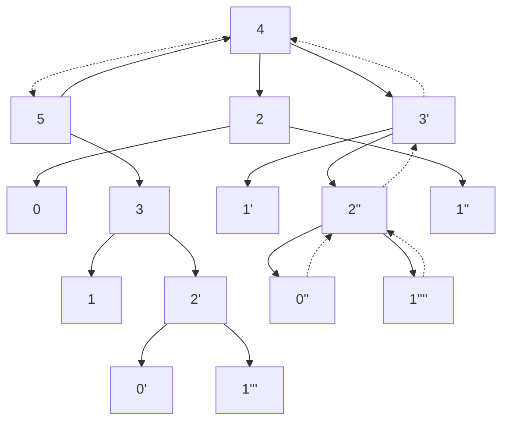
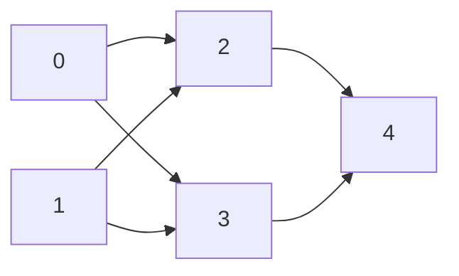

# 需要复习的题

> leetcode38 外观数列 leetcode698,139,121,376

**leetcode快捷键**

ctrl+`'`：运行代码

ctrl+`enter`：提交

ctrl+`?`：快速注释

alt+`上(下)箭头`：此行代码向上或向下移动一行

# 常用算法解决问题汇总

|    数据结构与算法    |               常见问题               |  重点题目   |
| :------------------: | :----------------------------------: | :---------: |
|    堆（优先队列）    |               TOPK问题               |             |
| 单调队列（滑动窗口） |               区间最值               |             |
|        单调栈        |             邻近最值关系             | leetcode496 |
|         队列         |                 广搜                 |             |
|        双指针        |             快慢指针去重             |             |
|        二分法        |          查找有序序列中元素          |             |
|         回溯         |     子集、组合、排列、切割字符串     |             |
|         广搜         |          层序遍历、最短路径          |             |
|         深搜         |              搜索走地图              |             |
|        哈希表        |       记录数据，减少空间复杂度       |             |
|       动态规划       | 求最大最小值，求方案总数，求可不可行 |             |
|       贪心算法       |       局部最优求解全局最优问题       |             |
|       拓扑排序       |          按逻辑顺序进行排序          | leetcode210 |
|        前缀树        |          前缀匹配，词频统计          | leetcode720 |

# 排序

### leetcode面试题 16.16 部分排序

- 题目描述

> 给定一个整数数组，编写一个函数，找出索引m和n，只要将索引区间[m,n]的元素排好序，整个数组就是有序的。注意：n-m尽量最小，也就是说，找出符合条件的最短序列。函数返回值为[m,n]，若不存在这样的m和n（例如整个数组是有序的），请返回[-1,-1]。
>
> 示例：
>
> 输入： [1,2,4,7,10,11,7,12,6,7,16,18,19]
> 输出： [3,9]

1. **解法一**

核心思想：先排序，再比较

- 新建一个数组，和原数组包含相同的元素
- 将新数组排序
- 依次比较新旧两个数组的元素，==第一个==元素不同的位置即为起始位置
- 然后接着依次对比两个数组的各个元素，直到都相同，最后一个具有不同元素的位置为终止位置

```c
int cmp(const void *a, const  void *b) 
{
    return *(int *)a - *(int *)b;
}
int* subSort(int* array, int arraySize, int* returnSize){

    int *tmp = (int *)malloc(sizeof(int) * arraySize);
    memcpy(tmp, array, sizeof(int) * arraySize);

    qsort(tmp, arraySize, sizeof(int), cmp);
    int *retAns = (int *)malloc(2 * sizeof(int));
    retAns[0] = -1;
    retAns[1] = -1;
    *returnSize = 2;

    for (int i = 0; i < arraySize; i++) {
        if (array[i] != tmp[i] && retAns[0] == -1) {
             retAns[0] = i;
        }

        if (array[i] != tmp[i]) {
             retAns[1] = i;
        }
    }

    return retAns;


}
```

2. **解法二**

核心思想：贪心加双指针

- 首先将序列分为三部分，左（单调增），中，右（单调增）

- 统计中间序列的最大最小值

- 扩充中间序列。
  这里使用了贪心的思路，即如果左侧最大值大于中间的最小值，则一定会被中间序列包括；
  同理，如果右侧最小值大于中间的最大值，则一定会被中间序列包括。
- 循环执行3，直至没有新的数据被包括到中间序列

```c
int* subSort(int* array, int arraySize, int* returnSize) {
    int ll, rr;
    int xflag = 1;
    *returnSize = 2;

    int *arr = (int *)malloc(sizeof(int) * 2);

    if (arraySize <= 1) {
        arr[0] = -1;
        arr[1] = -1;
        return arr;
    }

    for (int i = 0; i < arraySize - 1; i++) {
        if (array[i + 1] >= array[i]) continue;
        else {
            xflag = 0;
            ll = i;
            break;
        }
    }

    for (int i = arraySize - 1; i > 0; i--) {
        if (array[i] >= array[i - 1]) continue;
        else {
            rr = i;
            break;
        }
    }

    int min = 5000, max = -5000;
    int flag = 1;
    while (flag) {
        flag = 0;
        for (int i = ll + 1; i < rr; i++) {
            min = min < array[i] ? min : array[i];
            max = max > array[i] ? max : array[i];
        }

        while (array[ll] > min && ll > 0) {flag = 1; ll--;}
        while (array[rr] < max && rr < (arraySize - 1)) {flag = 1; rr++;}
    }
    if (rr == arraySize - 1) rr++;
    if (ll == 0) ll--;

    if (xflag) {
        arr[0] = -1;
        arr[1] = -1;
        return arr;
    }
    
    arr[0] = ll + 1;
    arr[1] = rr - 1;
    return arr;
}
```

2. 解法三

核心思想：双指针

- 定义两个指针，一个指向头，一个指向尾
- 先从前面遍历一遍数组，遇到不符合递增顺序的数字，向前遍历寻找它应该插入的位置，遍历一遍找到起始位置
- 再从前面遍历一遍数组，遇到不符合递减顺序的数字，向后遍历寻找它应该插入的位置，遍历一遍找到终止位置

```c
int* subSort(int* array, int arraySize, int* returnSize) {
    *returnSize = 2;
    int k = -1, ans_x = arraySize - 1, ans_y = 0;
    int xflag = 1;
    for (int i = 0; i < arraySize - 1; i++) {
        if (array[i + 1] < array[i]) {
            xflag = 0;
            int temp = array[i + 1];
            k = i;
            while (array[k] > temp && k > 0 )  k--;
            if (k == 0) {
                k--;
            }
            ans_x = (ans_x < (k + 1)) ? ans_x : (k + 1);
        }
    }

    for (int i = arraySize - 1; i > 0; i--) {
        if (array[i] < array[i - 1]) {
            int temp = array[i - 1];
            k = i;
            while (array[k] < temp && k < arraySize - 1) k++;
            if (k == arraySize - 1) {
                k++;
            }
            ans_y = (ans_y > (k - 1)) ? ans_y : (k - 1);
        }
    }

    int *arr = (int *)malloc(sizeof(int) * 2);

    if (xflag) {
        arr[0] = -1;
        arr[1] = -1;
        return arr;
    }
    arr[0] = ans_x;
    arr[1] = ans_y;
    return arr;
}
```

2. 大佬的代码

- 遍历一遍数组，定义两个指针
- 一个指针向后遍历，不断寻找最大值，当后面数字出现比前面最大数字小时，更新终止位置，比前面数字大时，更新最大值
- 一个指针向前遍历，不断寻找最小值，当前面数字出现比后面最小数字大时，更新终止位置，比前面数字小时，更新最小值

```c
int* subSort(int* array, int arraySize, int* returnSize){
    *returnSize=2;
    int *ret=(int*)malloc(sizeof(int)*(*returnSize));
    ret[0]=-1;
    ret[1]=-1;

    if(array==NULL || arraySize<2){
        return ret;
    }

    int max=array[0];
    int min=array[arraySize-1];
    int last=-1;
    int first=-1;
    for(int i=0;i<arraySize;i++){
        if(array[i]<max){
            last=i;
        }else{
            max=array[i];
        }

        if(min<array[arraySize-1-i]){
            first=arraySize-1-i;
        }else{
            min=array[arraySize-1-i];
        }
    }

    ret[0]=first;
    ret[1]=last;

    return ret;
}
```

# 哈希表

### leetcode1 两数之和

- 题目描述

> 给定一个整数数组 nums 和一个整数目标值 target，请你在该数组中找出 和为目标值 的那 两个 整数，并返回它们的数组下标。
>
> 你可以假设每种输入只会对应一个答案。但是，数组中同一个元素不能使用两遍。
>
> 你可以按任意顺序返回答案。

- 解题思路

使用哈希表，遍历数组中的数据，依次存入到哈希表（键：数值，值：下标）中，因为后续需要使用find寻找值，find函数是查找哈希表的键，所以将数值存储为键。

每次遍历，寻找target-nums[i]数据，如果可以找到，返回两数的下标（即it->second, i），如果没有找到，将当前值存入到哈希表中，如果始终没有找到，则返回空（{}）。

- 示例代码

```c++
class Solution {
public:
    vector<int> twoSum(vector<int>& nums, int target) {
        unordered_map<int, int> um;
        for (int i = 0; i < nums.size(); i++) {
            auto it = um.find(target - nums[i]);
            if (it != um.end()) {
                return {it->second, i};
            }
            um[nums[i]] = i;
        }
        return {};
    }
};
```

### leetcode49 字母异位词分组

- 题目描述

> 给定一个字符串数组，将字母异位词组合在一起。字母异位词指字母相同，但排列不同的字符串。

- 解题思路

字母异位词即具有相同字母的字符串，它们排序好之后相等。

那么可以使用哈希表，将排序好的字符串作为键值，然后将符合这个字符串序列的字符串组成的字符串数组为值

建立哈希映射`unordered_map<string, vector<string>> um`，

使用`emplace_back`不断将字符串添加到哈希表

存入哈希表后，最后遍历哈希表，将每一个键对应的字符串数组添加到二维数组中

- 示例代码

```c++
class Solution {
public:
    vector<vector<string>> groupAnagrams(vector<string>& strs) {
        vector< vector<string> > ans;
        unordered_map<string, vector<string> > us;
        for (auto str:strs) {
            string key = str;
            sort(key.begin(), key.end());
            us[key].emplace_back(str);
        }
        for (auto it = us.begin(); it != us.end(); it++) {
            ans.push_back(it->second);
        }
        return ans;
    }
};
```

### leetcode217 存在重复元素

- 解法１

核心思想：排序加比较

```c++
class Solution {
public:
    bool containsDuplicate(vector<int>& nums) {
        sort(nums.begin(),nums.end());

        if(nums.size()==0)
            return false;
        for(int i=0;i<nums.size()-1;i++)
        {
            if(nums[i]==nums[i+1])
                return true;
        }
        return false;
    }
};
```

- 解法２

核心思想：哈希映射

```c++
class Solution {
public:
    bool containsDuplicate(vector<int>& nums) {
        unordered_map<int, int> res;
        for(int i = 0; i < nums.size(); i++){
            if(res[nums[i]])
                return true;
            res[nums[i]]++;
        }
        return false;

    }
};
```

### leetcode560 和为k的子数组

- 题目描述

> 给定一个整数数组和一个整数 **k，**你需要找到该数组中和为 **k** 的连续的子数组的个数。

- 解题思路

前缀和+哈希表

前缀和：从0加到第j位即为第j位的前缀和

使用前缀和会简化计算，由于此题数组中和为k的连续子数组，如果维护一个前缀和数组

那么pre[i] - pre[j-1] = k，就证明从j - i位置的数据和为k，反之，如果哈希表中存在pre-k，证明存在加和为k的区间

首先第一个前缀和为0，初始化为1，就证明有1个位置的前缀和为0

每次在哈希表中寻找pre-k是否存在，如果存在，cnt += mp[pre-k]，有几个前缀和为pre-k，则加几次

然后将当前前缀和插入哈希表，最后返回最终结果。

- 示例代码

```c++
class Solution {
public:
    int subarraySum(vector<int>& nums, int k) {
        unordered_map<int, int>mp;
        mp[0] = 1;
        int pre = 0, cnt = 0;
        for (int i = 0; i < nums.size(); i++) {
            pre += nums[i];
            if (mp.find(pre - k) != mp.end()) cnt += mp[pre-k];
            mp[pre]++;
        }
        return cnt;
    }
};
```

### leetcode697 数组的度

- 题目描述

> 给定一个非空且只包含非负数的整数数组 nums，数组的度的定义是指数组里任一元素出现频数的最大值。
>
> 你的任务是在 nums 中找到与 nums 拥有相同大小的度的最短连续子数组，返回其长度。

- 解题思路

使用哈希表，键：数组的数值，值：一个数组，存储元素的个数，起始下标，结束下标

遍历哈希表，首先比较元素的个数，其次比较子数组的长度（结束下标-起始下标+1）

- 示例代码

```c++
class Solution {
public:
    int findShortestSubArray(vector<int>& nums) {
        unordered_map<int, vector<int>>mp;
        int n = nums.size();
        for (int i = 0; i < n; i++) {
            if (mp.count(nums[i])) {//如果元素存在，更新个数和结束下标
                mp[nums[i]][0]++;
                mp[nums[i]][2] = i;
            } else {//如果该元素首次出现，初始化为{1,i,i}
                mp[nums[i]] = {1, i, i};
            }
        }
        int maxlen = 0, minlen = 0;
        for (auto& [_,vec]:mp) {
            if (maxlen < vec[0]) {//选出最长元素
                maxlen = vec[0];
                minlen = vec[2] - vec[1] + 1;
            } else if(maxlen == vec[0]) {//选出最短子数组
                if (minlen > vec[2] - vec[1] + 1) {
                    minlen = vec[2] - vec[1] + 1;
                } 
            }
        }
        return minlen;
    }
};
```

# 二叉树

### leetcode589 N叉树的前序遍历

> 可以仿照二叉树的前序遍历，不同的是孩子树增多，所以需要通过一个循环来不断递归输出各个孩子节点处的值

```c
#define MAX_OP 10000

void pre_ordernode(struct Node* root, int* num, int* returnSize) {
    if (root == NULL) return ;
    for (int i = 0; i < root->numChildren; i++) {
        num[(*returnSize)++] = root->children[i]->val;
        pre_ordernode(root->children[i], num, returnSize);
    }
}

int* preorder(struct Node* root, int* returnSize) {
    *returnSize = 0;
    int *ans = (int *)calloc(MAX_OP, sizeof(int));
    if (root == NULL) return ans;
    ans[(*returnSize)++] = root->val;
    pre_ordernode(root, ans, returnSize);
    return ans;
}
```

### leetcode100 相同的树

- 题目描述

> 给定两个二叉树，编写一个函数来检验它们是否相同。
>
> 如果两个树在结构上相同，并且节点具有相同的值，则认为它们是相同的。

- 解题思路

> 针对树的问题，很自然的想法是采用`递归`的思想
>
> 因为一个节点每一个子节点和其下面所有节点也同样构成一棵树
>
> 从根节点向下看是一棵树，从根节点的每一个子节点向下看仍然是一棵树，相当于子树
>
> 所以可以将判断两棵树是否相同的问题，不断甩锅给它下面的子树去做，并返回子树判断的结果

> 递归操作很像是一个具有严格等级划分的公司内部，主管将一部分任务分给副管，再由副管不断的将部分工作分配给下一级，
>
> 等到最后一级完成任务后，再不断返回给上一级进行汇总工作，最终完成工作。
>
> 但这肯定不能无限分配给下一级，所以必须保证以下两个条件(出口条件)：
>
> 1. 最后一级在哪
> 2. 确保最后一级可以处理这个问题

所以根据上面的介绍，想要判断两棵树是否相等的问题，

**1. 将问题系统化**

也就是明确对于一个树而言，在满足什么条件时算相等，满足什么条件时算不等（出口条件）。

- 当两棵树均为空的时候，两棵树相等
- 当两棵树一棵为空，另一棵不为空时，两棵树不相等
- 当两棵树在某个节点处值不相等时，两棵树不相等

```c
if (p == NULL && q == NULL) return true;
if (p == NULL || q == NULL) return false;
if (p->val - q->val) return false;
```

**2. 找关系**

明确上一层和下一层的关系，也就是通过下一层怎么可以得到上一层

```c
return isSameTree(p->left, q->left) && isSameTree(p->right, q->right);
```

在处理问题的时候，则需要采用递归的思想来完成。也就是说在处理问题的时候可以层层甩锅，把同样的问题不断细化。

> 该问题，对于一个二叉树而言，判断两棵树树是否

```c
bool isSameTree(struct TreeNode* p, struct TreeNode* q){
    if (p == NULL && q == NULL) return true;
    if (p == NULL || q == NULL) return false;
    if (p->val - q->val) return false;
    return isSameTree(p->left, q->left) && isSameTree(p->right, q->right);
}
```

### leetcode101 对称二叉树

- 题目描述

给定一个二叉树，检查它是否是镜像对称的。

例如，二叉树 [1,2,2,3,4,4,3] 是对称的。

```
	1
   / \
  2   2
 / \ / \
3  4 4  3
```

但是下面这个 [1,2,2,null,3,null,3] 则不是镜像对称的:

```
 	1
   / \
  2   2
   \   \
   3    3
```

- 解题思路

**1. 系统化**

明确一个树而言，什么时候是镜像对称的，什么时候不是镜像对称的

- 树为空时，显然满足
- 左子树为空，右子树不空，显然不满足
- 其左子树和右子树镜像位置处的值不相等时，不满足

**2. 找关系**

将一棵树分为两棵树处理

不断向下判断，左子树的左子树是否等于右子树的右子树，左子树的右子树是否等于右子树的左子树

对于一棵树，层层向下递归，只有满足上述条件，才可最终判断这棵树为镜像对称

- 把一棵树镜像相等的问题转化为左右两棵子树是否镜像相等
- 把子树左右节点是否镜像相等的为题，转化为判断左节点的左子树和右节点的右子树是否镜像相等以及左子树的左节点和右子树的右节点的左子树是否镜像相等。

```c
bool isSameTrue(struct TreeNode *p, struct TreeNode *q) {
    if (p == NULL && q == NULL) return true;
    if (p == NULL || q == NULL) return false;
    if (p->val - q->val) return false;
    return isSameTrue(p->left, q->right) && isSameTrue(p->right, q->left);
}

bool isSymmetric(struct TreeNode* root){
    if (root == NULL) return true;
    return isSameTrue(root->left, root->right);
}
```

 ### leetcode102 二叉树的层序遍历

- 题目描述

给你一个二叉树，请你返回其按 层序遍历 得到的节点值。 （即逐层地，从左到右访问所有节点）。

示例：
二叉树：[3,9,20,null,null,15,7]

```
   3
   / \
  9  20
    /  \
   15   7
```

返回其层次遍历结果：

```
[
  [3],
  [9,20],
  [15,7]
]
```

- 解题思路

由于结果最终返回的是层序遍历的结果，返回的是二维的数组，且第二维数组的大小应为该层的节点数

所以首先需要进行三个准备工作

1. 获取树的深度
2. 获取每一层节点的数目

3. 根据树深和每一层节点个数，为二维数组开辟内存空间

最后执行层序遍历

```c
int getdepth(struct TreeNode *root) {//获取树深
    if (root == NULL) return 0;
    int l = getdepth(root->left), r = getdepth(root->right);
    return (l > r ? l : r) + 1;
}

void getcnt(struct TreeNode *root, int k, int *cnt) {//获取每一层节点的个数
    if (root == NULL) return ;
    cnt[k] += 1;
    getcnt(root->left, k + 1, cnt);
    getcnt(root->right, k + 1, cnt);
    return ;
}

void getresult(struct TreeNode *root, int **ret, int k, int *cnt) {//获得结果
    if (root == NULL) return ;
    ret[k][cnt[k]++] = root->val;
    getresult(root->left, ret, k + 1, cnt);
    getresult(root->right, ret, k + 1, cnt);
    return ;
}

int** levelOrder(struct TreeNode* root, int* returnSize, int** returnColumnSizes){
    int depth = getdepth(root);
    int **ret = (int **)malloc(sizeof(int *) * depth);
    int *cnt = (int *)calloc(depth, sizeof(int));

    getcnt(root, 0, cnt);
    for (int i = 0; i < depth; i++) {
        ret[i] = (int *)malloc(sizeof(int) * cnt[i]);
        cnt[i] = 0 ;
    }

    getresult(root, ret, 0, cnt);
    *returnSize = depth;
    *returnColumnSizes = cnt;
    return ret;
}
```

###　leetcode112 路径总和

- 题目描述

给定一个二叉树和一个目标和，判断该树中是否存在根节点到叶子节点的路径，这条路径上所有节点值相加等于目标和。

说明: 叶子节点是指没有子节点的节点。

示例: 
给定如下二叉树，以及目标和 sum = 22

```markdown
         `5`
         / \
       `4`  8
       /   / \
     `11`  13 4
     /  \      \
    7   `2`     1
```

返回true

- 解题思路

核心思想：递归

```c
bool hasPathSum(struct TreeNode* root, int sum){
    if (root == NULL) return false;
    if (root->val == sum && root->left == NULL && root->right == NULL) return true;
    return hasPathSum(root->left, sum - root->val) || hasPathSum(root->right, sum - root->val);
}
```

### leetcode226 翻转二叉树

- 题目描述

翻转一棵二叉树。

示例：

输入：

```markdown
     4
   /   \
  2     7
 / \   / \
1   3 6   9
```

输出：

```markdown
     4
   /   \
  7     2
 / \   / \
9   6 3   1
```

- 解题思路

巧用指针

```c
struct TreeNode* invertTree(struct TreeNode* root){
    if (root == NULL) return root;
    struct TreeNode *temp = root->left;
    root->left = root->right;
    root->right = temp;
    invertTree(root->left);
    invertTree(root->right);
    return root;
}
```

# 并查集

并查集用于解决连通性问题

并查集的实现本身不是难度，只需要初始化加一并一查

1. 初始化时需要将每一个节点的祖先节点都初始化为其自身

2. 合并时需要判断其祖先节点是否相等，如果不相等，则需要将一方的祖先节点指向另一方的祖先节点

3. 查找时，只有在寻找祖先节点的时候，只有当其节点本身等于祖先节点时，才说明此节点是祖先节点，否则递归寻找祖先节点

解决并查集问题主要是套用并查集模板，然后在主函数中做一些合并查找的工作。

**并查集模板**

```c++
class UnionSet {
public:
    vector<int> parents;
    UnionSet(int n) {
        for (int i = 0; i < n; i++) {
            parents.push_back(i);
        }
    }

    void merge(int a, int b) {
        parents[find(a)] = find(b);
    }

    int find(int x) {
        if (x != parents[x]) {
            parents[x] = find(parents[x]);
        }
        return parents[x];
    }
};
```

### leetcode200 岛屿数量

- 题目描述

给你一个由` '1'`（陆地）和` '0'`（水）组成的的二维网格，请你计算网格中岛屿的数量。

岛屿总是被水包围，并且每座岛屿只能由水平方向和/或竖直方向上相邻的陆地连接形成。

此外，你可以假设该网格的四条边均被水包围。

示例1：

```
输入：grid = [
  ["1","1","1","1","0"],
  ["1","1","0","1","0"],
  ["1","1","0","0","0"],
  ["0","0","0","0","0"]
]
输出：1
```

示例2：

```
输入：grid = [
  ["1","1","0","0","0"],
  ["1","1","0","0","0"],
  ["0","0","1","0","0"],
  ["0","0","0","1","1"]
]
输出：3
```

- 解题思路

法一：

核心思想：并查集

将所有为`1`的元素连成一个集合，最后判断代表元素等于其自身的元素数量即为岛屿数量

1. 遍历二维数组
2. 若为0，则退出本次循环
3. 若为1，判断其如果不在边界处且其左边或上边元素也为1，则合并代表元素
4. 最后再遍历一遍二维数组，找到所有代表元素等于其自身的元素

- 示例代码

**C++语言**

```c++
class UnionFind {
public:
    UnionFind(vector<vector<char>>& grid) {
        count = 0;
        int m = grid.size();
        int n = grid[0].size();
        for (int i = 0; i < m; ++i) {
            for (int j = 0; j < n; ++j) {
                if (grid[i][j] == '1') {
                    parent.push_back(i * n + j);
                    ++count;
                }
                else {
                    parent.push_back(-1);
                }
            }
        }
    }

    int find(int i) {
        if (parent[i] != i) {
            parent[i] = find(parent[i]);
        }
        return parent[i];
    }

    void unite(int x, int y) {
        if (find(x) == find(y)) return ;
        parent[find(x)] = find(y);
        count--;
    }

    int getCount() const {
        return count;
    }

private:
    vector<int> parent;
    int count;
};

class Solution {
public:
    int numIslands(vector<vector<char>>& grid) {
        int nr = grid.size();
        if (!nr) return 0;
        int nc = grid[0].size();

        UnionFind uf(grid);
        int num_islands = 0;
        for (int r = 0; r < nr; ++r) {
            for (int c = 0; c < nc; ++c) {
                if (grid[r][c] == '1') {
                    grid[r][c] = '0';
                    if (r - 1 >= 0 && grid[r-1][c] == '1') uf.unite(r * nc + c, (r-1) * nc + c);
                    if (r + 1 < nr && grid[r+1][c] == '1') uf.unite(r * nc + c, (r+1) * nc + c);
                    if (c - 1 >= 0 && grid[r][c-1] == '1') uf.unite(r * nc + c, r * nc + c - 1);
                    if (c + 1 < nc && grid[r][c+1] == '1') uf.unite(r * nc + c, r * nc + c + 1);
                }
            }
        }

        return uf.getCount();
    }
};
```

  **C语言**

```c
#define MC(T, n) (T *)malloc(sizeof(T) * (n))
#define CC(T, n) (T *)calloc(sizeof(T), (n))

typedef struct UnionSet {
    int *fa;
    int n;
} UnionSet;

UnionSet *init(int n) {
    UnionSet *u = MC(UnionSet, 1);
    u->fa = MC(int , n + 1);
    u->n = n;
    for (int i = 1; i <= n; i++) u->fa[i] = i;
    return u;
}

int find(UnionSet *u, int x) {
    if (u->fa[x] == x) return x;
    return find(u, u->fa[x]);
}

void  merge(UnionSet *u, int a, int b) {//亮点1:一行代码搞定合并
    u->fa[find(u, a)] = find(u, b);
}

void clear(UnionSet *u) {
    if (u == NULL) return ;
    free(u->fa);
    free(u);
    return ;
}


int numIslands(char** grid, int gridSize, int* gridColSize){
    if (!gridSize) return 0;
    int m = gridColSize[0];
    int n = gridSize;
    #define ind(i, j) ((i) * (m) + (j) + 1) //亮点2：确定每个元素所在的位置
    UnionSet *u = init(n * m);

    for (int i = 0; i < n; i++) {
        for (int j = 0; j < m; j++) {
            if (grid[i][j] == '0') continue;
            if (i - 1 >= 0 && grid[i-1][j] == '1') merge(u, ind(i, j), ind(i - 1, j));
            if (j - 1 >= 0 && grid[i][j-1] == '1') merge(u, ind(i, j), ind(i, j - 1));
        }
    }

    int ans = 0;
    for (int i = 0; i < n; i++) {
        for (int j = 0; j < m; j++) {
            if (grid[i][j] == '0') continue;
            ans += (find(u, ind(i, j)) == ind(i, j));
        }
    }
    clear(u);
    return ans;
}
```

亮点2：确定每一个元素所在的位置

| (0, 0)-----1 | (0, 1)-----2 |       (0, 2)-----3       | (0, 3)-----4 | (0, 4)-----5 |
| ------------ | ------------ | :----------------------: | ------------ | ------------ |
|              |              |                          |              |              |
|              |              | **(i, j)-----(i*m+j+1)** |              |              |
|              |              |                          |              |              |

- 复杂度分析

时间复杂度：O(M*N)，其中M为行数，N为列数。

空间复杂度：O(M*N)，即为并查集需要开辟的空间。

### leetcode547 省份数量

- 题目描述

> 有 n 个城市，其中一些彼此相连，另一些没有相连。如果城市 a 与城市 b 直接相连，且城市 b 与城市 c 直接相连，那么城市 a 与城市 c 间接相连。
>
> 省份 是一组直接或间接相连的城市，组内不含其他没有相连的城市。
>
> 给你一个 n x n 的矩阵 isConnected ，其中 isConnected[i][j] = 1 表示第 i 个城市和第 j 个城市直接相连，而 isConnected[i][j] = 0 表示二者不直接相连。
>
> 返回矩阵中 省份 的数量。

- 解题思路

  和上一道题一样的思路，使用并查集进行连通城市

1. 实现一个并查集，具有查找和合并的功能，并且初始化为每一个城市都先指向其自身，初始省份数量为n
2. 遍历二维数组，如果两个城市连通，那么就将其合并，并使省份数量-1
3. 最终返回省份数量

- 示例代码

```c++
class UnionFind {
public:
    UnionFind(vector<vector<int>>& grid) {
        int n = grid.size();
        count = n;//省份数量初始化为n
        for (int i = 0; i < n; i++) {//n个城市初始化
            parent.push_back(i);
        }
    }

    int find(int i) {
        if (parent[i] != i) {
            parent[i] = find(parent[i]);
        }
        return parent[i];
    }

    void merge(int x, int y) {
        if (find(x) == find(y)) return ;
        parent[find(x)] = find(y);
        count--;
    }

    int getCount() const {
        return count;
    }

private:
    vector<int> parent;
    int count;
};

class Solution {
public:
    int findCircleNum(vector<vector<int>>& isConnected) {
        int n = isConnected.size();//n个城市
        if (!n) return 0;
        UnionFind u(isConnected);
        for (int i = 0; i < n; i++) {
            for (int j = i + 1; j < n; j++) {
                if (isConnected[i][j]) {
                    u.merge(i, j);
                }
            }
        }
        return u.getCount();
    }
};
```

### leetcode721 账户合并

- 题目描述

> 给定一个列表 accounts，每个元素 accounts[i] 是一个字符串列表，其中第一个元素 accounts[i][0] 是 名称 (name)，其余元素是 emails 表示该账户的邮箱地址。
>
> 现在，我们想合并这些账户。如果两个账户都有一些共同的邮箱地址，则两个账户必定属于同一个人。请注意，即使两个账户具有相同的名称，它们也可能属于不同的人，因为人们可能具有相同的名称。一个人最初可以拥有任意数量的账户，但其所有账户都具有相同的名称。
>
> 合并账户后，按以下格式返回账户：每个账户的第一个元素是名称，其余元素是按字符 ASCII 顺序排列的邮箱地址。账户本身可以以任意顺序返回。

- 解题思路

此题较容易可以想到用并查集的方法，本题本质上要解决的就是连通性问题，将具有相同邮箱的人连通起来，并将他们的账户合并。

1. 使用哈希表将邮箱和人编号对应起来

2. 使用并查集，将具有相同邮箱的人合并

3. 使用另一个哈希表将同一个人(此时只有一个祖先编号)与其所有邮箱组织成一个映射
4. 将每个人的人名与邮箱均拼接成与之对应的一个数组
5. 将所有的数组添加到结果数组中

- 示例代码

```c++
class UnionSet {
public:
    vector<int> parents;
    UnionSet(int n) {
        for (int i = 0; i < n; i++) {
            parents.push_back(i);
        }
    }

    void merge(int a, int b) {
        parents[find(a)] = find(b);
    }

    int find(int x) {
        if (x != parents[x]) {
            return find(parents[x]);
        }
        return parents[x];
    }
};

class Solution {
public:
    vector<vector<string>> accountsMerge(vector<vector<string>>& accounts) {
        vector<vector<string>>ans;
        int n = accounts.size();
        if (!n) return ans;
        UnionSet u(n);
        map<string, int>mp;
        for (int i = 0; i < n; i++) {
            int m = accounts[i].size();
            for (int j = 1; j < m; j++) {
                string s = accounts[i][j];
                if (mp.find(s) == mp.end()) {
                    mp[s] = i;
                } else {
                    u.merge(i, mp[s]);
                }
            }
        }

        unordered_map<int, vector<string>> ump;
        for (auto& [k, v]:mp) ump[u.find(v)].emplace_back(k);//将同一个人的邮箱合并
        for (auto& [k, v]:ump) {
            sort(v.begin(), v.end());
            vector<string> temp(1, accounts[k][0]);
            temp.insert(temp.end(), v.begin(), v.end());
            ans.emplace_back(temp);
        }
        return ans;
    }
};
```

### leetcode128 最长连续序列

- 题目描述

给定一个未排序的整数数组 `nums` ，找出数字连续的最长序列（不要求序列元素在原数组中连续）的长度。

示例1：

```
输入：nums = [100,4,200,1,3,2]
输出：4
解释：最长数字连续序列是 [1, 2, 3, 4]。它的长度为 4。
```

示例2：

```
输入：nums = [0,3,7,2,5,8,4,6,0,1]
输出：9
```

- 解题思路

核心思想：并查集+哈希表

准备一个哈希表用于存放每一个数字以及其所对应的下标

准备一个并查集，将每一个数字组成的连续序列连接起来，其中并查集中应创建一个存放每一个元素构成连续序列长度的size数组，数组初始化为每个位置为1。

1. 遍历每一个数字，若该数字已出现在哈希表中，则退出本次循环

   若该元素k不在哈希表中，判断k-1和k+1是否出现过，若出现过，则将它们联合

2. 将元素k存入哈希表中

3. 遍历一遍size数组，取出其中的最大值即为最长连续序列

```c++
class UnionSet {
public :
    vector<int> fa, size;
    void init(int n) {
        fa.clear();
        for (int i = 0; i < n; i++) {
            fa.push_back(i);
            size.push_back(1);
        }
        return ;
    }
    int get(int x) {
        if (fa[x] == x) return x;
        return get(fa[x]);
    }
    void merge(int a, int b) {
        int aa = get(a), bb = get(b);
        if (aa == bb) return ;
        fa[aa] = bb;
        size[bb] += size[aa];
        return ; 
    }
};

class Solution {
public:
    int longestConsecutive(vector<int>& nums) {
        u.init(nums.size());
        unordered_map<int, int> ht;
        for (int i = 0; i < nums.size(); i++) {
            int k = nums[i];
            if (ht.find(k) != ht.end()) continue;//若找到该元素，则退出本次循环
            if (ht.find(k-1) != ht.end()) u.merge(i, ht[k-1]);
            if (ht.find(k+1) != ht.end()) u.merge(i, ht[k+1]);
            ht[k] = i;
        }

        int ans = 0;
        for (int i = 0; i < nums.size(); i++) {
            ans = max(ans, u.size[i]);
        }
        return ans;
    }
    UnionSet u;
};
```

初始化后：

| num  | 100  |  3   | 200  |  1   |  2   |
| :--: | :--: | :--: | :--: | :--: | :--: |
|  fa  |  0   |  1   |  2   |  3   |  4   |
| size |  1   |  1   |  1   |  1   |  1   |

结束后：

| num  | 100  |  3   | 200  |  1   |  2   |
| :--: | :--: | :--: | :--: | :--: | :--: |
|  fa  |  0   |  1   |  2   |  1   |  1   |
| size |  1   |  3   |  1   |  2   |  1   |

- 复杂度分析

时间复杂度：O(n)  只存在一次循环

空间复杂度：O(n) 哈希表中存储数组中所有的数需要O(n)空间

### leetcode130 被围绕的区域

- 题目描述

给定一个二维的矩阵，包含 `'X'` 和 `'O'`（**字母 O**）。

找到所有被 `'X'` 围绕的区域，并将这些区域里所有的 `'O'` 用 `'X'` 填充。

被围绕的区间不会存在于边界上，换句话说，任何边界上的 'O' 都不会被填充为 'X'。 任何不在边界上，或不与边界上的 'O' 相连的 'O' 最终都会被填充为 'X'。如果两个元素在水平或垂直方向相邻，则称它们是“相连”的。

示例：

```
X X X X
X O O X
X X O X
X O X X
```

输出：

```
X X X X
X X X X
X X X X
X O X X
```

- 解题思路

核心思想：并查集

1. 遍历二维数组中的每一个元素
2. 当元素为'X'则跳过
3. 当元素不位于边界且元素其上边或左边的元素为'O'，则将其连通
4. 对于所有处于边界的元素，都将其与0连通
5. 再次遍历数组，如果是'X'跳过，如果其元素与0的代表元素相同也跳过
6. 执行到这里的元素都是被包围的'O'元素，将它们改为'X'

```c++
class UnionSet {
public:
    vector<int> fa;

    void init(int n) {
        fa.clear();
        for (int i = 0; i <= n; i++) {
            fa.push_back(i);
        }
    }

    int get(int x) {
        return fa[x] = (fa[x] == x ? x : get(fa[x]));
    }

    void merge(int a, int b) {
        fa[get(a)] = get(b);
    }
};

class Solution {
public:
    void solve(vector<vector<char>>& board) {
        if (board.size() == 0) return ;
        if (board[0].size() == 0) return ;
        n = board.size();
        m = board[0].size();
        u.init(n * m);

        for (int i = 0;i < n; i++) {
            for (int j = 0; j < m; j++) {
                if (board[i][j] == 'X') continue;
                if (i && board[i - 1][j] == 'O') u.merge(ind(i,j), ind(i-1, j));
                if (j && board[i][j - 1] == 'O') u.merge(ind(i, j), ind(i, j-1));
                if (i == 0 || i + 1 == n) u.merge(ind(i, j), 0);
                if (j == 0 || j + 1 == m) u.merge(ind(i, j), 0);
            }
        }
        for (int i = 0; i < n; i++) {
            for (int j = 0; j < m; j++) {
                if (board[i][j] == 'X') continue;
                cout << u.get(0) << endl;
                if (u.get(ind(i, j)) == u.get(0)) continue;
                board[i][j] = 'X';
            }
        }

    }
    int ind(int i, int j) {
        return i * m + j + 1;
    }
    int n, m;
    UnionSet u;
};
```

- 复杂度分析

时间复杂度：O(N*M)

空间复杂度：O(N*M)

# 堆

**复杂度分析**

搜索（堆顶元素）:O(1)

添加:	O(logn)

删除：O(logn)

**常用于解决TOPK问题**

解决TOPK问题：（取前k个最大（小）元素或者取第k大（小）元素）

可以采用大顶堆或小顶堆

大顶堆：维护一个大顶堆，则最后堆顶的k个元素即为最大的k个元素。（不断取top，然后pop，可以得到前k个元素）

小顶堆：维护一个小顶堆，始终保证堆内的元素个数为k，当插入元素使得小顶堆的元素个数超过k，则弹出堆顶元素，这样最后小顶堆内包含的前k大的元素，堆顶元素始终为第k大的元素。

### leetcode703 数据流中的第k大元素

类似习题：剑指offer40,leetcode215

- 题目描述

> 设计一个找到数据流中第 `k` 大元素的类（class）。注意是排序后的第 `k` 大元素，不是第 `k` 个不同的元素

- 解题思路

维护一个小顶堆，保证堆内的元素始终为K个，如果元素个数超过k，就弹出堆顶元素，这样始终可以保证小顶堆中的元素就为前k个大的元素。那么堆顶元素就是第k大的元素。

- 示例代码

```c++
class KthLargest {
public:
    int k;
    priority_queue<int, vector<int>, greater<int>>q;//greater为谓语,即维护一个小顶堆
    KthLargest(int k, vector<int>& nums) {
        this->k = k;
        for (auto& num:nums) {
            add(num);
        }
    }
    
    int add(int val) {
        q.push(val);
        if (q.size() > k) {
            q.pop();
        }
        return q.top();
    }
};
```

### leetcode692 前K个高频单词

- 题目描述

> 给一非空的单词列表，返回前 *k* 个出现次数最多的单词。
>
> 返回的答案应该按单词出现频率由高到低排序。如果不同的单词有相同出现频率，按字母顺序排序。

- 示例代码

**法一：**维护一个小顶堆

```c++
typedef pair<int, string> PIS;
class cmp {
public:
    bool operator()(PIS& p1, PIS& p2) {
        return p1.first > p2.first || (p1.first == p2.first && p1.second < p2.second);
    }
};

class Solution {
public:
    vector<string> topKFrequent(vector<string>& words, int k) {
        map<string, int> mp;
        for (const auto& word : words) {
            mp[word]++;
        }
        
        // minHeap
        priority_queue<PIS, vector<PIS>, cmp> pq;
        for (const auto& m : mp) {
            pq.push(make_pair(m.second, m.first));
            if (pq.size() > k) {
                pq.pop();
            }
        }

        vector<string> res;
        for (int i = 0; i < k; i++) {
            res.push_back(pq.top().second);
            pq.pop();
        }
        reverse(res.begin(), res.end());

        return res;
    }
};
```

**法二：**维护一个大顶堆

```c++
class Solution1 {
public:
    vector<string> topKFrequent(vector<string>& words, int k) {
        map<string, int> mp;
        for (const auto& word : words) {
            mp[word]++;
        }

        typedef pair<int, string> PIS;
        auto cmp = [](PIS& p1, PIS& p2) {
            return p1.first < p2.first || (p1.first == p2.first && p1.second > p2.second);
        };
        priority_queue<PIS, vector<PIS>, decltype(cmp)> pq(cmp);
        for (const auto& m : mp) {
            pq.push(make_pair(m.second, m.first));
        }

        vector<string> res;
        for (int i = 0; i < k; i++) {
            res.push_back(pq.top().second);
            pq.pop();
        }

        return res;
    }
};
```

**法三：**利用技巧使用大顶堆维护一个小顶堆（元素取负号）

```c++
class Solution {
public:
    vector<string> topKFrequent(vector<string>& words, int k) {
        unordered_map<string, int> mp;
        for(string& ev: words) mp[ev]++;
        
        priority_queue<pair<int, string>> q;
        //利用pair的默认比较方式，可将优先级最低的元素（即出现次数最少或字典序最大）维护在堆顶
        for(auto& [str, cnt]: mp){
            q.push({-cnt, str});
            if(q.size() > k) q.pop();
        }
        vector<string> ans;
        while(!q.empty()){
            ans.push_back(q.top().second);
            q.pop();
        }
        reverse(ans.begin(), ans.end());
        return ans;
    }
};
```

### leetcode264 丑数

- 题目描述

编写一个程序，找出第 `n` 个丑数。

丑数就是质因数只包含 `2, 3, 5` 的**正整数**。

示例：

```
输入: n = 10
输出: 12
解释: 1, 2, 3, 4, 5, 6, 8, 9, 10, 12 是前 10 个丑数。
```

- 解题思路

核心思想：堆排序

事先准备好一个堆的结构体，维护一个小顶堆

1. 首先将1放入堆中；
2. 循环n次，每次记录堆顶元素，并将堆顶元素弹出堆，堆顶元素始终为当前堆中最小的丑数；
3. 若该堆顶元素是5的倍数，将该元素与5的乘积加入堆
4. 若该堆顶元素是3的倍数，将该元素与3和5的乘积加入堆
5. 其余情况，将该元素与2,3,5的乘积加入到堆

始终要保证当前的最小丑数位于堆顶

每次弹出堆顶元素，都可以保证该元素与其之前所有元素的2,3,5的倍数都在堆中

每次堆顶元素是否为最小丑数取决于在它之前是否可以先得到它，由于其之前元素所有的2,3,5的倍数都在这个堆中，所以该元素一定为最小丑数。

```c++
#define swap(a, b) { \
    __typeof(a) __temp = a; \
    a = b, b = __temp; \
}

typedef struct Heap {
    long long *data;
    int n, size;
} Heap;

Heap *init(int n) {
    Heap *h = (Heap *)malloc(sizeof(Heap));
    h->n = 0;
    h->size = n + 1;
    h->data = (long long *)malloc(sizeof(long long) * h->size);
    return h;
}

int empty(Heap *h) {
    return h->n == 0;
}

#define V(x) h->data[x]

void push(Heap *h, long long val) {
    h->data[++(h->n)] = val;
    int ind = h->n;
    while (ind > 1 && V(ind) < V(ind >> 1)) {
        swap(V(ind), V(ind >> 1));
        ind >>= 1;
    }
    return ;
}

long long top(Heap *h) { return V(1); }

void pop(Heap *h) {
    if (empty(h)) return ;
    V(1) = V(h->n);
    (h->n)--;
    int ind = 1;
    while ((ind << 1) <= h->n) {
        int temp = ind, l = ind << 1, r = ind << 1 | 1;
        if (V(l) < V(temp)) temp = l;
        if (r <= h->n && V(r) < V(temp)) temp = r;
        if (temp == ind) break;
        swap(V(ind), V(temp));
        ind = temp;
    }
    return ;
}

void clear(Heap *h) {
    if (h == NULL) return ;
    free(h->data);
    free(h);
    return ;
}

int nthUglyNumber(int n){
    Heap *h = init(3 * n);
    push(h, 1);
    long long ans = 0;
    while (n--) {
        ans = top(h);
        pop(h);
        if (ans % 5 == 0) {
            push(h, 5 * ans);
        } else if (ans % 3 == 0) {
            push(h, 3 * ans);
            push(h, 5 * ans);
        } else {
            push(h, 2 * ans);
            push(h, 3 * ans);
            push(h, 5 * ans);
        }
    }
    clear(h);
    return ans;
}
```

# 栈和队列

### leetcode20 有序的括号

- 题目描述

给定一个只包括 '('，')'，'{'，'}'，'['，']' 的字符串，判断字符串是否有效。

有效字符串需满足：

左括号必须用相同类型的右括号闭合。
左括号必须以正确的顺序闭合。
注意空字符串可被认为是有效字符串。

示例1：

```
输入: "()"
输出: true
```

示例2：

```
输入: "()[]{}"
输出: true
```

示例3：

```
输入: "([)]"
输出: false
```

- 解题思路

1. 循环遍历字符数组

2. 当遇到左括号时，向栈中压入元素

3. 遇到右括号时，判断当前栈是否无元素或者栈顶元素是否为其对应的左括号

   若不满足这两个条件，则为无效字符串

   若满足这两个条件，则将对应的左括号弹栈，继续执行循环

4. 当遍历整个字符串数组后，所有元素均满足以上条件，且栈为空（不存在多余左括号），则说明字符串有效

```c++
bool isValid(char * s){
    int len = strlen(s), top = -1, flag = 1;
    char *stack = (char *)malloc(sizeof(char) * len);
    while (s[0]) {
        switch(s[0]) {
            case '(':
            case '[':
            case '{': stack[++top] = s[0];break;
            case ')': flag = (top != -1 && stack[top--] == '(');break;
            case ']': flag = (top != -1 && stack[top--] == '[');break;
            case '}': flag = (top != -1 && stack[top--] == '{');break;
        }
        if (!flag) break;
        s++;
    }
    free(stack);
    return (flag && top == -1);
}
```

### leetcode225 用队列实现栈

- 题目描述

使用队列实现栈的下列操作：

```push(x) -- 元素 x 入栈
pop() -- 移除栈顶元素
top() -- 获取栈顶元素
empty() -- 返回栈是否为空
```

- 解题思路

用两个队列q1,q2实现栈

1. 插入元素：先判断q1是否为空，若不为空则向q1插入元素，反之向q2插入元素
2. 弹出元素：定义两个指针，p指向不为空队列，q指向为空的队列，将p队列中元素依次弹出加入到q队列中，最后一个元素不加入到q队列中，并返回最后一个元素。
3. 访问头元素：与弹出元素一致，区别是把所有元素均加入到q队列中。
4. 判断是否为空：判断两个队列是否都为空

**C++语言**

```c++
class MyStack {
public:
    queue<int> que;
    /** Initialize your data structure here. */
    MyStack() {
        
    }
    
    /** Push element x onto stack. */
    void push(int x) {
        que.push(x);
        for (int i = 1; i < que.size(); i++) {
            que.push(que.front());
            que.pop();
        }
    }
    
    /** Removes the element on top of the stack and returns that element. */
    int pop() {
        int t = que.front();
        que.pop();
        return t;
    }
    
    /** Get the top element. */
    int top() {
        return que.front();
    }
    
    /** Returns whether the stack is empty. */
    bool empty() {
        return que.empty();
    }
};
```

**Ｃ语言**

```c++
typedef struct Queue {
    int *data;
    int head, tail, length, count;
} Queue;

Queue *init(int n) {
    Queue *q = (Queue *)malloc(sizeof(Queue));
    q->data = (int *)malloc(sizeof(int) * n);
    q->head = q->tail = 0;
    q->length = n;
    q->count = 0;
    return q;
}

int empty(Queue *q) {
    return q->count == 0;
}

int top(Queue *q) {
    if (empty(q)) return 0;
    return q->data[q->head];
}

int push(Queue *q, int val) {
    if (q == NULL) return 0;
    if (q->count == q->length) return 0;
    q->data[q->tail] = val;
    q->tail += 1;
    if (q->tail == q->length) q->tail -= q->length;
    q->count++;
    return 1;
}

int pop(Queue *q) {
    if (q == NULL) return 0;
    if (empty(q)) return 0;
    q->head++;
    if (q->head == q->length) q->head -= q->length;
    q->count--;
    return 1;
}

void clear(Queue *q) {
    if (q == NULL) return ;
    free(q->data);
    free(q);
    return ;
}


typedef struct {
    Queue *q1, *q2;
} MyStack;

/** Initialize your data structure here. */

MyStack* myStackCreate() {
    MyStack *s = (MyStack *)malloc(sizeof(MyStack));
    s->q1 = init(100);
    s->q2 = init(100);
    return s;
}

/** Push element x onto stack. */
void myStackPush(MyStack* obj, int x) {
    if (!empty(obj->q1)) push(obj->q1, x);
    else push(obj->q2, x);
}

/** Removes the element on top of the stack and returns that element. */
int myStackPop(MyStack* obj) {
    Queue *p = (empty(obj->q1) ? obj->q2 : obj->q1);
    Queue *q = (empty(obj->q1) ? obj->q1 : obj->q2);
    int ele = top(p);
    pop(p);
    while (!empty(p)) {
        push(q, ele);
        ele = top(p);
        pop(p);
    }
    return ele;
}

/** Get the top element. */
int myStackTop(MyStack* obj) {
    Queue *p = (empty(obj->q1) ? obj->q2 : obj->q1);
    Queue *q = (empty(obj->q1) ? obj->q1 : obj->q2);
    int ele;
    while (!empty(p)) {
        ele = top(p);
        pop(p);
        push(q, ele);
    }
    return ele;
}

/** Returns whether the stack is empty. */
bool myStackEmpty(MyStack* obj) {
    return (empty(obj->q1) && empty(obj->q2));
}

void myStackFree(MyStack* obj) {
    if (obj == NULL) return ;
    clear(obj->q1);
    clear(obj->q2);
    free(obj);
    return ;
}
```

### leetcode232 用栈实现队列

- 题目描述

请你仅使用两个栈实现先入先出队列。队列应当支持一般队列的支持的所有操作（push、pop、peek、empty）：

实现 MyQueue 类：

```
void push(int x) 将元素 x 推到队列的末尾
int pop() 从队列的开头移除并返回元素
int peek() 返回队列开头的元素
boolean empty() 如果队列为空，返回 true ；否则，返回 false
```

- 解题思路

可以通过两个栈s1, s2来完成

栈的结构：后入先出

队列的结构：先入先出

1. 插入元素：向栈s1插入元素

2. 弹出元素：判断s2是否为空，

   为空：将s1中的元素依次弹出压入栈s2中，由于栈的结构与顺序表正好相反，故此时s2弹出元素的顺序与队列一致

   不为空：由于s2中元素与队列的弹出顺序一致，则直接从s2中弹出元素，并返回s2栈顶元素即可

3. 访问头元素：与弹出元素一致，区别是在最后直接访问s2的栈顶元素，而无需弹出元素

4. 判断是否为空：判断两个栈是否都为空

**C语言**

```c++
typedef struct Stack {
    int *data;
    int top, size;
} Stack;

Stack *init(int n) {
    Stack *s = (Stack *)malloc(sizeof(Stack));
    s->data = (int *)malloc(sizeof(int) * n);
    s->size = n;
    s->top = -1;
    return s;
}

int empty(Stack *s) {
    return s->top == -1;
}

int top(Stack *s) {
    if (empty(s)) return 0;
    return s->data[s->top];
}

int push(Stack *s, int val) {
    if (s == NULL) return 0;
    if (s->top + 1 == s->size) return 0;
    s->data[++(s->top)] = val;
    return 1;
}

int pop(Stack *s) {
    if (s == NULL) return 0;
    if (empty(s)) return 0;
    return s->data[(s->top)--]; //亮点1：巧妙的设置栈的返回值，可以简化后面队列弹出操作的代码
}

void clear(Stack *s) {
    if (s == NULL) return ;
    free(s->data);
    free(s);
    return ;
}


typedef struct {
    Stack *s1, *s2;
} MyQueue;

/** Initialize your data structure here. */

MyQueue* myQueueCreate() {
    MyQueue *q = (MyQueue *)malloc(sizeof(MyQueue));
    q->s1 = init(100);
    q->s2 = init(100);
    return q;
}

/** Push element x to the back of queue. */
void myQueuePush(MyQueue* obj, int x) {
    push(obj->s1, x);
}

/** Removes the element from in front of queue and returns that element. */
int myQueuePop(MyQueue* obj) {
    if (empty(obj->s2)) {
        while (!empty(obj->s1)) {
            push(obj->s2, pop(obj->s1));
        }
    }
    return pop(obj->s2);
}

/** Get the front element. */
int myQueuePeek(MyQueue* obj) {
    if (empty(obj->s2)) {
        while (!empty(obj->s1)) {
            push(obj->s2, pop(obj->s1));
        }
    }
    return top(obj->s2);
}

/** Returns whether the queue is empty. */
bool myQueueEmpty(MyQueue* obj) {
    return (empty(obj->s1) && empty(obj->s2));
}

void myQueueFree(MyQueue* obj) {
    clear(obj->s1);
    clear(obj->s2);
    free(obj);
}
```

### leetcode71 简化路径

- 题目描述

> 给你一个字符串 path ，表示指向某一文件或目录的 Unix 风格 绝对路径 （以 '/' 开头），请你将其转化为更加简洁的规范路径。
>
> 在 Unix 风格的文件系统中，一个点（.）表示当前目录本身；此外，两个点 （..） 表示将目录切换到上一级（指向父目录）；两者都可以是复杂相对路径的组成部分。任意多个连续的斜杠（即，'//'）都被视为单个斜杠 '/' 。 对于此问题，任何其他格式的点（例如，'...'）均被视为文件/目录名称。
>
> 请注意，返回的 规范路径 必须遵循下述格式：
>
> 始终以斜杠 '/' 开头。
> 两个目录名之间必须只有一个斜杠 '/' 。
> 最后一个目录名（如果存在）不能 以 '/' 结尾。
> 此外，路径仅包含从根目录到目标文件或目录的路径上的目录（即，不含 '.' 或 '..'）。
> 返回简化后得到的 规范路径 。

- 示例代码

**法一：**用栈

主要思想：维护一个栈s以及一个临时字符串变量temp，以'/'作为分隔符，每次都将两个'/'之间的内容压入栈中(除非是'..'或者'.'，不执行压栈操作)，当遇到'..'时，如果栈中有元素需要进行弹栈，最后将栈中的内容拼接成规范路径形式即可。

```c++
class Solution {
public:
    string simplifyPath(string path) {
        path += '/';
        stack<string>s;
        string temp;
        for (auto c:path) {//auto为系统自动确定c的类型,c:path，遍历path中的每个字符
            if (c == '/') {
                if (!s.empty() && temp == "..") {
                    s.pop();
                }
                if (!temp.empty() && temp != "." && temp != "..") {
                    s.push(temp);
                }
                temp.clear();//清空temp
            } else {
                temp += c;
            }
        }
        string ans;
         if(s.empty()) ans = '/';
        while (!s.empty()) {
            string t = s.top();
            s.pop();
            ans = '/' + t + ans;
        }
        return ans;
    }
};
```

**法二：**使用istringstream和getline的方法

> C++引入了ostringstream、istringstream、stringstream这三个类，要使用他们创建对象就必须包含<sstream>这个头文件。
> istringstream类用于执行C++风格的串流的输入操作。
> ostringstream类用于执行C风格的串流的输出操作。
> strstream类同时可以支持C风格的串流的输入输出操作。
>
> istringstream为输入流，类似于cin操作，传入s就相当于is为读入了s的字符串流
>
> getline(字符串流, 临时字符串变量, 分隔符);
>
> getline每次读到分隔符位置停止，并将当前内容读入临时字符串变量中
>
> 每次读入分为以下三种情况：
>
> 1. 如果读到'.'或者空或者'..' && v.size() == 0时，不需要进行操作
> 2. 若读到'..'，且栈中有元素，栈中弹出元素
> 3. 其它直接压入数组

```c++
class Solution {
public:
    vector<string> split(const string& s,char delemiter){
        vector<string> v;
        string temp;
        istringstream is(s);
        while(getline(is,temp,delemiter)){
            if(temp==""||temp=="."||(temp==".."&&v.size()==0))
                continue;
            else if(temp==".."&&v.size()>0)
                v.pop_back();
            else
                v.push_back(temp);
        }
        return v;
    }
    string simplifyPath(string path) {
        string str= "";
        vector<string> tmp=split(path,'/');
        for(auto s:tmp){
            str+="/";
            str+=s;
        }
        return str==""?"/":str;
    }
};
```

### leetcode394 字符串解码

- 题目描述

> 给定一个经过编码的字符串，返回它解码后的字符串。
>
> 编码规则为: k[encoded_string]，表示其中方括号内部的 encoded_string 正好重复 k 次。注意 k 保证为正整数。
>
> 你可以认为输入字符串总是有效的；输入字符串中没有额外的空格，且输入的方括号总是符合格式要求的。
>
> 此外，你可以认为原始数据不包含数字，所有的数字只表示重复的次数 k ，例如不会出现像 3a 或 2[4] 的输入。

- 代码演示

**解题思路：**

创建两个栈，一个存储数字nums，一个存取字符strs

遍历字符串，当遇到'['时，将读到的字符和数字入栈

当读到']'时，开始解开当前这一层括号，从数字栈中弹出一个元素代表重复次数，然后和字符串栈中的最近（栈顶）元素进行拼接，赋值给结果变量res，字符串中弹出该元素。

```c++
class Solution {
public:
    string decodeString(string s) {
        string res = "";
        stack <int> nums;
        stack <string> strs;
        int num = 0;
        int len = s.size();
        for(int i = 0; i < len; ++i) {
            if(s[i] >= '0' && s[i] <= '9') {
                num = num * 10 + s[i] - '0';
            } else if ((s[i] >= 'a' && s[i] <= 'z') ||(s[i] >= 'A' && s[i] <= 'Z')) {
                res = res + s[i];
            } else if (s[i] == '[') { //将'['前的数字压入nums栈内， 字母字符串压入strs栈内
                nums.push(num);
                num = 0;
                strs.push(res); 
                res.clear();
            } else { //遇到']'时，操作与之相配的'['之间的字符，使用分配律
                int times = nums.top();
                nums.pop();
                for(int j = 0; j < times; ++j)
                    strs.top() += res;
                res = strs.top(); //之后若还是字母，就会直接加到res之后，因为它们是同一级的运算
                strs.pop();       //若是左括号，res会被压入strs栈，作为上一层的运算    
            }
        }
        return res;
    }
};
```

### leetcode622 设计循环队列

```c++
class MyCircularQueue {
public:
    MyCircularQueue(int k) {
        data = new int[k];
        head = -1;
        tail = -1;
        size = k;
    }
    
    bool enQueue(int value) {
        if (isFull()) return false;
        if (isEmpty()) head = 0;
        tail = (tail + 1) % size;
        data[tail] = value;
        return true;
    }
    
    bool deQueue() {
        if (isEmpty()) return false;
        if (head == tail) {
            head = -1;
            tail = -1;
        } else {
            head = (head + 1) % size;
        }
        return true;
    }
    
    int Front() {
        if (isEmpty()) return -1;
        return data[head];
    }
    
    int Rear() {
        if (isEmpty()) return -1;
        return data[tail];
    }
    
    bool isEmpty() {
        return head == -1;
    }
    
    bool isFull() {
        return (tail + 1) % size == head;
    }
    int head, tail, size;
    int* data;
};
```

### leetcode641 设计循环双端队列

```c++
class MyCircularDeque {
public:
    /** Initialize your data structure here. Set the size of the deque to be k. */
    MyCircularDeque(int k) {
        data = new int[k];
        head = -1;
        tail = -1;
        size = k;
    }
    
    /** Adds an item at the front of Deque. Return true if the operation is successful. */
    bool insertFront(int value) {
        if (isFull()) return false;
        if (isEmpty()) {
            head = 0;
            tail = (head + size - 1) % size;
        }
        head = (head + size - 1) % size;
        data[head] = value;
        return true;
    }
    
    /** Adds an item at the rear of Deque. Return true if the operation is successful. */
    bool insertLast(int value) {
        if (isFull()) return false;
        if (isEmpty()) {
            head = 0;
        }
        tail = (tail + 1) % size;
        data[tail] = value;
        return true;
    }
    
    /** Deletes an item from the front of Deque. Return true if the operation is successful. */
    bool deleteFront() {
        if (isEmpty()) return false;
        if (head == tail) {
            head = -1;
            tail = -1;
        } else {
            head = (head + 1) % size;
        }
        return true;
    }
    
    /** Deletes an item from the rear of Deque. Return true if the operation is successful. */
    bool deleteLast() {
        if (isEmpty()) return false;
        if (head == tail) {
            head = -1;
            tail = -1;
        } else { 
            tail = (tail + size - 1) % size;
        }
        return true;
    }
    
    /** Get the front item from the deque. */
    int getFront() {
        if (isEmpty()) return -1;
        return data[head];
    }
    
    /** Get the last item from the deque. */
    int getRear() {
        if (isEmpty()) return -1;
        return data[tail];
    }
    
    /** Checks whether the circular deque is empty or not. */
    bool isEmpty() {
        return head == -1;
    }
    
    /** Checks whether the circular deque is full or not. */
    bool isFull() {
        return (tail + 1) % size == head;
    }
private:
    int head, tail, size;
    int *data;
};
```

### leetcode496 下一个更大元素

- 题目描述

> 给你两个 没有重复元素 的数组 nums1 和 nums2 ，其中nums1 是 nums2 的子集。
>
> 请你找出 nums1 中每个元素在 nums2 中的下一个比其大的值。
>
> nums1 中数字 x 的下一个更大元素是指 x 在 nums2 中对应位置的右边的第一个比 x 大的元素。如果不存在，对应位置输出 -1 。

- 解题思路

本题求解的是临近最大值关系，所以可以用一个单调栈去维护

使用单调栈去处理nums2数组，维护一个单调递增栈，也就是栈顶元素始终是最小的

从左向右将nums[2]的元素存储到栈中，每次遇到可以将堆顶元素弹出栈的元素，那么该元素一定是堆顶元素右面第一个它大的元素，使用map进行记录。

最后遍历nums[1]数组，判断在map中是否存在右面第一个比自身大的元素，如果有则将该元素加入结果数组中，如果没有找到，将-1加到结果数组中

- 示例代码

```c++
class Solution {
public:
    vector<int> nextGreaterElement(vector<int>& nums1, vector<int>& nums2) {
        vector<int>ans;        
        stack<int>s;
        unordered_map<int , int>mp;
        for (int i = 0; i < nums2.size(); i++) {
            while (!s.empty() && nums2[i] > s.top()) {
                mp[s.top()] = nums2[i];
                s.pop();
            }
            s.push(nums2[i]);
        }

        for (int i = 0; i < nums1.size(); i++) {
            if (mp.find(nums1[i]) != mp.end()) {
                ans.push_back(mp[nums1[i]]);
            } else {
                ans.push_back(-1);
            }
        }
        return ans;
    }
};
```

# 字符串

### leetcode459 重复的字符串

- 题目描述

> 给定一个非空的字符串，判断它是否可以由它的一个子串重复多次构成。给定的字符串只含有小写英文字母，并且长度不超过10000。

```markdown
输入: "abab"

输出: True

输入: "aba"

输出: False
```

- 解题思路

重点思想：此题可以转换为在s+s字符串中匹配s的问题。匹配位置从(0,n)不包括首尾

如果可以在s+s中匹配到s，则可以说明s字符串是一个由循环子串重复多次得到的

证明如下：

> - 假设 s 可由 子串 x 重复 n 次构成，即 s = nx
> - 则有 s+s = 2nx
> - 移除 s+s 开头和结尾的字符，变为 (s+s)[1:-1]，则破坏了开头和结尾的子串 x
> - 此时只剩 2n-2 个子串
>   若 s 在 (s+s)[1:-1] 中，则有 2n-2 >= n，即 n >= 2，确保在s+s剩下的部分能够与s匹配
> - 即 s 至少可由 x 重复 2 次构成
> - 否则，n < 2，n 为整数，只能取 1，说明 s 不能由其子串重复多次构成

明白了上面的叙述，其实这就是一个字符串匹配的裸题了，可以使用KMP算法

**法一：KMP算法**

母串为:s+s 模式串:s

**法二：使用自带的字符串搜索算法find**

- 示例代码

**法一：KMP**

```c++
class Solution {
public:
    void getNext(const string t, int *next) {
        next[0] = -1;
        int j = -1;
        for (int i = 1; t[i]; i++) {
            while (j != -1 && t[j + 1] != t[i]) j = next[j];
            if (t[i] == t[j + 1]) j += 1;
            next[i] = j;
        }
        return ;
    }

    bool kmp(const string s, const string t) {
        int n = s.length();
        int j = -1;
        int *next = (int *)malloc(sizeof(int) * n + 1);
        getNext(t, next);
        for (int i = 1; i < n - 1; i++) {
            while (j != -1 && t[j + 1] != s[i]) j = next[j];
            if (t[j + 1] == s[i]) j += 1;
            if (t[j + 1] == 0) return true;
        }
        return false;
    }

    bool repeatedSubstringPattern(string s) {
        return kmp(s + s, s);
    }
};
```

**法二：find**

```c++
class Solution {
public:
    bool repeatedSubstringPattern(string s) {
        return (s + s).find(s, 1) != s.size();
    }
};
```

**法三：Sunday**

```c++
class Solution {
public:
    bool sunday(const string s, const string t) {
        int offset[256]; //存储模式串中每个字符属于倒数第几位
        int n = t.length(), m = s.length();
        for (int i = 0; i < 256; i++) offset[i] = n + 1;
        for (int i = 0; t[i]; i++) offset[t[i]] = n - i;
        for (int i = 1; i  + n <= m - 1; i += offset[s[i + n]]) { //s串剩余长度要比模板串长
            int flag = 1;
            for (int j = 0; t[j] && flag; j++) {
                flag = flag && (s[i + j] == t[j]);
            }
            if (flag) return true;
        }
    return false;
}

    bool repeatedSubstringPattern(string s) {
        return sunday(s + s, s);
    }
};
```

# 数组

### leetcode867 转置矩阵

```c++
class Solution {
public:
    vector<vector<int>> transpose(vector<vector<int>>& matrix) {
        int row = matrix.size();
        int col = matrix[0].size();
        vector< vector<int> > temp(col, vector<int>(row, 0));
 		//二维数组的构造，[[1,2,3], [4,5,6],[7,8,9]]
        //vector< vector<int> > temp(3, vector<int>(3, 0));
        //第一个数字代表第一维，第二维是一个3*0数组结构
        for (int i = 0; i < row; i++) {
            for (int j = 0; j < col; j++) {
                temp[j][i] = matrix[i][j];
            }
        }
        return temp;
    }
};
```

### leetcode 1588所有奇数长子数组的和

```c++
class Solution {
public:
    int sumOddLengthSubarrays(vector<int>& arr) {
        int k = 1;
        int sum = 0;
        while (k <= arr.size()) {
            for (int i = 0; i + k <= arr.size(); i++) {
                /*for (int j = 0; j < k; j++) {
                    sum += arr[i + j];
                }*/
                sum += accumulate(arr.begin() + i, arr.begin() + i + k, 0);
            }
            k += 2;
        }
        return sum;
    }
};
```

> accumulate(arr.begin() + i, arr.begin() + i + k, 0);计算两个位置之间所有元素的和，第三个参数是累加的初值
>
> accumulate定义在#include<numeric>中，作用有两个，一个是累加求和，另一个是自定义类型数据的处理

### 剑指offer04 二维数组中的查找

- 题目描述

> 在一个 n * m 的二维数组中，每一行都按照从左到右递增的顺序排序，每一列都按照从上到下递增的顺序排序。请完成一个高效的函数，输入这样的一个二维数组和一个整数，判断数组中是否含有该整数。

- 示例代码

```c++
class Solution {
public:
    bool findNumberIn2DArray(vector<vector<int>>& matrix, int target) {
        if (matrix.empty()) return false;
        int head = 0, tail = matrix[0].size() - 1;
        while (head < matrix.size() && tail >= 0 && head >= 0 && tail < matrix[0].size()) {
            if (matrix[head][tail] == target) {
                return true;
            } else if (matrix[head][tail] < target) {
                head++;
            } else {
                tail--;
            }
        }
        return false;        
    }
};
```

### leetcode566 重塑数组

- 题目描述

> 在MATLAB中，有一个非常有用的函数 reshape，它可以将一个矩阵重塑为另一个大小不同的新矩阵，但保留其原始数据。
>
> 给出一个由二维数组表示的矩阵，以及两个正整数r和c，分别表示想要的重构的矩阵的行数和列数。
>
> 重构后的矩阵需要将原始矩阵的所有元素以相同的行遍历顺序填充。
>
> 如果具有给定参数的reshape操作是可行且合理的，则输出新的重塑矩阵；否则，输出原始矩阵。

- 解题思路

该问题可以分为两步考虑

将该数组重塑为一维数组，将一维数组重塑为二维数组。

找出坐标之间的对应关系

设原数组的行数m列数n，原二维数组的坐标(i, j)展成一维的坐标位置为x=n*i+j

原数组：二维－>一维

$$\left\{\begin{aligned}&i=x/n \\ &j=x\%n \end{aligned}\right.$$

若$mn != rc$，则直接返回原数组

遍历一维数组下标，`ans[x/c][x%c] = nums[x/n][x%n]`

- 示例代码

```c++
class Solution {
public:
    vector<vector<int>> matrixReshape(vector<vector<int>>& nums, int r, int c) {
        int m = nums.size();
        int n = nums[0].size();
        if (m * n != r * c) return nums;//如果尺寸不符则不能重塑
        vector< vector<int> > ans(r, vector<int>(c));
        for (int x = 0; x < m * n; ++x) {
            ans[x / c][x % c] = nums[x / n][x % n];
        } 
        return ans;
    }
};
```

# 链表

### leetcode21 合并两个有序链表

- 题目描述

> 将两个升序链表合并为一个新的 **升序** 链表并返回。新链表是通过拼接给定的两个链表的所有节点组成的。 

- 示例代码

**法一：自己写的**

```c++
class Solution {
public:
    ListNode* mergeTwoLists(ListNode* l1, ListNode* l2) {
        if (l1 == NULL || l2 == NULL) {
            return l1 == NULL ? l2 : l1;
        }
        ListNode* p = (l1->val < l2->val) ? l1 : l2;
        ListNode* q = (l1->val < l2->val) ? l2 : l1;
        ListNode* ret = p;
        while (q != NULL) {
            while (p->next != NULL && q->val > p->next->val) {
                p = p->next;
            }
            ListNode* temp = q->next;
            q->next = p->next;
            p->next = q;
            p = p->next;
            q = temp;
        }
        return ret;
    }
};
```

**法二：递归**

若l1和l2有一个为空，则返回不空的一个；若都不为空，递归判断下一个元素并插入链表

```c++
class Solution {
    public ListNode mergeTwoLists(ListNode l1, ListNode l2) {
        if (l1 == null) {
            return l2;
        } else if (l2 == null) {
            return l1;
        } else if (l1.val < l2.val) {
            l1.next = mergeTwoLists(l1.next, l2);
            return l1;
        } else {
            l2.next = mergeTwoLists(l1, l2.next);
            return l2;
        }

    }
}
```

**法三：迭代**

```c++
class Solution {
public:
    ListNode* mergeTwoLists(ListNode* l1, ListNode* l2) {
        ListNode* preHead = new ListNode(-1);//定义一个新的头节点指针

        ListNode* prev = preHead;
        while (l1 != nullptr && l2 != nullptr) {
            if (l1->val < l2->val) {
                prev->next = l1;
                l1 = l1->next;
            } else {
                prev->next = l2;
                l2 = l2->next;
            }
            prev = prev->next;
        }

        // 合并后 l1 和 l2 最多只有一个还未被合并完，我们直接将链表末尾指向未合并完的链表即可
        prev->next = l1 == nullptr ? l2 : l1;

        return preHead->next;
    }
};
```

### leetcode203 移除链表元素

- 题目描述

> 删除链表中等于给定值val的所有节点

- 题解思路

定义一个虚拟头节点，依次遍历下一个元素如果是待删元素，直接将当前节点指针指向待删元素的下一个元素

- 示例代码

```c++
class Solution {
public:
    ListNode* removeElements(ListNode* head, int val) {
        ListNode ret;
        ret.next = head;
        ListNode *p = &ret, *q;
        while (p->next != NULL) {
            if (p->next->val == val) {
                q = p->next;
                p->next = q->next;
     			delete(q);
            } else {
                p = p->next;
            }
        }
        return ret.next;
    }
};
```

### leetcode24 两两交换链表中的节点

- 题目描述

> 给定一个链表，两两交换其中相邻的节点，并返回交换后的链表。
>
> **你不能只是单纯的改变节点内部的值**，而是需要实际的进行节点交换。

- 示例代码

```c++
class Solution {
public:
    ListNode* swapPairs(ListNode* head) {
        ListNode *p, *q, ret;
        ret.next = head;
        p = &(ret);
        q = head;
        while (q && q->next) {
            p->next = q->next;
            q->next = p->next->next;
            p->next->next = q;
            p = q;
            q = q->next;
        }
        return ret.next;
    }
};
```

### leetcode2 两数之和

- 题目描述

> 给你两个 非空 的链表，表示两个非负的整数。它们每位数字都是按照 逆序 的方式存储的，并且每个节点只能存储 一位 数字。
>
> 请你将两个数相加，并以相同形式返回一个表示和的链表。
>
> 你可以假设除了数字 0 之外，这两个数都不会以 0 开头。

- 示例代码

**解题思路：**

该题很像是使用链表在进行加法竖式的运算

```c++
class Solution {
public:
    ListNode* addTwoNumbers(ListNode* l1, ListNode* l2) {
        ListNode ret;
        ListNode* head = &ret;
        int ans_num = 0; //记录进位
        while (l1 != NULL || l2 != NULL) {
            int temp = ans_num + (l1 == NULL ? 0:l1->val) + (l2 == NULL ? 0:l2->val);
            //temp=当前位置l1->val+l2->val+来自前一位的进位
            head->next = new ListNode(temp % 10);//在链表中插入当前位置的值
            ans_num = temp / 10;//更新进位
            head = head->next;
            if (l1 != NULL) l1 = l1->next;
            if (l2 != NULL) l2 = l2->next;
        }
        if (ans_num) head->next = new ListNode(ans_num);
        //当l1和l2均为空时，如果进位不为0，则插入该值
        return ret.next;
    }

```

# map

### leetcode846 一手顺子

- 题目描述

> 爱丽丝有一手（hand）由整数数组给定的牌。 
>
> 现在她想把牌重新排列成组，使得每个组的大小都是 W，且由 W 张连续的牌组成。
>
> 如果她可以完成分组就返回 true，否则返回 false。

- 示例代码

**解题思路**

将数组中的元素均存入到map容器中，map中为有序排列。以数组该牌的大小为key值，该牌的数量为value值，

每次取出首张牌，即当前最小的牌，然后遍历W次，如果不能构成连续的W张牌，则视为失败。每拿走一张牌，需要将该牌数量减1，如果该牌数量为0，则需要将该牌从map中清除。

```c++
class Solution {
public:
    bool isNStraightHand(vector<int>& hand, int W) {
        int len = hand.size();
        if (hand.size() % W) return false;
        map<int, int> m;
        for (auto x:hand) m[x]++;//将vector中数据存入map中作为key
        while (!m.empty()) {
            int start = m.begin()->first;
            for (int i = start; i < start + W; i++) {
                if (m.find(i) == m.end()) return false;
                m[i]--;
                if (!m[i]) m.erase(i);
            }
        }
        return true;
    }
};
```

### leetcode1604 警告一小时内使用相同员工卡大于等于三次的人

- 题目描述

> 力扣公司的员工都使用员工卡来开办公室的门。每当一个员工使用一次他的员工卡，安保系统会记录下员工的名字和使用时间。如果一个员工在一小时时间内使用员工卡的次数大于等于三次，这个系统会自动发布一个 警告 。
>
> 给你字符串数组 keyName 和 keyTime ，其中 [keyName[i], keyTime[i]] 对应一个人的名字和他在 某一天 内使用员工卡的时间。
>
> 使用时间的格式是 24小时制 ，形如 "HH:MM" ，比方说 "23:51" 和 "09:49" 。
>
> 请你返回去重后的收到系统警告的员工名字，将它们按 字典序升序 排序后返回。
>
> 请注意 "10:00" - "11:00" 视为一个小时时间范围内，而 "23:51" - "00:10" 不被视为一小时内，因为系统记录的是某一天内的使用情况。

- 解题思路

将员工和其对应的打卡时间存入到map中，然后将每位员工的打卡时间按照从小到大的顺序排序。遍历每一位员工，如果它的打卡时间连续的三个中（只需比较当前时间与上上个时间的差），时间在一小时内则将该员工存入结果数组中，跳过本次循环，判断下一个员工。

- 示例代码

```c++
class Solution {
public:
    vector<string> alertNames(vector<string>& keyName, vector<string>& keyTime) {
       unordered_map<string, vector<string>>m;
       for (int i = 0; i < keyName.size(); i++) {
           m[keyName[i]].push_back(keyTime[i]);
       }
       for (auto& x:m) sort(x.second.begin(), x.second.end());
       vector<string> res;
       for (auto& x:m) {
           for (int i = 2; i < x.second.size(); i++) {
               int diff = stoi(x.second[i].substr(0, 2)) - stoi(x.second[i-2].substr(0, 2));//stoi可以将数字字符转换成数字
               if (diff == 0 || (diff == 1 && (x.second[i].substr(3) <= x.second[i-2].substr(3)))) {
                   res.push_back(x.first);
                   break;
               }
           }
       }
       sort(res.begin(), res.end());
       return res;
    }
};
```

# 滑动窗口法+双指针

### leetcode344 反转字符串

- 题目描述

> 编写一个函数，其作用是将输入的字符串反转过来。输入字符串以字符数组 char[] 的形式给出。
>
> 不要给另外的数组分配额外的空间，你必须原地修改输入数组、使用 O(1) 的额外空间解决这一问题。
>
> 你可以假设数组中的所有字符都是 ASCII 码表中的可打印字符。

- 示例代码

```c++
class Solution {
public:
    void reverseString(vector<char>& s) {
        for (int head = 0, tail = s.size() - 1; head < tail; head++, tail--) {
            swap(s[head], s[tail]);
        }
        return ;
    }
};
```

### 剑指offer59 leetcode239滑动窗口的最大值

- 题目描述

> 给定一个数组 `nums` 和滑动窗口的大小 `k`，请找出所有滑动窗口里的最大值。

- 解题思路

求解滑动窗口的最值问题。求解最大值，则维护一个单调递减队列，使用deque容器可完成

使得deque容器的队首始终是当前窗口中的最大值，若果队首数据超过窗口区间，则出队。

- 示例代码

```c++
class Solution {
public:
    vector<int> maxSlidingWindow(vector<int>& nums, int k) {
        vector<int>res;
        deque<int>dq;
        for (int i = 0; i < nums.size(); i++) {
            while (!dq.empty() && (nums[dq.back()] < nums[i])) dq.pop_back();
            dq.push_back(i);
            if (i >= k - 1) {
                res.push_back(nums[dq.front()]);
                if (i - k + 1 == dq.front()) dq.pop_front();
            }
        }
        return res;
    }
}
```

### leetcode3 无重复字符的最长子串

- 题目描述

> 给定一个字符串，请你找出其中不含有重复字符的 **最长子串** 的长度。

- 示例代码

**法一**

双指针+哈希表

维护一个左指针，一个右指针，确保左右指针之间无重复字符

左指针遍历字符串，计算从每一个字符开始的最长子串，并用res记录结果

左指针遍历每一个字符，需要先将先前字符弹出哈希表，然后右指针开始向右走，每次判断下一步数据是否在哈希表中出现，如果没有出现，则添加该数据并向右走一步，直到遇到重复数据，更新长度。

```c++
class Solution {
public:
    int lengthOfLongestSubstring(string s) {
        unordered_set<char> ans;
        int rk = -1;
        int res = 0;
        for (int lk = 0; lk < s.size(); lk++)  {
            lk && ans.erase(s[lk-1]);
            while (rk + 1 < s.size() && !ans.count(s[rk + 1])) {
                ans.insert(s[rk + 1]);
                rk++;
            }
            res = max(res, rk - lk + 1);
        }
        return res;
    }
};
```

**法二**

滑动窗口+哈希表

遍历字符串中的每一位，一直维护一个没有重复字符的窗口，返回队列的最长长度。

定义一个左指针开始指向0位置，当不断向窗口中添加元素时，如果存在重复元素，则从窗口的左面依次删除元素，直到将重复元素删除，这时窗口中仍然没有重复元素。

```c++
class Solution {
public:
    int lengthOfLongestSubstring(string s) {
        unordered_set<char>us;
        int left = 0, maxstr = 0;
        for (int i = 0; i < s.size(); i++) {
            while (us.find(s[i]) != us.end()) {
                us.erase(s[left]);
                left++;
            }
            maxstr = max(maxstr, i - left + 1); 
            us.insert(s[i]);
        }
        return maxstr;
    }
};
```

### leetcode209 长度最小的子数组

- 题目描述

> 给定一个含有 n 个正整数的数组和一个正整数 target 。
>
> 找出该数组中满足其和 ≥ target 的长度最小的 连续子数组 [numsl, numsl+1, ..., numsr-1, numsr] ，并返回其长度。如果不存在符合条件的子数组，返回 0 。

- 示例代码

```c++
class Solution {
public:
    int minSubArrayLen(int target, vector<int>& nums) {
        int n = nums.size();
        if (accumulate(nums.begin(), nums.end(), 0) < target) return 0;
        if(!n) return 0;
        int sum = 0;
        int l =0, r = 0, ans = INT_MAX;
        while (r < n) {
            sum += nums[r];
            while (sum >= target) {
                ans = min(ans, r - l + 1);
                sum -= nums[l];
                l++;
            }
            r++;
        }
        return ans;
    }
};
```

### leetcode567 字符串的排序

- 题目描述

> 给定两个字符串 **s1** 和 **s2**，写一个函数来判断 **s2** 是否包含 **s1** 的排列。
>
> 换句话说，第一个字符串的排列之一是第二个字符串的子串。

- 示例代码

**法一：滑动窗口**

可以将字符串s1的长度看做是窗口大小。

如果窗口大小大于我们要遍历的字符串s2，则直接返回false

首先需要第一次在窗口中添加数据

然后遍历字符串d2，维护一个这样的窗口，每次进一个字符，出一个字符，不断判断当前窗口的字符是否和字符串s1相同

```c++
class Solution {
public:
    bool checkInclusion(string s1, string s2) {
        int n1 = s1.length(), n2 = s2.length();
        vector<int> cnt_s1(26), cnt_s2(26);
        if (n1 > n2) return false;
        for (int i = 0; i < n1; i++) {//第一次添加窗口数据
            ++cnt_s1[s1[i] - 'a'];
            ++cnt_s2[s2[i] - 'a'];
        }
        if (cnt_s1 == cnt_s2) return true;
        for (int i = n1; i < n2; i++) {//每次进来一个元素，弹出一个元素，不断与s1左对比
            ++cnt_s2[s2[i] - 'a'];
            --cnt_s2[s2[i - n1] - 'a'];
            if (cnt_s1 == cnt_s2) return true;
        }
        return false;
    }
};
```

**法二：双指针**

先统计s1中出现的字符，即令cnt中对应位置的元素-1

遍历s2中所有的字符，要保证cnt数组中每一个位置都为0，每次向cnt中添加一个元素（右指针右移）。若大于0，左指针右移。

如果当(r - l  + 1 == n)，使得cnt数组中所有位置都为0，则返回true

```c++
class Solution {
public:
    bool checkInclusion(string s1, string s2) {
        int n1 = s1.length(), n2 = s2.length();
        if (n1 > n2) return false;
        vector<int>cnt(26);
        for (int i = 0; i < n1; i++) {
            --cnt[s1[i] - 'a'];
        }
        int left = 0;
        for (int i = 0; i < n2; i++) {
            int x = s2[i] - 'a';
            ++cnt[x];
            while (cnt[x] > 0) {
                --cnt[s2[left] - 'a'];
                left++;
            }
            if (i - left + 1 == n1) return true;
        }
        return false;
    }
};
```

### leetcode424 替换后的最长字符

相似题目：leetcode1004最大连续1的个数

- 题目描述

> 给你一个仅由大写英文字母组成的字符串，你可以将任意位置上的字符替换成另外的字符，总共可最多替换 k 次。在执行上述操作后，找到包含重复字母的最长子串的长度。

- 解题思路

采用双指针

开辟一个数组区记录字符出现的次数，左右指针均由0开始

开始固定左指针，右指针向后移动，每移动一位，当前元素数量+1

max_n中始终记录着数量最多元素的个数

当区间所含元素的个数比最多元素的个数多k个以上，这时要保证区间长度（只增不减），左右指针均向右移动，且需要把移除元素的数量减去，若遇到数量更多的元素，则会继续固定左指针，右指针不断向后移动。

遍历结束最终返回区间长度即可。

- 示例代码

```c++
class Solution {
public:
    int characterReplacement(string s, int k) {
        vector<int>v(26);
        int n = s.size();
        int maxn = 0; //存储当前字符数量的最大值
        int l = 0, r = 0;
        while (r < n) {
            ++v[s[r] - 'A'];//每次添加一个元素
            maxn = max(maxn, v[s[r] - 'A']);
            if (r - l + 1 - maxn > k) {//如果当前区间元素数量-最大元素个数>k,则左右指针均向后移动
                v[s[l] - 'A']--;
                l++;
            }
            r++;
        }
        return r - l;
    }
};
```

### leetcode27 移除元素

相似题目：leetcode26,283

- 题目描述

> 给你一个数组 nums 和一个值 val，你需要 原地 移除所有数值等于 val 的元素，并返回移除后数组的新长度。
>
> 不要使用额外的数组空间，你必须仅使用 O(1) 额外空间并 原地 修改输入数组。
>
> 元素的顺序可以改变。你不需要考虑数组中超出新长度后面的元素。

- 解题思路

采用双指针，快慢指针

两个指针不断遍历数组，当发生nums[j]=val时，快指针继续走，慢指针固定不动，每次都将快指针指向的元素赋给慢指针的位置，这样最终的数组将会将val的位置覆盖，最终返回i的位置即为新数组的长度

- 示例代码

```c++
class Solution {
public:
    int removeElement(vector<int>& nums, int val) {
       int i = 0;
       int n = nums.size();
       for (int j = 0; j < n; j++) {
           if (nums[j] != val) {
               nums[i] = nums[j];
               i++;
           }
       }
       return i;
    }
};
```

### leetcode125 验证回文串

- 题目描述

> 给定一个字符串，验证它是否是回文串，只考虑字母和数字字符，可以忽略字母的大小写。

- 示例代码

```c++
class Solution {
public:
    bool isPalindrome(string s) {
        string str;
        for ( auto x:s) {
            if (isalnum(x)) {
                str += tolower(x);
            }
        }
        int n = str.length();
        int l = 0, r = n - 1;
        while (l < r) {
            if (str[l] != str[r]) return false;
            l++, r--;
        }
        return true;
    }
};
```

> isalnum(x) 		//判断x是否为数字或字母，如果是返回非0，否则返回0
>
> isalpha(x)		  //判断x是否是字母
>
> islower(x)		  //判断是否是小写字母
>
> isupper(x)		 //判断是否是大写字母

# 二分法

### leetcode704 二分查找

相似题目：leetcode35

- 题目描述

> 给定一个 n 个元素有序的（升序）整型数组 nums 和一个目标值 target  ，写一个函数搜索 nums 中的 target，如果目标值存在返回下标，否则返回 -1。

- 解题思路

二分查找裸题

- 示例代码

```c++
class Solution {
public:
    int search(vector<int>& nums, int target) {
        int l = 0, r = nums.size() - 1, mid;
        while (l <= r) {
            mid = (l + r) >> 1;
            if (nums[mid] == target) {
                return mid;
            } else if(nums[mid] < target) {
                l = mid + 1;
            } else {
                r = mid - 1;
            }
        }
        return -1;
    }
};
```

### leetcode278 第一个错误版本

- 题目描述

> 你是产品经理，目前正在带领一个团队开发新的产品。不幸的是，你的产品的最新版本没有通过质量检测。由于每个版本都是基于之前的版本开发的，所以错误的版本之后的所有版本都是错的。
>
> 假设你有 n 个版本 [1, 2, ..., n]，你想找出导致之后所有版本出错的第一个错误的版本。
>
> 你可以通过调用 bool isBadVersion(version) 接口来判断版本号 version 是否在单元测试中出错。实现一个函数来查找第一个错误的版本。你应该尽量减少对调用 API 的次数。

- 解题思路

此题可以用特殊的二分法做，即00000001111111问题，寻找第一个1出现的位置

- 示例代码

```c++
class Solution {
public:
    int firstBadVersion(int n) {
        long long l = 1, r = n;
        while (l != r) {
            long long mid = (l + r) / 2;
            if (isBadVersion(mid)) {
                r = mid;
            } else {
                l = mid + 1;
            }
        }
        return l;
    }
};
```

### leetcode162 寻找峰值

- 题目描述

> 峰值元素是指其值大于左右相邻值的元素。
>
> 给你一个输入数组 nums，找到峰值元素并返回其索引。数组可能包含多个峰值，在这种情况下，返回 任何一个峰值 所在位置即可。
>
> 你可以假设 nums[-1] = nums[n] = -∞ 。

- 解题思路

此题可以使用朴素二分法

由于假设两边是无穷小，我们固定最后一个元素向前看，如果倒数第二个元素比最后一个元素小，那么最后一个元素即为峰值。否则，最后一个元素的位置正在爬坡，最终一定会到一个峰值位置

我们必须要明确一点，每一个爬坡的位置最终一定会爬到峰值位置，而二分时r始终指向由右向左爬坡的位置去爬坡，而l始终指向的是由左向右爬坡的位置，经过二分l，r最终一定会指向一个坡，当l和r相遇时 即到了这个坡的峰值。

- 示例代码

```c++
class Solution {
public:
    int findPeakElement(vector<int>& nums) {
        int l = 0, r = nums.size() - 1;
        while (l - r) {
            int mid = (l + r) >> 1;
            if (nums[mid] > nums[mid + 1]) {
                r = mid;
            } else {
                l = mid + 1;
            }
        }
        return l;
    }
};
```

### leetcode74 搜索二维矩阵

- 题目描述

> 编写一个高效的算法来判断 m x n 矩阵中，是否存在一个目标值。该矩阵具有如下特性：
>
> 每行中的整数从左到右按升序排列。
> 每行的第一个整数大于前一行的最后一个整数。

- 解题思路

**法一：**由于数组是具有特定规律的，所以可以将数组当做一维数组去做，使用二分法，思路同数组专栏中的leetcode566题很像，要明确一维数组和二维数组下标之间的关系。

时间复杂度：O(log(mn))

**法二：**可以使用双指针（一个指向行，一个指向列），开始指向右上角位置，如果小于目标值，则继续向下寻找，如果大于目标值，则继续向左寻找。确定边界条件，如果越界，则视为没有找到。

时间复杂度：O(max(m, n))

**法三：**可以遍历数组中的每一行，对每一行都使用二分法，可以使用函数binary_search，返回值为bool型

时间复杂度：O(m*log(n))

- 示例代码

**法一**

```c++
class Solution {
public:
    bool searchMatrix(vector<vector<int>>& matrix, int target) {
        int m = matrix.size(), n = matrix[0].size();
        int l = 0, r = m * n - 1;
        while (l <= r) {
            int mid = (l + r) >> 1;
            if (matrix[mid / n][mid % n] == target) {
                return true;
            } else if (matrix[mid / n][mid % n] < target) {
                l = mid + 1;
            } else {
                r = mid - 1;
            }
        }
        return false;
    }
};
```

**法二**

```c++
class Solution {
public:
    bool searchMatrix(vector<vector<int>>& matrix, int target) {
        int l = 0, r = matrix[0].size() - 1;
        while (l >= 0 && l < matrix.size() && r >= 0 && r < matrix[0].size()) {
            if (matrix[l][r] == target) {
                return true;
            } else if (matrix[l][r] < target) {
                l++;
            } else {
                r--;
            }
        }
        return false;
    }
};
```

**法三**

```c++
class Solution {
public:
    bool searchMatrix(vector<vector<int>>& matrix, int target) {
        for (int i = 0; i < matrix.size(); i++) {
            if (binary_search(matrix[i].begin(), matrix[i].end(), target)) return true;
        }
        return false;
    }
};
```

# 回溯

回溯算法属于暴力匹配，其效率并不高，但是对于一些需要大量进行循环嵌套的问题，循环可能写不出来，这时可以使用回溯算法。回溯算法实质是暴力匹配问题，可以通过剪枝进行优化。

递归中循环控制的是宽度，递归控制的是深度。宽度可以根据每次递归的所需数据的数量确定上下界宽度，递归的层数则需要视题目要求而定，通过终止条件结束递归。

先画出N叉树结构，根据层与层之间的区别确定递归的回溯参数，可以根据层间区别确定宽度参数。

==把回溯问题抽象为树形结构，可以直观的看出其搜索的过程：「for循环横向遍历，递归纵向遍历，回溯不断调整结果集」。==

回溯参数什么时候需要传入起始下标：当题目中说明同一元素不能多次使用的时候，需要记录起始下标

回溯参数什么时候需要传入标记数组：当题目中涉及到不能出现层间重复或分之间重复时需要标记数组

==回溯模板==

```c++
void backtracking(参数) {
    if (终止条件) {
        存放结果;
        return;
    }

    for (选择：本层集合中元素（树中节点孩子的数量就是集合的大小）) {
        处理节点;
        backtracking(路径，选择列表); // 递归
        回溯，撤销处理结果
    }
}
```

### leetcode78 子集

相似题目：leetcode90子集2，去除层间的重复，使用used数组

- 题目描述

> 给你一个整数数组 `nums` ，数组中的元素 **互不相同** 。返回该数组所有可能的子集（幂集）。
>
> 解集 **不能** 包含重复的子集。你可以按 **任意顺序** 返回解集。

- 解题思路

**子集和组合问题的区别在于，子集本质也是组合问题，但子集问题需要存储每一次递归的结果**

使用回溯算法，对于回溯算法的理解，可以将其看做是在遍历一个N叉树。由于是想获取子集，第一,层可以选择的元素有1、 2、 3，我们采取dfs策略，一个分支一个分支的处理

1. 明确回溯每一层的目的

   先画出N叉树，从N叉树中可以清晰的看到，第一层可以选择数组中的任意元素，第二层在第一层的基础上进行选择，依次类推。

   整个流程是一个分支一个分支的进行处理。

2. 确定回溯参数

   对于每一个子问题，需要添加向自己数组中添加元素，所以应传入数组索引。在递归每一层的时候，需要更新起始下标，比如第一层起始下标选择了i，第二层就起始下标就需要从i+1开始递归，所以需要传入起始下标参数。

3. 确定回溯的终止条件

   此题由于得到所有子集，所以没有单独的终止条件，递归的走完第一层的最后一个分支得到所有的子集则结束递归。

我们来模拟一下程序执行的流程：以{1， 2， 3}为例

>  首先将空集加入到结果数组中（结果数组是存放所有子集的集合数组）

> 第一层可能的元素有1, 2, 3，会依次执行每个分支。首先对于1的分支进行递归，递归的开始先将子集数组加入到结果数组中，代表1是其中的一个子集

> 递归调用函数，起始下标加1，代表下一层元素有2，3两种情况，第一次先将2加入到子集中，此时子集数组中含有1,2两个元素，继续递归调用

> 先将1, 2加入子集中，然后判断2的下一层，起始下标为3，将3压入子集中，此时子集中含有1, 2, 3三个元素，继续递归调用。

> 将子集1, 2, 3加入到结果数组中，继续开始循环，由于此时起始下标超过数组长度，所以第三层不能继续向下遍历，即该层已经结束递归，开始回溯，回溯时要先将此次的元素3弹出（因为不能影响上一层其它元素递归的结果）

> 回溯到了第二层的2元素，２元素在递归到3后，也结束递归，开始回溯，于是弹出元素2，到了第一层的元素1。元素1下一层的起始下标是从2开始的，2递归结束后开始递归执行3，将3压入到子集数组中，此时子集中的元素是1,3

> 将1,3加入到结果数组中，此时第一层是元素1的情况已经执行完，开始回溯，子集数组中将元素1弹出。
>
> 开始执行第一层选择元素2的情况，以此类推。


- 示例代码

```c++
class Solution {
public:
    vector< vector<int> > ans;
    vector<int>path;
    void backtracking(int start, vector<int> &nums) {//起始下标，数组
        ans.push_back(path);
        for (int i = start; i < nums.size(); i++) {
            path.push_back(nums[i]);
            backtracking(i+1, nums);
            path.pop_back();
        }
    }
    vector<vector<int>> subsets(vector<int>& nums) {
        backtracking(0,nums);
        return ans;
    }
};
```

### leetcode491 递增子序列

- 题目描述

> 给定一个整型数组, 你的任务是找到所有该数组的递增子序列，递增子序列的长度至少是2。

- 解题思路

这仍然是一个求子集的问题，子集问题特点就是没有递归终止条件，需要将所有的中间结果都存储在结果数组中。

但是此题较上一题增加了限制，就是结果数组中的子集必须是2位以上，并且必须是递增，无重复组合。

此题也要考虑树层之间去重问题，但是不能向以前一样先排序然后弄一个标记数组去做，因为此题要求找到递增子序列（涉及到序列，数字顺序不能改变），故不能提前改变数组的位置。

我们用一个数组去记录当前层是否有重复元素

- 示例代码

```c++
class Solution {
public:
    vector<vector<int>>ans;
    vector<int>path;
    void backtracking(const vector<int>& nums, int start) {
        if (path.size() > 1) {
            ans.push_back(path);
        }
        int used[201] = {0};
        //每次递归此处初始化，每层开始都为0。标记数组只对本次循环有效，即只对本层生效
        for (int i = start; i < nums.size(); i++) {
            if ((!path.empty() && nums[i] < path.back()) || used[nums[i] + 100] == 1) {
                continue;//如果不满足递增或者层间出现重复，结束本次循环
            }
            used[nums[i] + 100] = 1;
            path.push_back(nums[i]);
            backtracking(nums, i + 1);
            path.pop_back();
        }
    }
    vector<vector<int>> findSubsequences(vector<int>& nums) {
        backtracking(nums, 0);
        return ans;
    }
};
```

### leetcode77 组合

相似题目：leetcode216 组合总和 leetcode17电话号码的字母组合

- 题目描述

> 给定两个整数 *n* 和 *k*，返回 1 ... *n* 中所有可能的 *k* 个数的组合。

- 解题思路

**使用回溯的方法**

1. 确定每一层回溯的目的

   首先画出N叉树的结构，可知递归每一层都是选择一个数，然后第二层在递归选择一个数，递归的层数为k层，即N叉树的深度。数字n为N叉树的宽度。每一次递归都是从n个元素中选择k个数的子问题，只不过起始下标不同

2. 确定回溯参数

   既然每一个子问题都是从n个元素中选择k个元素的子问题，每次递归只有起始下标不同，那么可以将n,k,start作为回溯参数。

3. 确定回溯终止条件

   当path中的元素个数为k时，将path数组追加入结果数组中，并终止此次递归。

**剪枝优化**

如果是从1-4中选择4个元素，那么如下图所示，当数组中剩余的元素不足k-path.size()个元素，那么不如再继续向下遍历了，那么我们来分析一下下标到何值时向下遍历是无意义的。n-i+1代表数组中剩下的元素数量

当n-i+1<k-path.size()时，代表数组中元素不够用了，可以不在继续向下循环了，那么就需要满足

n-i+1>=k-path.size()，即i<=n-(k-path.size()) + 1


- 示例代码

```c++
class Solution {
public:
    vector<vector<int>>ans;
    vector<int>path;
    void backtracking(int n, int k, int start) {
        if (path.size() == k) {
            ans.push_back(path);
            return ;
        }
        for (int i = start; i <= n - (k - path.size()) + 1; i++) {//确定每一层回溯宽度
            path.push_back(i);
            backtracking(n, k, i + 1);//根据回溯时层间的不同确定参数
            path.pop_back();
        }
    }
    vector<vector<int>> combine(int n, int k) {
        backtracking(n, k, 1);
        return ans;
    }
};
```

### leetcode39 组合总和

- 题目描述

> 给定一个无重复元素的数组 candidates 和一个目标数 target ，找出 candidates 中所有可以使数字和为 target 的组合。
>
> candidates 中的数字可以无限制重复被选取。

- 解题思路


组合问题使用回溯的方法

1. 明确回溯目的

   画出N叉树，由于可以出现重复元素，所以每一层的起始下标是从自身下标开始，每一层的宽度为从当前下标开始到结束。深度由终止条件控制，每一层回溯的目的都是在找结果等于目标值的组合。

2. 确定回溯参数

   根据题意在数组中找一个组合之和等于目标值，所以参数一定有数组和目标值，根据层之间的差异，可知递归下一层的起始下标从当前下标开始，故需传入下标位置。

3. 确定回溯终止条件

   组合之和大于目标值，直接终止。组合之和等于目标值，将当前路径加入到结果数组中。

4. 每次回溯做的事情

   每次回溯需要先将数据取出，然后sum值减去取出的元素。

5. 剪枝优化

   可以先将数组进行排序，然后在循环时，一旦发生组合之和大于目标值，则这层不必在向下遍历了，因为数组按从小到大排序，后面的数据一定会比当前元素大。

   

- 示例代码

```c++
class Solution {
public:
    vector<vector<int>>ans;
    vector<int>path;
    int sum = 0;
    void backtracking(vector<int>& nums, int target, int start) {
        if (sum > target) return ;
        if (sum == target) {
            ans.push_back(path);
            return ;
        }
        for (int i = start; i < nums.size() && sum + nums[i] <= target; i++) {
            sum += nums[i];
            path.push_back(nums[i]);
            backtracking(nums, target, i);
            sum -= nums[i];
            path.pop_back();
        }
    }
    vector<vector<int>> combinationSum(vector<int>& candidates, int target) {
        sort(candidates.begin(), candidates.end());
        backtracking(candidates, target, 0);
        return ans;
    }
};
```

### leetcode40 组合总和２

- 题目描述

> 给定一个数组 candidates 和一个目标数 target ，找出 candidates 中所有可以使数字和为 target 的组合。
>
> candidates 中的每个数字在每个组合中只能使用一次。

- 解题思路

使用回溯法，但是与上一题不同的是上一道题中一个元素可以被多次使用，但是数组中不含有重复元素

而这道题，一个元素不能被多次使用，但是数组中包含多个重复元素。此题要求组合中可以含有重复的元素，但是同一树层中不能含有相同的元素，故此题需要开辟一个标记数组来标记同层间元素有没有被使用过，由于同一个元素不能被使用多次，故还需要记录起始下标。

1. 明确每一层回溯的目的

   首先明确该题条件，是一种特殊情况的组合问题，根据题意画出N叉树。每一层向下递归的目的都是继续添加剩余元素，直至达到终止条件。递归的宽度由起始下标到数组总长度，递归的深度取决于分支元素和。

2. 确定回溯参数

   根据提议是在数组中找到目标数，所以需要传入数组与目标值

   由于一个元素不能被重复使用多次，故需要记录起始下标

   由于需要保证层间元素去重，需要传入一个标记数组

   >  标记数组used[i]=true代表该分支间出现重复元素，这个我们不需要管，因为起始下标已经保证我们同一元素不能多次使用，所以即使有重复元素，这也是因为数组中就含有重复元素。

   > 标记数组nums[i]=nums[i-1]&&used[i-1]=false，证明该元素为层间重复元素，并且与之重复的元素已经递归结束了，故该元素不用继续向下递归。

3. 确定回溯终止条件

   当分支元素和等于目标值，将该分支元素加入到结果数组中，并终止递归

   当分支元素和大于目标值，停止递归

4. 单层回溯的过程

   每一层满足递归条件则加入到分支数组中，并令总和加上这个元素

   当递归终止时需要将这一元素从分支数组中弹出，并从总和中减去这一元素

5. 剪枝优化

   和上一道题一样，先对数组进行排序，一旦组合之和大于目标值，该层可以提前结束递归


- 示例代码

```c++
class Solution {
public:
    vector<vector<int>>ans;
    vector<int>path;
    int sum = 0;
    void backtracking(const vector<int>& nums, vector<bool>& used,  int target, int start) {
        if (sum > target) return ;
        if (sum == target) {
            ans.push_back(path);
            return ;
        }

        for (int i = start; i < nums.size() && sum + nums[i] <= target; i++) { 
            if (i  && nums[i] == nums[i-1] && used[i-1]==false) {
                //nums[i]=nums[i-1]证明该元素为重复元素
                //used[i-1]=false与之重复的同层元素已经递归进行了所有分支，
                //所以当前元素可以不用继续递归，否则会使重复的组合
                continue;
            }
            sum += nums[i];
            path.push_back(nums[i]);
            used[i]=true;//代表的是分支出现重复元素
            backtracking(nums, used, target, i + 1);
            used[i]=false;
            path.pop_back();
            sum -= nums[i];
        }
    }
    vector<vector<int>> combinationSum2(vector<int>& candidates, int target) {
        vector<bool>used(candidates.size(), false);
        sort(candidates.begin(), candidates.end());
        backtracking(candidates,used, target, 0);
        return ans;
    }
};
```

### leetcode131 切割回文串

- 题目描述

> 给定一个字符串 *s*，将 *s* 分割成一些子串，使每个子串都是回文串。
>
> 返回 *s* 所有可能的分割方案。

- 解题思路

切割回文串的问题可以抽象为组合问题


1. 明确回溯目的

   画出N叉树结构，可以发现此问题可以抽象成组合问题，每一层的宽度就是可供切割的位置，深度仍然是视递归终止条件而定，此题的终止条件便是切割到最后一个字符的位置。

2. 明确回溯参数

   由于不能重复切割一个位置，故应该存储起始下标，每递归一层，起始下标应向后移动一位，即递归的下一层的应该是在剩下的字符串中继续进行切割

3. 明确递归终止条件

   当切割到字符串结束位置时，终止递归

4. 单次回溯过程

   每一次需要判断当前切割的字符串是否是回文串，如果不是回文串的话，停止向下递归

- 示例代码

```c++
class Solution {
public:
    vector<vector<string>>ans;
    vector<string>path;
    void backtracking(string& s, int start) {
        if (start == s.size()) {
            ans.push_back(path);
            return ;
        }
        for (int i = start; i < s.size(); i++) {
            if (isPalindrome(s, start, i)) {
                string str = s.substr(start, i - start + 1);
                path.push_back(str);
            } else {
                continue;
            }
            backtracking(s, i + 1);
            path.pop_back();
        }
    }
    bool isPalindrome(string s, int start, int end) {
        for (int i = start, j = end; i < j; i++, j--) {
            if (s[i] != s[j]) return false;
        }
        return true;
    }
    vector<vector<string>> partition(string s) {
        backtracking(s, 0);
        return ans;
    }
};
```

### leetcode46 全排列

- 题目描述

> 给定一个 **没有重复** 数字的序列，返回其所有可能的全排列。

- 解题思路

**回溯法**

1. 确定每一层回溯的目的

   画出N叉树，排列问题和组合问题不同的是，排列问题有顺序的问题，所以不用考虑123和321重复的问题，

   所以它的递归过程不用记录起始坐标值，每一层向下递归寻找的元素必须是这个分支中没有出现的元素，所以它需要有一个记录元素有没有在该分支中出现的数组。

2. 确定回溯参数和回溯终止条件

   每一组排列中元素的个数都应等于数组的元素个数，每次递归代表找到一个元素，在向下递归的过程中每次都少一个元素，直到等于０，代表找到了本次排列的全部元素，可以将此次排列加入到结果数组中。

- 示例代码

**法一**

使用`next_permutation`按顺序每次返回下一个全排列

```c++
class Solution {
public:
    vector<vector<int>> permute(vector<int> &nums) {
        if (!nums.size())  //特判
            return {};
        int sum = 1;
        for (int i = 2; i <= nums.size(); ++i)  //计算出要预留的空间
            sum *= i;
        vector<vector<int>> re;
        re.reserve(sum);                //预留sum个空间
        for (int i = 0; i < sum; ++i) {    //因为已经知道个数 ，所以直接计算这么多个全排列即可
            re.push_back(nums);
            next_permutation(nums.begin(), nums.end()); //利用stl的 下一个全排列 (默认按字典序从小到大排列)
        }
        return re;
    }
};
```

**法二**

回溯法

```c++
class Solution {
public:
    vector<vector<int>> result;
    vector<int> path;
    void backtracking(vector<int>& nums, vector<bool>& used) {
        if (path.size() == nums.size()) {
            result.push_back(path);
            return ;
        }
        for (int i = 0; i < nums.size(); i++) {
            if (used[i] == true) continue;
            used[i] = true;
            path.push_back(nums[i]);
            backtracking(nums, used);
            path.pop_back();
            used[i] = false;
        }
    }
    vector<vector<int>> permute(vector<int>& nums) {
        vector<bool>used(nums.size(), false);
        backtracking(nums, used);
        return result;
    }
};
```

```c++
class Solution {
public:
    vector<vector<int>> result;
    vector<int> path;
    int mark[105];
    int k = 1, t;
    void backtracking (int left, vector<int>& nums) {
        // 此时说明找到了一组
        if (!left) {
            result.push_back(path);
            return;
        }
        for (int i = 0; i < nums.size(); i++) {
            if (mark[i]) continue; // path里已经收录的元素，直接跳过
            mark[i] = 1;
            path.push_back(nums[i]);
            backtracking(left - 1, nums);
            path.pop_back();
            mark[i] = 0;
        }
    }
    vector<vector<int>> permute(vector<int>& nums) {
        backtracking(nums.size(), nums);
        return result;
    }
};
```

### leetcode47 全排列2

- 题目描述

> 给定一个可包含重复数字的序列 `nums` ，**按任意顺序** 返回所有不重复的全排列。

- 解题思路

此题较上题的差别就是要去除层间的重复元素，那么这和组合问题2与子集问题2是一类问题，先对数组进行排序，然后通过一个标记数组进行层间去重与分支间去重。注意标记数组中存放的下标，在分支去重时判断该下标有没有用过，在进行层间去重时判断是否具有相同的且已经递归结束的层间数据。

- 示例代码

```c++
class Solution {
public:
    vector<vector<int>>ans;
    vector<int>path;
    void backtracking(vector<int>& nums, vector<bool>& used) {
        if (path.size() == nums.size()) {
            ans.push_back(path);
            return ;
        }
        for (int i = 0; i < nums.size(); i++) {
            if (i && nums[i] == nums[i-1] && used[i-1] == false) {
                continue;
            }
            if (!used[i]) {
                used[i] = true;
                path.push_back(nums[i]);
                backtracking(nums, used);
                path.pop_back();
                used[i]=false;
            }
        }
    }
    vector<vector<int>> permuteUnique(vector<int>& nums) {
        sort(nums.begin(), nums.end());
        vector<bool>used(nums.size(), false);
        backtracking(nums, used);
        return ans;
    }
};
```

### leetcode51 N皇后

- 题目描述

> n 皇后问题 研究的是如何将 n 个皇后放置在 n×n 的棋盘上，并且使皇后彼此之间不能相互攻击。
>
> 给你一个整数 n ，返回所有不同的 n 皇后问题 的解决方案。
>
> 每一种解法包含一个不同的 n 皇后问题 的棋子放置方案，该方案中 'Q' 和 '.' 分别代表了皇后和空位。

- 解题思路

本题实质上也是回溯问题

1. 明确递归的问题

   画出N叉树，每一次递归的宽度应是棋盘的列数，递归的深度是棋盘的深度。宽度即每N叉树每层循环的次数，深度即视终止条件而定。

2. 确定递归参数

   递归参数首先应传入字符数组用于记录每种可能的情况，应该传入行，每次递归加1

   可以传入n说明题意求解N皇后问题，以此确定终止条件，当然也可以直接用chessboard.size()

   而不需要传入n

3. 确定递归终止条件

   当行参数遍历到n位置时，也就是遍历完整个棋盘，此时递归结束

4. 单层回溯做的事情

   每一次需要根据题意判断同列和斜线方向有没有Q，不需要遍历行，因为行之间每次只选择一个位置，不会发生行间重复，如果没有Q，可以添加Q，然后递归进行下一行，回溯时就需要将当前的Q移除，再进行下一个分支判断。如果不满足题意，即列或斜线方向有Q，则直接跳过即可。

- 示例代码

```c++
class Solution {
public:
    vector<vector<string>>ans;
    void backtracking(int n, vector<string>chessboard, int row) {
        if (row == n) {
            ans.push_back(chessboard);
            return ;
        }
        for (int col = 0; col < n; col++) {
            if (isValid(n, row, col, chessboard)) {
                chessboard[row][col] = 'Q';
                backtracking(n, chessboard, row + 1);
                chessboard[row][col] = '.';
            }
        }
    }
    bool isValid(int n, int row, int col, vector<string> chessboard) {
        for (int i = 0; i < row; i++) {//列方向
            if (chessboard[i][col] == 'Q') return false;
        }
        for (int i = row - 1, j = col - 1; i >= 0 && j >= 0; i--, j--) {//45度方向
            if (chessboard[i][j] == 'Q') return false;
        }
        for (int i = row - 1, j = col + 1; i >= 0 && j < n; i--, j++) {//135度方向
            if (chessboard[i][j] == 'Q') return false;
        }
        return true;
    }
    vector<vector<string>> solveNQueens(int n) {
        vector<string>chessboard(n,string(n, '.'));
        backtracking(n, chessboard, 0);
        return ans;
    }
};
```

### leetcode37 数独

- 题目描述

> 编写一个程序，通过填充空格来解决数独问题。
>
> 一个数独的解法需遵循如下规则：
>
> 数字 1-9 在每一行只能出现一次。
> 数字 1-9 在每一列只能出现一次。
> 数字 1-9 在每一个以粗实线分隔的 3x3 宫内只能出现一次。

- 解题思路

本题与之前问题不同的是此问题是二维回溯问题，无需确定递归终止条件，最终将二维字符数组填满即可

本题实质上也是一个暴力搜索的问题，遍历每一行每一列，对每一个需要填数的位置，都从1-9进行填充，如果该位置符合条件，就将此数填充到数独中，继续向下遍历。如果存在某种填数情况导致最终一行中填任何数都无效，那么直接返回false，并一层层的回溯进行删数。只有每层递归均返回true，最终才能形成一个完整的数独。

- 示例代码

```c++
class Solution {
public:
    bool backtracking(vector<vector<char>>& board) {
        for (int i = 0; i < board.size(); i++) {
            for (int j = 0; j < board[0].size(); j++) {
                if (board[i][j] != '.') continue;
                for (char k = '1'; k <= '9'; k++) {
                    if (isValid(i, j, k, board)) {
                        board[i][j] = k;
                        if (backtracking(board)) return true;
                        board[i][j] = '.';
                    }
                }
                return false;
            }
        }
        return true;
    }

    bool isValid(int row, int col, char k, vector<vector<char>>& board) {
        for (int i = 0; i < 9; i++) {//判断列
            if (board[i][col] == k) return false;
        }
        for (int i = 0; i < 9; i++) {//判断行
            if (board[row][i] == k) return false;
        }
        int newrow = (row / 3) * 3;//判断9宫格
        int newcol = (col / 3) * 3;
        for (int i = newrow; i < newrow + 3; i++) {
            for (int j = newcol; j < newcol + 3; j++) {
                if (board[i][j] == k) return false;
            }
        }
        return true;
    }
    void solveSudoku(vector<vector<char>>& board) {
        backtracking(board);
    }
};
```

### leetcode698 划分K个相等的子集

- 题目描述

> 给定一个整数数组 `nums` 和一个正整数 `k`，找出是否有可能把这个数组分成 `k` 个非空子集，其总和都相等。

- 解题思路

此题仍然可以使用回溯法

1. 每一步回溯的目的

   回溯的目的就是找到和为target的子集。回溯的宽度是从开始位置到结束位置，回溯的深度视终止条件而定

2. 确定回溯参数

   回溯需要寻找和为目标值的子集，故需要一个目标值以及原数组，还需要一个标记数组，用来记录已经使用过的数字。还需要设置两个参数，一个是起始的下标位置，另一个是每次的加和值。最后根据题意需要记录k值。

   当遍历到 当前值+nums[j] == target时，继续从位置0，当前值0进行回溯，且k要减一代表找到一个子集符合要求backtrack(0, 0, k-1, nums, help, target)。当遍历到当前值+num[j] < target时，当前值更新为+nums[j]之后的值，从j+1继续寻找子集中的值。

3. 确定回溯终止条件

   当k等于1时，就说明找到了符合题目要求的子集组合

4. 单层回溯做的事情

   首先需要判断当前值是否使用过，以及当前值加nums[j]是否大于等于target，如果满足这两点，在判断这个数是比目标值大还是小，从而进行不同方向的递归。当最终找到满足要求的子集时，会返回true。如果这一次没找到，在回溯的时候将该值去除标记，寻找下一个子集组合。

- 示例代码

```c++
class Solution {
public:
    //   //i:开始位置， cw:当前值
    bool backtrack(int i, int cw,int k, vector<int> &nums, vector<int> &help, int target){
        if(k == 1)   return true; //目标就是把size元素全装进去(最后一组肯定等于target)
        bool flag = false;
        for(int j = i; j < nums.size(); ++j){
            if(!help[j] && cw + nums[j] <= target){
                help[j] = 1; //做出选择
                if(cw+nums[j] == target)
                    flag = backtrack(0, 0, k-1, nums, help, target); //找到了一组，k=k-1
                else   
                    flag = backtrack(j+1, cw+nums[j], k, nums, help, target); //没找到
                if(flag) return true;
                help[j] = 0; //撤销选择
            }
        }
        return flag;
    }
    bool canPartitionKSubsets(vector<int>& nums, int k) {
        vector<int> help(nums.size(), 0); //  用于记录nums中的第i个元素有没有被匹配过
        int sum = 0;
        for(const auto &c : nums)
            sum += c;
        if(sum % k != 0 )    return false;
        int target = sum / k; 
        return backtrack(0, 0, k, nums, help, target);
    }
};
```

# 深度优先搜索

1.DFS 和回溯算法区别
DFS 是一个劲的往某一个方向搜索，而回溯算法建立在 DFS 基础之上的，但不同的是在搜索过程中，达到结束条件后，恢复状态，回溯上一层，再次搜索。因此回溯算法与 DFS 的区别就是有无状态重置

2.何时使用回溯算法
当问题需要 "回头"，以此来查找出所有的解的时候，使用回溯算法。即满足结束条件或者发现不是正确路径的时候(走不通)，要撤销选择，回退到上一个状态，继续尝试，直到找出所有解为止

### leetcode938 二叉搜索树的范围和

- 题目描述

> 给定二叉搜索树的根结点 `root`，返回值位于范围 *`[low, high]`* 之间的所有结点的值的和。

- 解题思路

使用深度优先搜索，按分支进行搜索。

首先定义一个全局变量和，如果当前值小于最小值，则搜索右子树，如果当前值大于最大值，则搜索左子树。

如果在最小值最大值之间，则返回最大值+左子树返回值+右子树返回值

- 示例代码

```c++
class Solution {
public:
    int sum = 0;
    int rangeSumBST(TreeNode* root, int low, int high) {
        if (root == NULL) return 0;
        if (root->val < low) return rangeSumBST(root->right, low, high);
        if (root->val > high) return rangeSumBST(root->left, low, high);
        return root->val + rangeSumBST(root->left, low, high) + rangeSumBST(root->right, low, high);
    }
};
```

### leetcode200 岛屿数量

- 题目描述

> 给你一个由 '1'（陆地）和 '0'（水）组成的的二维网格，请你计算网格中岛屿的数量。
>
> 岛屿总是被水包围，并且每座岛屿只能由水平方向和/或竖直方向上相邻的陆地连接形成。
>
> 此外，你可以假设该网格的四条边均被水包围

- 解题思路

使用深度优先搜索，首先如果碰到一个1，则陆地数量加1，并将所有与之连通的1都置为0。遍历整个二维数组，记录每次首先遇到的1，便是岛屿数量。

- 示例代码

```c++
class Solution {
public:
    int ans = 0;
    int dir[4][2] = {0, 1, 1, 0, 0, -1, -1, 0};
    void dfs(vector<vector<char>>& grid, int x, int y) {
        for (int i = 0; i < 4; i++) {
            int xx = x + dir[i][0];
            int yy = y + dir[i][1];
            if (xx < 0 || yy < 0 || xx >= grid.size() || yy >= grid[0].size() ) continue;
            if (grid[xx][yy] == '1') {
                grid[xx][yy] = '0';
                dfs(grid, xx, yy);
            }
        }
    }
    int numIslands(vector<vector<char>>& grid) {
        for (int i = 0; i < grid.size(); i++) {
            for (int j = 0; j < grid[0].size(); j++) {
                if (grid[i][j] == '1') {
                    ans++;
                    grid[i][j] = '0';
                    dfs(grid, i, j);
                }
            }
        }
        return ans;
    }
};
```

# 广度优先搜索

**深搜和广搜的区别**

**深搜**：是按分支进行搜索，当一个分支搜索结束，便开始回溯搜索第二个分支，依次类推，直到搜索完整个地图。

**广搜**：是按层进行搜索，需要维护一个队列，每次将队首元素弹出，然后将队首元素的子孩子全部加入到队列中，直至整个队列为空，遍历结束，它的遍历顺序是按层进行遍历。

### leetcode200 岛屿数量

- 广搜版

```c++
class Solution {
public:
    struct node {
        int x, y;
    };
    int ans = 0;
    int dir[4][2] = {0, 1, 1, 0, 0, -1, -1, 0};
    
    void bfs(vector<vector<char>>& grid, int x, int y) {
        queue<node>que;
        que.push((node){x, y});
        while (!que.empty()) {
            node temp = que.front();
            que.pop();
            for (int i = 0; i < 4; i++) {
                int x = temp.x + dir[i][0];
                int y = temp.y + dir[i][1];
                if (x < 0 || y < 0 || x >= grid.size() || y >= grid[0].size() ) continue;
                if (grid[x][y] == '1') {
                    que.push((node){x, y});
                    grid[x][y] = '0';
                }
            }
        }
    }
    
    int numIslands(vector<vector<char>>& grid) {
        for (int i = 0; i < grid.size(); i++) {
            for (int j = 0; j < grid[0].size(); j++) {
                if (grid[i][j] == '1') {
                    ans++;
                    bfs(grid, i, j);
                }
            }
        }
        return ans;
    }
};
```

### leetcode102 二叉树的层序遍历

相似题目：leetcode107二叉树的层序遍历2

- 题目描述

> 给你一个二叉树，请你返回其按 **层序遍历** 得到的节点值。 （即逐层地，从左到右访问所有节点）。

- 解题思路

二叉树的层序遍历使用BFS，需要记录每层节点的数量，每次将节点的

- 示例代码

```c++
class Solution {
public:
    vector<vector<int>> levelOrder(TreeNode* root) {
        vector<vector<int>>ans;
        queue<TreeNode*>que;
        if (root != NULL) que.push(root);
        while (!que.empty()) {
            int size = que.size();//记录每层节点的数量
            vector<int>path;
            for (int i = 0; i < size; i++) {
                TreeNode *temp = que.front();
                que.pop();
                path.push_back(temp->val);//将每一层节点值存入到path数组中
                if (temp->left != NULL) que.push(temp->left);
                if (temp->right != NULL) que.push(temp->right);
            }
            ans.push_back(path);
        }
        return ans;
    }
};
```

### leetcode429 N叉树的层序遍历

- 题目描述

> 给定一个 N 叉树，返回其节点值的*层序遍历*。（即从左到右，逐层遍历）。
>
> 树的序列化输入是用层序遍历，每组子节点都由 null 值分隔（参见示例）。

- 示例代码

```c++
class Solution {
public:
    vector<vector<int>> levelOrder(Node* root) {
        vector<vector<int>>ans;
        queue<Node*>que;
        if(!root) return ans;
        que.push(root);
        while (!que.empty()) {
            vector<int>path;
            int size = que.size();
            for (int i = 0; i < size; i++) {
                Node* temp = que.front();
                que.pop();
                path.push_back(temp->val);
                for (Node* it : temp->children) {
                    que.push(it);
                }
            }
            ans.push_back(path);
        }
        return ans;
    }
};
```

### leetcode559 Ｎ叉树的最大深度

- 题目描述

> 给定一个 N 叉树，找到其最大深度。
>
> 最大深度是指从根节点到最远叶子节点的最长路径上的节点总数。
>
> N 叉树输入按层序遍历序列化表示，每组子节点由空值分隔（请参见示例）。
>

- 示例代码

```c++
class Solution {
public:
    int maxDepth(Node* root) {
        if (root == NULL) return 0;
        queue<Node*>que;
        que.push(root);
        int deep = 0;
        while (!que.empty()) {
            deep++;
            int size = que.size();
            for (int i = 0; i < size; i++) {
                Node *temp = que.front();
                que.pop();
                for (Node *it : temp->children) {
                    que.push(it);
                }
            }
        }
        return deep;
    }
};
```

### leetcode199 二叉树的右视图

相似题目：leetcode637 二叉树的层平均值

- 题目描述

> 给定一棵二叉树，想象自己站在它的右侧，按照从顶部到底部的顺序，返回从右侧所能看到的节点值。

- 示例代码

```c++
class Solution {
public:
    vector<int> rightSideView(TreeNode* root) {
        vector<int>ans;
        queue<TreeNode*>que;
        if (!root) return ans;
        que.push(root);
        while (!que.empty()) {
            int size = que.size();
            for (int i = 0; i < size; i++) {
                TreeNode* temp = que.front();
                que.pop();
                if (i == size - 1) ans.push_back(temp->val);
                if (temp->left) que.push(temp->left);
                if (temp->right) que.push(temp->right);
            }
        }
        return ans;
    }
};
```

# 动态规划

可以使用动态规划的问题一般都有一些特点可以遵循。如题目的问法一般是三种方式：

1.求最大值/最小值

2.求可不可行

3.求方案总数

如果碰到一个问题，是问这三个问题之一的，就有90%概率是使用动态规划来求解。

重点说明的是，如果一个问题是让求出所有的方案和结果，则肯定不是使用动态规划，这时应该考虑回溯。

****

动态规划与递归的不同：

- 递归总体看来是一个从上向下不断递归的操作，递归操作堪比暴力搜索，需要反复的计算重复的内容，例如计算斐波那契数列(fib(5))



由递归可以看出，大量的元素被重复计算，导致算法效率降低，元素左上角的'代表重复计算的次数。例如计算fib(5)的时候需要计算fib(3)，计算fib(4)的时候又需要重新计算fib(3)。

- 动态规划则是一种从下自上的操作，找到相邻元素之间的关系，确定初始条件，就可以自底向上搜索到我们要求的数即可，也就是上图中的虚线方向，大大减少了重复计算。

- 动归五部曲

1. 确定dp数组及其下标含义
2. 确定递归方程
3. 确定起始条件
4. 确定递归顺序
5. 举例dp数组

### leetcode53 最大子序和

- 题目描述

> 给定一个整数数组 `nums` ，找到一个具有最大和的连续子数组（子数组最少包含一个元素），返回其最大和。

- 解题思路

使用动态规划，每一位最长区间和都为max(nums[i], now + nums[i])

在所有的位中取区间和最大

- 示例代码

**法一：动态规划**

```c++
class Solution {
public:
    int maxSubArray(vector<int>& nums) {
        int ans = INT_MIN, now = 0;
        for (int i = 0; i < nums.size(); i++) {
            now = max(now + nums[i], nums[i]);
            ans = max(ans, now);
        }
        return ans;
    }
};
```

**法二：贪心算法**

每次加和小于0，就从0开始加

```c+
class Solution {
public:
    int maxSubArray(vector<int>& nums) {
        int result = INT32_MIN;
        int count = 0;
        for (int i = 0; i < nums.size(); i++) {
            count += nums[i];
            if (count > result) { // 取区间累计的最大值（相当于不断确定最大子序终止位置）
                result = count;
            }
            if (count <= 0) count = 0; // 相当于重置最大子序起始位置，因为遇到负数一定是拉低总和
        }
        return result;
    }
};
```

### leetcode62 不同路径

- 题目描述

> 一个机器人位于一个 m x n 网格的左上角 （起始点在下图中标记为 “Start” ）。
>
> 机器人每次只能向下或者向右移动一步。机器人试图达到网格的右下角（在下图中标记为 “Finish” ）。
>
> 问总共有多少条不同的路径？

- 解题思路

使用动态规划

1. 确定dp数组以及下标含义

   dp[i] [j]代表从原点到i, j位置的方法总数

2. 确定递推公式

   dp[i] [j] = dp[i-1] [j] + dp[i] [j - 1]

3. dp数组的初始化

   如何初始化呢，首先dp[i] [0]一定都是1，因为从(0, 0)的位置到(i, 0)的路径只有一条，那么dp[0] [j]也同理。

   ```c++
   for (int i = 0; i < m; i++) dp[i][0] = 1;
   for (int i = 0; i < n; i++) dp[0][i] = 1;
   ```

4. 确定遍历顺序

   这里要看一下递归公式dp[i] [j] =  dp[i - 1] [j] + dp[i] [j - 1]，dp[i] [j]都是从其上方和左方推导而来，那么从左到右一层一层遍历就可以了。

   这样就可以保证推导dp[i] [j]的时候，dp[i - 1] [j] 和 dp[i] [j - 1]一定是有数值的。

5. 举例推导dp数组

- 示例代码

**法一：动态规划**

时间复杂度：O(m*n) 空间复杂度：O(m * n)

```c++
class Solution {
public:
    int uniquePaths(int m, int n) {
        vector<vector<int>>dp(m, vector<int>(n, 0));
        for (int i = 0; i < m; i++) dp[i][0] = 1;
        for (int i = 0; i < n; i++) dp[0][i] = 1;
        for (int i = 1; i < m; i++) {
            for (int j = 1; j < n; j++) {
                dp[i][j] = dp[i-1][j] + dp[i][j-1];
            }
        }
        return dp[m-1][n-1];
    }
};
```

**法二：深搜**

时间复杂度：O(2^m+n-1^-1)	会超时

```c++
class Solution {
public:
    int dfs(int x, int y, int m, int n) {
        if (x > m || y > n) return 0;
        if (x == m || y == n) return 1;
        return dfs(x + 1, y, m, n) + dfs(x, y + 1, m, n);
    } 
    int uniquePaths(int m, int n) {
        return dfs(1, 1, m, n);
    }
};
```

### leetcode63 不同路径2

- 示例代码

> 一个机器人位于一个 m x n 网格的左上角 （起始点在下图中标记为“Start” ）。
>
> 机器人每次只能向下或者向右移动一步。机器人试图达到网格的右下角（在下图中标记为“Finish”）。
>
> 现在考虑网格中有障碍物。那么从左上角到右下角将会有多少条不同的路径？

- 解题思路

和上一题一样，仍然是动态规划的问题

区别：存在障碍物

递推公式仍然是dp[i] [j] = dp[i-1] [j] + dp[i] [j-1]

但是初始条件要变，递归方程也要有条件

初始条件：第一行第一列当遇到障碍物其后面的dp值均为0

递归方程：若当前位置为障碍物，不进行递归，保持为0

- 示例代码

```c++
class Solution {
public:
    int uniquePathsWithObstacles(vector<vector<int>>& obstacleGrid) {
        int m = obstacleGrid.size();
        int n = obstacleGrid[0].size();
        int dp[m][n];
        memset(dp, 0, sizeof(dp));
        for (int i = 0; i < m && !obstacleGrid[i][0]; i++) dp[i][0] = 1;
        for (int i = 0; i < n && !obstacleGrid[0][i]; i++) dp[0][i] = 1;
        for (int i = 1; i < m; i++) {
            for (int j = 1; j < n; j++) {
                if (!obstacleGrid[i][j]) {
                    dp[i][j] = dp[i][j-1] + dp[i-1][j];
                }
            }
        }
        return dp[m-1][n-1];
    }
};
```

### leetcode343 整数拆分

- 题目描述

> 给定一个正整数 *n*，将其拆分为**至少**两个正整数的和，并使这些整数的乘积最大化。 返回你可以获得的最大乘积。

- 解题思路

1. 确定递归状态

   dp[i]为整数i拆分完后整数的乘积最大化值（i不能拆成自身和0）

2. 递归方程

   对于第i个数，j从1开始遍历，每次遍历一个数字，获取dp[i]的方式有两种

   dp[i] = max(dp[i-j] * j , (i-j) * j)

   因为当固定一个因子为j时，只能有两种结果，一种结果是dp[i-j]拆分得到的结果最大乘积与j相乘，另一种是直接将i-j作为一个因子与j相乘，只有这两种可能，所以就等于这两种结果的最大值。

   遍历j，得到dp[i]的最大值即为结果

3. 确定递归初始条件

   dp[2] = 1

4. 确定递归顺序

   根据递推公式，可以看出应该从左到右依次遍历

5. 举例推导dp数组

- 示例代码

```c++
class Solution {
public:
    int integerBreak(int n) {
        vector<int>dp(n+1);
        dp[2]=1;
        for (int i = 3; i <= n; i++) {
            for (int j = 1; j <= i - 1; j++) {
                dp[i] = max(dp[i], max(dp[i-j] * j, (i - j) * j));
            }
        }
        return dp[n];
    }
};
```

### leetcode96 不同的二叉搜索树

- 题目描述

> 给定一个整数 *n*，求以 1 ... *n* 为节点组成的二叉搜索树有多少种？

- 解题思路

此题本质上也是一道动态规划问题

1. 确定dp数组以及下标的含义

   dp[i] 代表1到i为节点组成的二叉搜索树的个数为dp[i]。

2. 确定递推公式

   dp[i] += dp[j-1]* [i-j]

   dp[j-1]*dp[i-j]代表头节点为j的左子树数与右子树数的乘积

3. 确定递归初始条件

   dp[i] = 0

4. 确定递归顺序

   先用i遍历所有情况，再对每一种情况用j去遍历各个子节点搜索树的数量

- 示例代码

```c++
class Solution {
public:
    int numTrees(int n) {
        vector<int>dp(n+1);
        dp[0] = 1;
        for (int i = 1; i <= n; i++) {
            for (int j = 1; j <= i; j++) {
                dp[i] += dp[j-1] * dp[i-j];
            }
        }
        return dp[n];
    }
};
```

### 背包问题之0/1背包

- 题目描述

> 有N件物品和一个最多能被重量为W 的背包。第i件物品的重量是weight[i]，得到的价值是value[i] 。**每件物品只能用一次**，求解将哪些物品装入背包里物品价值总和最大。

- 解题思路

0/1背包问题是典型的动态规划题目

1. 确定dp数组及其下标含义

   dp[i] [j]代表使用了前i件物品，背包承重为j时的最大价值

2. 确定递归方程

   判断dp[i] [j]怎么由其同样的问题去推导

   对于dp[i] [j]只能有两种情况，一种是选择i商品，一种是没有选择i商品

   没有选择i商品:dp[i-1] [j]

   选择i商品:dp[i-1] [j-wieght[i]] + value[i]，由于每件商品只能选一件，所以我们加上value[i]代表选了该商品，背包剩余承重为j-weight[i]，还需要继续在背包装前i-1件的商品

   ==所以dp[i] [j] = max(dp[i-1] [j], dp[i-1] [j - weight[i]] + value[i])==

3. 确定递归初始条件

   当背包承重为0时，最大价值一定是0

   当只有物品0时且背包承重大于0物品重量时，此时最大价值就为0物品的价值

   注意：背包重量初始化应该倒叙遍历，否则会重复加0号物品的价钱

   ```c++
   for (int j = bagWeight; j >= weight[0]; j--) {
       dp[0][j] = dp[0][j-1] + value[0];
   }
   ```

   

4. 确定遍历顺序

   由于是二维数组，所以先遍历背包还是先遍历物品都是可以的

5. 举例dp数组

   这里的dp[2] [3] = 20

   

**优化**

其实可以使用滚动数组在空间上进行优化，去掉一维

比如在二维时先遍历物品再遍历背包，当存完物品0的所有情况，然后在计算物品1的所有情况，只用到了i-1行数据，且这时第一行的所有元素已经没有用了，可以覆盖第一行元素，也就是继续使用第一行元素的空间，直接在其基础上进行更新数据即可。

从二维的递推关系式dp[i] [j] = max(dp[i-1] [j], dp[i-1] [j - weight[i]] + value[i])，可以去掉一维只记录dp[j]，那么其代表的含义就是背包承重质量为j时的最大价值，此时dp[j] = max(dp[j], dp[j - weight[i]] + value[i])（max括号里的元素实际上都是前一行的）

这里遍历顺序非常关键：

- 首先背包承重的遍历顺序应该是倒序，因为对于物品0存放数据之后

那么此时的dp数组是二维时的第一行元素，然后我们继续遍历物品1时，如果从前向后遍历，那么前面的元素被破坏（前面的元素应该是二维中的第一行元素），那么在计算后面的dp[j]值时，已经找不到第一行元素的数据了，不同于二维数组的时候，二维数组的i-1行元素不会被破坏，所以正序倒序都可以，但这里计算本行元素的时候时，是根据原数据的空间下进行更新的。

- 必须先遍历物品再遍历背包

因为背包是倒序遍历的，如果先遍历背包4，那么前面的元素还没有被赋值，导致始终都只存储了一个物品0。


- 示例代码

```c++
void test_1_wei_bag_problem() {
    vector<int> weight = {1, 3, 4};
    vector<int> value = {15, 20, 30};
    int bagWeight = 4;

    // 初始化
    vector<int> dp(bagWeight + 1, 0);
    for(int i = 0; i < weight.size(); i++) { // 遍历物品
        for(int j = bagWeight; j >= weight[i]; j--) { // 遍历背包容量
            dp[j] = max(dp[j], dp[j - weight[i]] + value[i]);
        }
    }
    cout << dp[bagWeight] << endl;
}

int main() {
    test_1_wei_bag_problem();
}
```

### leetcode416 分割等和子集

- 题目描述

> 给定一个**只包含正整数**的**非空**数组。是否可以将这个数组分割成两个子集，使得两个子集的元素和相等。

- 解题思路

使用动态规划，本质上还是一个背包问题的变种

这里我们只需要在数组中挑选出和为target的子集

所以这里

背包重量：sum/2

物品重量：物品的值

物品价值：物品的值

所以这道题的递归方程为dp[j] = max(dp[j], dp[j - nums[i]] + nums[i])

最后如果能找到dp[target] = target，即说明可以在子集中找到一个等于目标值的子集，返回true

如果不等于target，证明能找到的最大价值子集都不到目标值，所以返回false。

- 示例代码

```c++
class Solution {
public:
    bool canPartition(vector<int>& nums) {
        int sum = accumulate(nums.begin(), nums.end(), 0);
        if (sum % 2) return false;
        int target = sum / 2;
        vector<int>dp(10001, 0);
        for (int i = 0; i < nums.size(); i++) {
            for (int j = target; j >= nums[i]; j--) {
                dp[j] = max(dp[j], dp[j-nums[i]] + nums[i]);
            }
        }
        if (dp[target] == target) return true;
        return false;
    }
};
```

### leetcode1049 最后一块石头的重量2

- 题目描述

> 有一堆石头，每块石头的重量都是正整数。
>
> 每一回合，从中选出任意两块石头，然后将它们一起粉碎。假设石头的重量分别为 x 和 y，且 x <= y。那么粉碎的可能结果如下：
>
> 如果 x == y，那么两块石头都会被完全粉碎；
> 如果 x != y，那么重量为 x 的石头将会完全粉碎，而重量为 y 的石头新重量为 y-x。
> 最后，最多只会剩下一块石头。返回此石头最小的可能重量。如果没有石头剩下，就返回 0。

- 解题思路

  此题仍然是一道动态规划问题中0/1背包的变种问题，和上一道题的思路基本一致。

  首先需要明白什么时候会剩下最小的重量，那就是将石头分为两堆，当两堆的元素尽可能相等即可

  分割等和子集的问题是使得最终分成的两堆都等于target，也就是target的背包最对可不可以装和为target大小的元素。而这道题是看target的背包最大能承重多少dp[target]，然后剩下的元素和就为sum-dp[target]，由于target = sum / 2就是向下取整，所以剩下的物品重量一定比背包承重大，那么剩下的最小重量就为(sum-dp[target]) - dp[target]。

- 示例代码

```c++
class Solution {
public:
    int lastStoneWeightII(vector<int>& stones) {
        vector<int>dp(15001, 0);
        int sum = accumulate(stones.begin(), stones.end(), 0);
        int target = sum / 2;
        for (int i = 0; i < stones.size(); i++) {
            for (int j = target; j >= stones[i]; j--) {
                dp[j] = max(dp[j], dp[j - stones[i]] + stones[i]);
            }
        }
        return (sum - dp[target]) - dp[target];
    }
};
```

### leetcode494 目标和

- 题目描述

> 给定一个非负整数数组，a1, a2, ..., an, 和一个目标数，S。现在你有两个符号 + 和 -。对于数组中的任意一个整数，你都可以从 + 或 -中选择一个符号添加在前面。
>
> 返回可以使最终数组和为目标数 S 的所有添加符号的方法数。

- 解题思路

首先分析本题，其实可以将其抽象为将数组中所有元素分为两组，两组的差等于目标值。

例如数组中全部元素的加和为sum，分得的一组为left，另一组的和为sum-left，根据题意left-(sum-left)=S，那么可以解得其中一个组合left=(sum+S)/2。

根据上面的分析，那么这道题就抽象为了，求数组元素中的一个组合，使组合中的元素和为(sum+S)/2，求有多少种这样的组合，那么这道题就变成了一道求组合和值的回溯问题。但是回溯求解组合问题的时间复杂度是O(2^n^)，超时了。

再来分析，此题是在数组中寻找(sum+S)/2的组合数量，那么此题也可以抽象为一道0/1背包问题，那么背包的承重就是(sum+S)/2，每个元素只能用一次，相当于物品。但是不同于背包问题的是，它求解的并不是最大价值，而是所有的组合数，我们继续套用递归五部曲

1. 确定dp及其下标含义

   dp[j]代表背包承重为j时装满物品的方法总数

2. 确定递推公式

   对于dp[j]，无非有两种情况，一种情况是使用了i元素的方法总数dp[j-nums[i]]，另一种是没有使用i元素dp[j]（二维数组中的代表dp[i-1] [j]）

   dp[j] += dp[j-nums[j]]

3. 确定递归初始条件

   dp[0] = 1，其余均为0，代表背包承重为0时，也有一种方法就是不装

   背包的承重是从后向前遍历，所以dp[0]=0的话，那么再怎么加都是0

   在遍历第一个元素i=0的时候，那么根据递推公式，只有j=nums[i]时的dp[j]=1，符合实际情况

4. 确定遍历顺序

   由于是一维数组，那么遍历顺序仍然是先遍历物品，再遍历背包，背包需要从后向前遍历，避免破坏数组。

5. dp数组举例

   nums[2]的最后一个元素应为0

   
   
   

==求解装满背包有几种方法常用递归公式==

```c++
dp[j] += dp[j-nums[i]];
```

==求解是否可以装满背包，装满背包的最大价值问题常用递归公式==

```c++
dp[j] = max(dp[j], dp[j-weight[i]] + value[i]);
```

- 示例代码

**法一：动态规划**

```c++
class Solution {
public:
    int findTargetSumWays(vector<int>& nums, int S) {
        int sum = accumulate(nums.begin(), nums.end(), 0);
        if (S > sum) return 0;
        if ((sum + S) % 2) return 0;
        int target = (sum + S) / 2;
        vector<int>dp(target + 1, 0);
        dp[0] = 1;
        for (int i = 0; i < nums.size(); i++) {
            for (int j = target; j >= nums[i]; j--) {
                dp[j] += dp[j - nums[i]];
            }
        }
        return dp[target];
    }
};
```

**法二：回溯法**（超时）

```c++
class Solution {
public:
    void backtracking(vector<int>& nums, int target, int start, int sum) {
        if (sum == target) {
            cnt++;
            return ;
        }
        for (int i = start; i < nums.size(); i++) {
            sum += nums[i];
            backtracking(nums, target, i + 1, sum);
            sum -= nums[i];
        }
	}
    int findTargetSumWays(vector<int>& nums, int S) {
        int sum = accumulate(nums.begin(), nums.end(), 0);
        if (S > sum) return 0;
        if ((sum + S) % 2) return 0;
        int target = (sum + S) / 2;
        backtracking(nums, target, 0, 0);
        return cnt;
    }
};
```

### leetcode474 一和零

- 题目描述

> 给你一个二进制字符串数组 strs 和两个整数 m 和 n 。
>
> 请你找出并返回 strs 的最大子集的大小，该子集中 最多 有 m 个 0 和 n 个 1 。
>
> 如果 x 的所有元素也是 y 的元素，集合 x 是集合 y 的 子集 。

- 解题思路

这道题实则也是一个0/1背包的问题，但是它这个背包是二维的

之前的dp[j]代表背包承重质量为j时物品的最大价值

而这里需要定义一个二维的背包dp[i] [j]代表0背包承重i，1背包承重j时的最大子集数

原背包问题递推公式dp[j] = max(dp[j], dp[j-weight[i]] + value[i])

**对比**

物品：每一个字符串

背包：题目要求的0和1的数量

物品重量：每个字符串0和1的数量

物品价值：每一个物品的价值为1。背包最大价值即包含最多子集的情况

一和零问题的递推公式dp[i] [j] = max(dp[i] [j]，dp[i-ZeroNum] [j-OneNum] + 1)，也就是对于dp[i] [j]也只有两种选择，一种是使用当前元素，一种是不使用当前元素，那么此时就是dp[i] [j]，一种是使用了当前元素，当前元素所包含0,1的数量分别为ZeroNum,OneNum，那么此时的自己数应为dp[i-ZeroNum] [j-OneNum]+1，使用当前元素，子集数量加一。

初始化条件仍然是dp[i] [j] = 0;

遍历顺序，此时应该是三层for循环，第一层仍然是遍历物品，也就是这里的字符串，需要统计每一个字符串0,1的数量代表的就是物品的重量，然后遍历两个背包（先遍历哪个背包都行），但是遍历顺序必须是倒序。

- 示例代码

```c++
class Solution {
public:
    int findMaxForm(vector<string>& strs, int m, int n) {
        vector<vector<int>>dp(m + 1, vector<int>(n + 1, 0));
        for (auto& str : strs) { 
            int OneNum = 0, ZeroNum = 0;
            for (auto& c : str) {
                if (c == '0') ZeroNum++;
                else OneNum++;
            }
            for (int i = m; i >= ZeroNum; i--) {
                for (int j = n; j >= OneNum; j--) {
                    dp[i][j] = max(dp[i][j], dp[i-ZeroNum][j-OneNum] + 1);
                }
            }
        }
        return dp[m][n];
    }
};
```

### leetcode518 零钱兑换2

- 题目描述

> 给定不同面额的硬币和一个总金额。写出函数来计算可以凑成总金额的硬币组合数。假设每一种面额的硬币有无限个。 

- 解题思路

1. **前情提要**

由于零钱可以重复使用，所以此题是一道完全背包的问题

**完全背包：在0/1背包的基础上，所有的物品是可以重复使用的，其实只需要改变一点即可，即当遍历背包容量的时候需要从前向后遍历，这样在遍历货物i的时候，当遍历背包容量为j时，该容量之前可能已经使用了第i号物品了，但是根据递归方程式到第j位置时仍然可以使用第i号物品。**

**0/1背包：背包容量从后向前遍历，以保证在开始装货物i的时候，这一行起始是不存在货物i的，在遍历背包容量j时，比j小的容量还没有存在第i号物品，也就是在从后向前遍历的过程中，根据递推表达式，每一次的第i号物品都是第一次被使用。**

完全背包在求解最大价值问题的时候和背包与物品的遍历顺序无关，

在0/1背包问题中，由于背包容量是倒序遍历，所以必须先遍历物品。可以设想一下如果先遍历背包容量，从最后一位开始遍历，先遍历第一个物品，然后遍历第二个物品时，发现其前面没有第一个物品的数据。

完全背包中，背包容量是从前向后遍历的，所以在遍历到d[j]的时候一定可以保证前面的数据都已经被计算好了。而无论哪种遍历顺序，最后都只是求得最大价值。

2. **本题思路**

回到本题，本题是求解目标货币值的组合数，此题与**目标和**一题比较相似，但是值得注意的是此题必须先遍历物品再遍历背包容量。

因为背包中的货币组合是不能重复的，先遍历货币（物品），再遍历目标价钱（背包容量），可以保证在遍历货币1的时候是和其它货币无关的；如果先遍历价钱在遍历货币，对于dp[j]之前的元素可能已经使用了其它的货币。

以货币coins[0]=1,coins[1]=5举例说明

**情况1：先遍历物品在遍历背包容量**

| 背包容量   | 0    | 1    | 2    | 3    | 4    | 5    | 6    |
| ---------- | ---- | ---- | ---- | ---- | ---- | ---- | ---- |
| coins[0]=1 | 1    | 1    | 1    | 1    | 1    | 1    | 1    |
| coins[1]=5 | 1    | 1    | 1    | 1    | 1    | 2    | 2    |

**情况2：先遍历背包容量在遍历物品**

| 背包容量   | 0    | 1    | 2    | 3    | 4    | 5    | 6    |
| ---------- | ---- | ---- | ---- | ---- | ---- | ---- | ---- |
| coins[0]=1 | 1    | 1    | 1    | 1    | 1    | 1    | 2    |
| coins[1]=5 | 1    | 1    | 1    | 1    | 1    | 2    | 3    |

在遍历到dp[6],coins[0]时，根据递推公式dp[j] += dp[j-coins[0]]，即dp[6] += dp[5]，原dp[6]为0，由于是先遍历背包容量，所以此时的dp[5]=2，已经计算过coins[5]的情况了(1, 5)(111111)。在遍历dp[6]，coins[1]时，此时又考虑了一遍货币为5的情况(5, 1)。

- 示例代码

```c++
class Solution {
public:
    int change(int amount, vector<int>& coins) {
        vector<int>dp(amount + 1, 0);
        dp[0] = 1;
        for (int i = 0; i < coins.size(); i++) {
            for (int j = coins[i]; j <= amount; j++) {
                dp[j] += dp[j - coins[i]];
            }
        }
        return dp[amount];
    }
};
```

### leetcode377 组合总和4

- 题目描述

> 给定一个由正整数组成且不存在重复数字的数组，找出和为给定目标正整数的组合的个数。
>
> 请注意，顺序不同的序列被视作不同的组合。

- 解题思路

此题仍然是一道完全背包的问题，不同的是这里的组合与顺序有关，实际上是一个排列的问题，

根据上一题我们可以得出排列问题与组合问题只是在遍历顺序上有不同，此题应该先遍历背包，在遍历物品，这样得到的是排列的方法总数。如果需要列出每一种排列组合，那只能用回溯的方法爆搜。

- 示例代码

```c++
class Solution {
public:
    int combinationSum4(vector<int>& nums, int target) {
        vector<int>dp(target + 1, 0);
        dp[0] = 1;
        for (int j = 0; j <= target; j++) {
            for (int i = 0; i < nums.size(); i++) {
                if (j - nums[i] >= 0 && dp[j] < INT_MAX - dp[j - nums[i]]) {
                    dp[j] += dp[j - nums[i]];
                }
            }
        }
        return dp[target];
    }
};
```

### leetcode322 零钱兑换

- 题目描述

> 给定不同面额的硬币 coins 和一个总金额 amount。编写一个函数来计算可以凑成总金额所需的最少的硬币个数。如果没有任何一种硬币组合能组成总金额，返回 -1。
>
> 你可以认为每种硬币的数量是无限的。

- 解题思路

1. 确定dp及其下标含义

   dp[j]代表总金额为j时的最少硬币数量

2. 确定递推公式

   dp[j] = min(dp[j], dp[j-coins[i]] + 1);

   如果没有选择第i个硬币，则硬币数量为dp[j]，如果选择了第i个硬币的话，硬币的数量是dp[j-nums[i]]+1

3. 确定初始条件

   当总金额为0时，那么最少硬币数为0，其它情况要取最小，故其它位置应该初始化为最大值INT_MAX

4. 确定遍历顺序

   此题遍历先遍历背包或先遍历物品都不影响最终结果

   ==因为先遍历物品是求组合问题，先遍历背包是求排列问题，而集合中硬币数量与是否是组合还是排列无关==

- 示例代码

```c++
class Solution {
public:
    int coinChange(vector<int>& coins, int amount) {
        vector<int>dp(amount + 1, INT_MAX);
        dp[0] = 0;
        for (int i = 0; i < coins.size(); i++) {
            for (int j = coins[i]; j <= amount; j++) {
                if (dp[j - coins[i]] != INT_MAX) {
                    dp[j] = min(dp[j], dp[j - coins[i]] + 1);
                }
            }
        }
        if (dp[amount] == INT_MAX) return -1;//如果可以组合成总金额一定不为INT_MAX
        return dp[amount];
    }
};
```

### leetcode279 完全平方数

- 题目描述

> 给定正整数 n，找到若干个完全平方数（比如 1, 4, 9, 16, ...）使得它们的和等于 n。你需要让组成和的完全平方数的个数最少。
>
> 给你一个整数 n ，返回和为 n 的完全平方数的 最少数量 。
>
> 完全平方数 是一个整数，其值等于另一个整数的平方；换句话说，其值等于一个整数自乘的积。例如，1、4、9 和 16 都是完全平方数，而 3 和 11 不是。

- 解题思路

和上一题完全一样的套路，且比上一题简单的地方是不用考虑总金额不等于n的情况

- 示例代码

```c++
class Solution {
public:
    int numSquares(int n) {
        vector<int>dp(n + 1, INT_MAX);
        dp[0] = 0;
        for (int i = 0; i * i <= n; i++) {
            for (int j = i * i; j <= n; j++) {
                if (dp[j - i * i] == INT_MAX) continue;
                dp[j] = min(dp[j], dp[j -i * i] + 1);
            }
        }
        return dp[n];
    }
};
```

### leetcode198 打家劫舍

- 题目描述

> 你是一个专业的小偷，计划偷窃沿街的房屋。每间房内都藏有一定的现金，影响你偷窃的唯一制约因素就是相邻的房屋装有相互连通的防盗系统，如果两间相邻的房屋在同一晚上被小偷闯入，系统会自动报警。
>
> 给定一个代表每个房屋存放金额的非负整数数组，计算你 不触动警报装置的情况下 ，一夜之内能够偷窃到的最高金额。

- 解题思路

1. 确定dp及其下标含义

   dp[i]代表到第i家时能抢劫的最大价值

2. 确定递归公式

   dp[i] = max(dp[i-2]+nums[i], dp[i-1])

   到第i家只有两种情况，一种是偷，那么此时的累计价钱就是dp[i-2]+nums[i]

   另一种情况是不偷，那么此时就是dp[i-1]的能偷到的最大价值

3. 确定初始条件

   根据递推公式可知，初始需要确定dp[0]和dp[1]，dp[0]=nums[0]，dp[1]=max(nums[0], nums[1])

4. 确定递归顺序

   根据递推公式，遍历顺序应从前向后

- 示例代码

```c++
class Solution {
public:
    int rob(vector<int>& nums) {
        if (nums.size() == 0) return 0;
        if (nums.size() == 1) return nums[0];
        vector<int>dp(nums.size(), 0);
        dp[0] = nums[0];
        dp[1] = max(nums[0], nums[1]);
        for (int i = 2; i < nums.size(); i++) {
            dp[i] = max(dp[i-2] + nums[i], dp[i-1]);
        }
        return dp[nums.size() - 1];
    }
};
```

### leetcode213　打家劫舍2

- 题目描述

> 你是一个专业的小偷，计划偷窃沿街的房屋，每间房内都藏有一定的现金。这个地方所有的房屋都 围成一圈 ，这意味着第一个房屋和最后一个房屋是紧挨着的。同时，相邻的房屋装有相互连通的防盗系统，如果两间相邻的房屋在同一晚上被小偷闯入，系统会自动报警 。
>
> 给定一个代表每个房屋存放金额的非负整数数组，计算你 在不触动警报装置的情况下 ，能够偷窃到的最高金额。

- 解题思路

和上一道题的不同之处就是此题成环了，首尾两个元素不能同时抢，那么我们可以分为两种情况考虑，一种是不考虑首元素，然后按照不成坏考虑算出最大值，另一种是不考虑尾元素，然后按照不成环考虑算出最大值，然后最后取两者的最大值。所以可以将题目上一题中的打家劫舍封装成一个函数，然后将分成两种情况考虑，求得最大值。

- 示例代码

```c++
class Solution {
public:
    int rob(vector<int>& nums) {
        if (nums.size() == 0) return 0;
        if (nums.size() == 1) return nums[0];
        int result1 = robRange(nums, 0, nums.size() - 2); // 情况二
        int result2 = robRange(nums, 1, nums.size() - 1); // 情况三
        return max(result1, result2);
    }
    // 198.打家劫舍的逻辑
    int robRange(vector<int>& nums, int start, int end) {
        if (end == start) return nums[start];
        vector<int> dp(nums.size());
        dp[start] = nums[start];
        dp[start + 1] = max(nums[start], nums[start + 1]);
        for (int i = start + 2; i <= end; i++) {
            dp[i] = max(dp[i - 2] + nums[i], dp[i - 1]);
        }
        return dp[end];
    }
};
```

### leetcode337　打家劫舍3

- 题目描述

> 在上次打劫完一条街道之后和一圈房屋后，小偷又发现了一个新的可行窃的地区。这个地区只有一个入口，我们称之为“根”。 除了“根”之外，每栋房子有且只有一个“父“房子与之相连。一番侦察之后，聪明的小偷意识到“这个地方的所有房屋的排列类似于一棵二叉树”。 如果两个直接相连的房子在同一天晚上被打劫，房屋将自动报警。
>
> 计算在不触动警报的情况下，小偷一晚能够盗取的最高金额。

- 解题思路

此题是动态规划问题在树形结构中的应用入门题

对于每一个节点，也只有用和不用两种情况，我们可以维护每一个节点用或不用的最大值，最后返回根节点用或不用的最大值。

对于任意一个节点，第一种情况：如果使用该节点，那么该节点对应的最大值应该等于当前节点值，加上其左右子节点没有使用过时的最大值。第二种情况：如果没有使用该节点，那么该节点的最大值，应为其左子节点使用或没使用过的最大值+右子节点使用或没使用过的最大值.

**确定递推公式**

所以我们可以使用一个数组为每个节点存储两种状态，一种是使用过的最大值，一种是没使用过的最大值。

我们就用一个数组left[0]表示没有使用左子节点的最大值，left[1]代表使用了左子节点的最大值，右子节点同理。

使用该节点:val1 = root->val + left[0] + right[0];

没有使用该节点：val2 = max(left[0], left[1]) + max(right[0],right[1]);

**初始条件：**就是在节点为空的时候，那么它用或者不用价值都是0，那么它的返回值应是{0, 0}。

**遍历顺序：**应该从下向上遍历，故需要采用后序遍历，最后遍历根节点。

- 示例代码

```c++
class Solution {
public:
    int rob(TreeNode* root) {
        vector<int> res = robTree(root);
        return max(res[0], res[1]);
    }

    vector<int> robTree(TreeNode *root) {
        if (root == NULL) return {0, 0};
        vector<int> left = robTree(root->left);
        vector<int> right = robTree(root->right);
        //使用当前节点,等于当前节点值加上不使用左右节点的值
        int val1 = root->val + left[0] + right[0];
        //不使用当前节点，等于左节点的最大值加右节点的最大值
        int val2 = max(left[0], left[1]) + max(right[0], right[1]);
        return {val2, val1};
    }
};
```

### leetcode121 买卖股票的最佳时机

- 题目描述

> 给定一个数组 prices ，它的第 i 个元素 prices[i] 表示一支给定股票第 i 天的价格。
>
> 你只能选择 某一天 买入这只股票，并选择在 未来的某一个不同的日子 卖出该股票。设计一个算法来计算你所能获取的最大利润。
>
> 返回你可以从这笔交易中获取的最大利润。如果你不能获取任何利润，返回 0 。

- 解题思路

**确定递归状态dp**

dp[i] [0]始终维护着当前持有股票时的最大收益

dp[i] [1]始终维护着当前不持有股票的最大收益

**确定递推公式**

最终返回最后位置不持有股票的最大收益为全局最大收益

dp[i] [0] = (dp[i-1] [0], -prices[i]);也就是保持原状态或在i位置买入 

dp[i] [1] = (dp[i-1] [1], dp[i-1] [0] + prices[i]);也就是保持原状态或在i位置卖出

**初始化：**dp[0] [0] = -prices[0] dp[0] [1] = 0

**遍历顺序：**从前向后

- 示例代码

**法一：动态规划**

```c++
class Solution {
public:
    int maxProfit(vector<int>& prices) {
        vector<vector<int>>dp(prices.size() + 1, vector<int>(2, 0));
        dp[0][0] = -prices[0];
        dp[0][1] = 0;
        for (int i = 1; i < prices.size(); i++) {
            dp[i][0] = max(dp[i-1][0], -prices[i]);
            dp[i][1] = max(dp[i-1][1], dp[i-1][0] + prices[i]);
        }
        return dp[prices.size() - 1][1];
    }
};
```

**法二：贪心算法**

```c++
class Solution {
public:
    int maxProfit(vector<int>& prices) {
        int low = INT_MAX, ans = 0;
        for (int i = 0; i < prices.size(); i++) {
            low = min(low, prices[i]);
            ans = max(ans, prices[i] - low);
        }
        return ans;
    }
};
```

# 贪心算法

贪心算法需要首先分析一个小问题，它可能是处理局部问题的最优值，从而判断出全局的最优值。

**「贪心的本质是选择每一阶段的局部最优，从而达到全局最优」**

**手动模拟一下感觉可以局部最优推出整体最优，而且想不到反例，那么就试一试贪心」**

### leetcode1217 玩筹码

- 题目描述

> 数轴上放置了一些筹码，每个筹码的位置存在数组 chips 当中。
>
> 你可以对 任何筹码 执行下面两种操作之一（不限操作次数，0 次也可以）：
>
> 将第 i 个筹码向左或者右移动 2 个单位，代价为 0。
> 将第 i 个筹码向左或者右移动 1 个单位，代价为 1。
> 最开始的时候，同一位置上也可能放着两个或者更多的筹码。
>
> 返回将所有筹码移动到同一位置（任意位置）上所需要的最小代价。

- 解题思路

我们可以考虑每次移动筹码的策略

先考虑局部最优问题

根据题意，移动两个格子不消耗能量，所以我们应该尽可能的使用方式一，将所有的筹码集中成尽可能小的堆数，

可以将所有的奇数筹码移动的1位置，将所有偶数筹码移动到0位置

通过方式一可以将所有筹码分成相邻的两份，然后在将较少的一堆移动到较大的一堆即可。

我们通过考虑局部最优：每次优先使用方式一将筹码分为尽可能少的堆数，然后使用方式二将少筹码的堆移动到多筹码的堆。

- 示例代码

```c++
class Solution {
public:
    int minCostToMoveChips(vector<int>& position) {
        int even = 0, odd =0;
        for (int i = 0; i < position.size(); i++) {
            if (position[i] % 2) odd++;
            else even++;
        }
        return min(odd, even);
    }
};
```

### leetcode376 摆动序列

- 题目描述

> 如果连续数字之间的差严格地在正数和负数之间交替，则数字序列称为摆动序列。第一个差（如果存在的话）可能是正数或负数。少于两个元素的序列也是摆动序列。
>
> 例如， [1,7,4,9,2,5] 是一个摆动序列，因为差值 (6,-3,5,-7,3) 是正负交替出现的。相反, [1,4,7,2,5] 和 [1,7,4,5,5] 不是摆动序列，第一个序列是因为它的前两个差值都是正数，第二个序列是因为它的最后一个差值为零。
>
> 给定一个整数序列，返回作为摆动序列的最长子序列的长度。 通过从原始序列中删除一些（也可以不删除）元素来获得子序列，剩下的元素保持其原始顺序。

- 解题思路


贪心策略

**「局部最优：删除单调坡度上的节点（不包括单调坡度两端的节点），那么这个坡度就可以有两个局部峰值」**

**「整体最优：整个序列有最多的局部峰值，从而达到最长摆动序列」**

- 示例代码

**法一：贪心**

```c++
class Solution {
public:
    int wiggleMaxLength(vector<int>& nums) {
        if (nums.size() <= 1) return nums.size();
        int curDiff = 0; // 当前一对差值
        int preDiff = 0; // 前一对差值
        int result = 1;  // 记录峰值个数，序列默认序列最右边有一个峰值
        for (int i = 1; i < nums.size(); i++) {
            curDiff = nums[i] - nums[i - 1];
            // 出现峰值
            if ((curDiff > 0 && preDiff <= 0) || (preDiff >= 0 && curDiff < 0)) {
                result++;
                preDiff = curDiff;
            }
        }
        return result;
    }
};
```

**法二：动态规划**

```c++
class Solution {
public:
    int wiggleMaxLength(vector<int>& nums) {
        if (nums.size() < 2) return nums.size();
        int up = 1, down = 1;
        for (int i = 1; i < nums.size(); i++) {
            if (nums[i] > nums[i-1]) {
                up = max(up, down + 1);
            } else if (nums[i] < nums[i-1]) {
                down = max(down, up + 1);
            }
        }
        return max(up, down);
    }
};
```

### leetcode55 跳跃游戏

- 题目描述

> 给定一个非负整数数组 `nums` ，你最初位于数组的 **第一个下标** 。
>
> 数组中的每个元素代表你在该位置可以跳跃的最大长度。
>
> 判断你是否能够到达最后一个下标。

- 解题思路

我们从起始位置开始跳，询问是否能到达最后一个下标。

我们需要设身处地的考虑一下，每一步的策略，对于每一步我们肯定会尽可能的远走，每次都记录一个最远能到达的位置，这就是局部最优，如果我们每一步都这样考虑的话，那么当最远能走到的距离包含最后一个下标的话就可以到达最后一个下标，这时全局最优。

如果局部最优可以推得全局最优，又想不出反例，这时可以试试用贪心。

贪心：就是每一步我们都按局部最优去走，走到最后可以得到一个全局最优结果

- 示例代码

```c++
class Solution {
public:
    bool canJump(vector<int>& nums) {
        int cover = 0;
        if (nums.size() == 1) return true;
        for (int i = 0; i <= cover; i++) {
            cover = max(i + nums[i], cover);
            if (cover >= nums.size() - 1) return true;
        }
        return false;
    }
};
```

### leetcode45 跳跃游戏2

- 题目描述

> 给定一个非负整数数组，你最初位于数组的第一个位置。
>
> 数组中的每个元素代表你在该位置可以跳跃的最大长度。
>
> 你的目标是使用最少的跳跃次数到达数组的最后一个位置。

- 解题思路

此题统计的是最少的步数

局部最优：每次尽可能的远走，如果这一步没有到终点，下一步也尽可能的远走

全局最优：以最少的步数到达终点

那么什么时候我们需要记录其在走一步呢，那么就是我在第一步尽可能远走到达的位置处，发现如果没有到达终点，那么此时应该再向前走一步（且这一步仍然要尽可能的远走），这时局部最优。

通过局部最优，我们每次都这样走，最后就能以最少的步数到达终点。

- 示例代码

```c++
class Solution {
public:
    int jump(vector<int>& nums) {
        //if (nums.size() == 1) return 0;
        int cur = 0, next = 0, step = 0;
        for (int i = 0; i < nums.size() - 1; i++) {
            next = max(i + nums[i], next);
            if (i == cur) {//此时i<nums.size() - 1，证明还没有到达终点
                step++;
                cur = next;
            }
        }
        return step;
    }
};
```

### leetcode1005 K次取反后最大化的数组和

- 题目描述

> 给定一个整数数组 A，我们只能用以下方法修改该数组：我们选择某个索引 i 并将 A[i] 替换为 -A[i]，然后总共重复这个过程 K 次。（我们可以多次选择同一个索引 i。）
>
> 以这种方式修改数组后，返回数组可能的最大和。

- 解题思路

使用贪心策略

局部最优，也就是每次我们考虑的问题，首先应该将绝对值较大的负数翻转，如果将所有负数均翻转为正数，还有剩余的翻转次数，那么我们循环翻转绝对值最小的元素，直至翻转次数没有了。

全局最优，翻转后的数组和最大

- 示例代码

```c++
static bool cmp(int a, int b) {
    return abs(a) > abs(b);
}

class Solution {
public:
    int largestSumAfterKNegations(vector<int>& A, int K) {
        sort(A.begin(), A.end(), cmp);
        for (int i = 0; i < A.size(); i++) {
            if (A[i] < 0 && K > 0) {
                A[i] *= -1;
                K--;
            }
        }
        while (K--) {
            A[A.size() - 1] *= -1;
        }
        return accumulate(A.begin(), A.end(), 0);
    }
};
```

### leetcode135 分发糖果

- 题目描述

> 老师想给孩子们分发糖果，有 N 个孩子站成了一条直线，老师会根据每个孩子的表现，预先给他们评分。
>
> 你需要按照以下要求，帮助老师给这些孩子分发糖果：
>
> 每个孩子至少分配到 1 个糖果。
> 评分更高的孩子必须比他两侧的邻位孩子获得更多的糖果。
> 那么这样下来，老师至少需要准备多少颗糖果呢？

- 解题思路

这需要考虑两个维度上的贪心策略，一个是保证左面分高的孩子的糖数比右边分低的糖数多，另一个是保证右面分高的孩子的糖数比左面分低的糖数多，这两个都属于局部最优，而全局最优则是保证中间分高的同学比两边分地的同学分得的糖果都要多。

遇到这种问题，我们应该一个维度一个维度的考虑

1. 先考虑右面分高的孩子获得更多的糖果

局部最优：单个右面分高的孩子都会分到更多的糖果

全局最优：所有右面分高的孩子都会分得更多的糖果

2. 再考虑左面分高的孩子获得更多的糖果

这时应该从后向前遍历，这样保证从右向左有个累加过程

局部最优：单个孩子如果他是左面分高的孩子，那么它的糖果数应是右面孩子糖果数+1与他之前所持有的糖果中选择一个较大值，以保证它比左右分低的孩子的糖果数都多，即max(candy(i), candy(i+1)+1)。

全局最优：中间分高的同学比两边分地的同学分得的糖果都要多。

- 示例代码

```c++
class Solution {
public:
    int candy(vector<int>& ratings) {
        vector<int>candy(ratings.size(), 1);
        //比较右面分数比其大的数据，糖果+1
        for (int i = 1; i < ratings.size(); i++) {
            if (ratings[i] > ratings[i-1]) {
                candy[i] = candy[i-1] + 1;
            }
        }
        //比较左面分数比起大的数据，糖果等于，右面+1与左面+1的最大值
        for (int i = ratings.size() - 2; i >= 0; i--) {
            if (ratings[i] > ratings[i+1]) {
                candy[i] = max(candy[i+1] + 1, candy[i]);
            }
        }
        int ans = accumulate(candy.begin(), candy.end(), 0);
        return ans;
    }
};
```

### leetcode406 根据身高重建队列

- 题目描述

> 假设有打乱顺序的一群人站成一个队列，数组 people 表示队列中一些人的属性（不一定按顺序）。每个 people[i] = [hi, ki] 表示第 i 个人的身高为 hi ，前面 正好 有 ki 个身高大于或等于 hi 的人。
>
> 请你重新构造并返回输入数组 people 所表示的队列。返回的队列应该格式化为数组 queue ，其中 queue[j] = [hj, kj] 是队列中第 j 个人的属性（queue[0] 是排在队列前面的人）。

- 解题思路

和上一道题一样，也是一个贪心的二维策略，我们仍然需要一维一维的去应用贪心策略

这里面一维是身高，另一维便是位于自己位置前大于自己身高的元

局部最优：先考虑第一维，按照身高降序排列，并且同等身高的人，k大的位于后面

全局最优：所有人排列顺序都将满足降序排列，且同等身高的人k大的排在后面

局部最优：再考虑第二维，从前向后按照k值将每一个人插入到k位置中

全局最优：可以使每个人都在符合要求的位置上

在插入的时候，考虑到效率问题，可以使用链表

- 示例代码

```c++
static bool cmp(vector<int>& a, vector<int>& b) {
    if (a[0] == b[0]) return a[1] < b[1];
    return a[0] > b[0];
}

class Solution {
public:
    vector<vector<int>> reconstructQueue(vector<vector<int>>& people) {
        sort(people.begin(), people.end(), cmp);
        list<vector<int>> que;
        for (int i = 0; i < people.size(); i++) {
            int pos = people[i][1];
            auto it = que.begin();
            while(pos--) it++;
            que.insert(it, people[i]);
        }
        return vector<vector<int>>(que.begin(), que.end());
    }
};
```

### leetcode452 用最少数量的箭引爆气球

- 题目描述

> 在二维空间中有许多球形的气球。对于每个气球，提供的输入是水平方向上，气球直径的开始和结束坐标。由于它是水平的，所以纵坐标并不重要，因此只要知道开始和结束的横坐标就足够了。开始坐标总是小于结束坐标。
>
> 一支弓箭可以沿着 x 轴从不同点完全垂直地射出。在坐标 x 处射出一支箭，若有一个气球的直径的开始和结束坐标为 xstart，xend， 且满足  xstart ≤ x ≤ xend，则该气球会被引爆。可以射出的弓箭的数量没有限制。 弓箭一旦被射出之后，可以无限地前进。我们想找到使得所有气球全部被引爆，所需的弓箭的最小数量。
>
> 给你一个数组 points ，其中 points [i] = [xstart,xend] ，返回引爆所有气球所必须射出的最小弓箭数。

- 解题思路

使用贪心策略

我们可以考虑每次我们会怎么射箭，我们一定会先射掉重合数量多的气球，这就是局部最优，每次都先射重合数量多的气球，全局最优就是使用了最少的箭数

- 示例代码

```c++
static bool cmp(vector<int>& a, vector<int>& b) {
    return a[0] < b[0];
}

class Solution {
public:
    int findMinArrowShots(vector<vector<int>>& points) {
        if (points.empty()) return 0;
        sort(points.begin(), points.end(), cmp);
        int ans = 1;//至少一个气球也需要一支箭
        for (int i = 1; i < points.size(); i++) {
            if (points[i][0] > points[i-1][1]) {
                ans++;
            } else {
                points[i][1] = min(points[i][1], points[i-1][1]);
            }
        }
        return ans;
    }
};
```

### leetcode435 无重叠区间

- 题目描述

>  给定一个区间的集合，找到需要移除区间的最小数量，使剩余区间互不重叠。
>
> 注意:
>
> 可以认为区间的终点总是大于它的起点。
> 区间 [1,2] 和 [2,3] 的边界相互“接触”，但没有相互重叠

- 解题思路

可以将区间按右边界从小到大进行排序，然后每次都优先选择右边界较小的区间保留，这样可以保证给剩余区间留下更大的空间，这就是局部最优，而全局最优就是最终得到了尽可能多的不重叠区间。

最后用总的区间个数减去不重叠区间个数就是移除区间数量的最小值。

- 示例代码

```c++
static bool cmp(vector<int>& a, vector<int> &b) {
    return a[1] < b[1];
}

class Solution {
public:
    int eraseOverlapIntervals(vector<vector<int>>& intervals) {
        if (intervals.size() <= 1) return 0;
        sort(intervals.begin(), intervals.end(), cmp);
        int ans = 1;
        int end = intervals[0][1];
        for (int i = 1; i < intervals.size(); i++) {
            if (intervals[i][0] >= end) {
                ans++;
                end = intervals[i][1];
            }
        }
        return intervals.size() - ans;
    }
};
```

### leetcode56 合并区间

- 题目描述

> 以数组 intervals 表示若干个区间的集合，其中单个区间为 intervals[i] = [starti, endi] 。请你合并所有重叠的区间，并返回一个不重叠的区间数组，该数组需恰好覆盖输入中的所有区间。

- 解题思路

局部优化：我们需要按左边界排序，然后每次都找到最远的右边界。

全局优化：得到所有合并的区间。

按照左边界从小到大排序之后，如果 `intervals[i][0] < intervals[i - 1][1]` 即intervals[i]左边界 < intervals[i - 1]右边界，则一定有重复，因为intervals[i]的左边界一定是大于等于intervals[i - 1]的左边界。

- 示例代码

```c++
static bool cmp(vector<int>& a, vector<int>& b) {
    return a[0] < b[0];
}

class Solution {
public:
    vector<vector<int>> merge(vector<vector<int>>& intervals) {
        vector<vector<int>>ans;
        if (intervals.empty()) return ans;
        sort(intervals.begin(), intervals.end(), cmp);
        int flag = false;
        int length = intervals.size();
        for (int i = 1; i < length; i++) {
            int start = intervals[i - 1][0];
            int end = intervals[i- 1][1];
            while (i < length && intervals[i][0] <= end) {
                end = max(intervals[i][1], end);
                if (i == length - 1) flag = true;
                i++;
            }
            ans.push_back({start, end});
        }
        if (!flag) {
            ans.push_back({intervals[length - 1][0], intervals[length - 1][1]});
        }
        return ans;
    }
};
```

### leetcode738 单调递增的数字

- 题目描述

> 给定一个非负整数 N，找出小于或等于 N 的最大的整数，同时这个整数需要满足其各个位数上的数字是单调递增。
>
> （当且仅当每个相邻位数上的数字 x 和 y 满足 x <= y 时，我们称这个整数是单调递增的。）

- 解题思路

局部最优：我们每次遇到nums[i-1] > nums[i]时，需要对nums[i-1]--，然后令i及后面的元素都为'9'

全局最优：获得小于或等于N的最大整数满足单调递增

为了保证获得最大的整数，我们需要尽可能的不改变高位数字，所以从后向前遍历

- 示例代码

```c++
class Solution {
public:
    int monotoneIncreasingDigits(int N) {
        string strNum = to_string(N);//整数转字符串
        for (int i = strNum.size() - 1; i > 0; i--) {
            if (strNum[i-1] > strNum[i]) {
                strNum[i-1]--;
                for (int j = i; j < strNum.size(); j++) {
                    strNum[j] = '9';
                }
            }
        }
        return stoi(strNum);//字符串转整数
    }
};
```

# 拓扑排序

解决具有逻辑顺序的排序问题

### leetcode210 课程表2

- 题目描述

> 现在你总共有 n 门课需要选，记为 0 到 n-1。
>
> 在选修某些课程之前需要一些先修课程。 例如，想要学习课程 0 ，你需要先完成课程 1 ，我们用一个匹配来表示他们: [0,1]
>
> 给定课程总量以及它们的先决条件，返回你为了学完所有课程所安排的学习顺序。
>
> 可能会有多个正确的顺序，你只要返回一种就可以了。如果不可能完成所有课程，返回一个空数组。

- 题解思路

此题选课之间是有逻辑顺序的，所以需要按逻辑顺序进行排序，此时使用拓扑排序的方法

拓扑排序需要有向图，我们可以通过深搜或广搜来模拟拓扑排序的过程




**深搜**

维护一个二维数组作为有向图，第一维代表所有的课程，第二维的数组存储的是每个课程指向的课程，也就是需要以本课程作为前导课的课程。

以上图为例，那么最终存储的二维数组如下

```
[
[2,3],[2,3],[4],[4]
]
```

实现如下:

```c++
for (auto& info:prerequisites) {
    edge[info[1]].push_back(info[0]);
}
```

对于每一个课程应有未访问0，访问中1，已访问2三种状态

我们遍历每一个课程，如果该课程处于未访问状态，我们对其进行深搜，先将该课程标记为1，递归寻找其指向的课程，直到到达终点(首先到达4课程)，遍可以将该课程加入结果数组中，并将该课程标记为2。

如果在遍历过程中，递归到达自身，那么也就是碰到了也在搜索中的课程，那么此时一定是成环了，代表找不到具有逻辑序的顺序。

**广搜**

使用广搜进行模拟拓扑排序

首先需要一个记录每个课程入度的数组

如果找到入度为0的课程，将其加入到队列中。

如果队列不为空，每次将队首元素加入结果数组中并弹出队列，并将其指向的相邻节点入度减1，如果其相邻节点此时入度也为0，那么直接将其也加入到队列中。一直到队列为空，此时如果结果数组中的课程数量不等于课程数，那么就证明有向图中有几门课程形成环，从而其入度均不为0，不能加入到队列中，成环则不符合逻辑序。

- 示例代码

**深搜版**

```c++
class Solution {
private:
    // 存储有向图
    vector<vector<int>> edges;
    // 标记每个节点的状态：0=未搜索，1=搜索中，2=已完成
    vector<int> visited;
    // 用数组来模拟栈，下标 0 为栈底，n-1 为栈顶
    vector<int> result;
    // 判断有向图中是否有环
    bool valid = true;

public:
    void dfs(int u) {
        // 将节点标记为「搜索中」
        visited[u] = 1;
        // 搜索其相邻节点
        // 只要发现有环，立刻停止搜索
        for (int v: edges[u]) {
            // 如果「未搜索」那么搜索相邻节点
            if (visited[v] == 0) {
                dfs(v);
            }
            // 如果「搜索中」说明找到了环
            else if (visited[v] == 1) {
                valid = false;
                return;
            }
        }
        // 将节点标记为「已完成」
        visited[u] = 2;
        // 将节点入栈
        result.push_back(u);
    }

    vector<int> findOrder(int numCourses, vector<vector<int>>& prerequisites) {
        edges.resize(numCourses);
        visited.resize(numCourses);
        for (const auto& info: prerequisites) {
            edges[info[1]].push_back(info[0]);
        }
        // 每次挑选一个「未搜索」的节点，开始进行深度优先搜索
        for (int i = 0; i < numCourses && valid; ++i) {
            if (!visited[i]) {
                dfs(i);
            }
        }
        if (!valid) {
            return {};
        }
        // 如果没有环，那么就有拓扑排序
        // 注意下标 0 为栈底，因此需要将数组反序输出
        reverse(result.begin(), result.end());
        return result;
    }
};
```

**广搜版**

```c++
class Solution {
private:
    // 存储有向图
    vector<vector<int>> edges;
    // 存储每个节点的入度
    vector<int> indeg;
    // 存储答案
    vector<int> result;

public:
    vector<int> findOrder(int numCourses, vector<vector<int>>& prerequisites) {
        edges.resize(numCourses);
        indeg.resize(numCourses);
        for (const auto& info: prerequisites) {
            edges[info[1]].push_back(info[0]);
            ++indeg[info[0]];
        }

        queue<int> q;
        // 将所有入度为 0 的节点放入队列中
        for (int i = 0; i < numCourses; ++i) {
            if (indeg[i] == 0) {
                q.push(i);
            }
        }

        while (!q.empty()) {
            // 从队首取出一个节点
            int u = q.front();
            q.pop();
            // 放入答案中
            result.push_back(u);
            for (int v: edges[u]) {
                --indeg[v];
                // 如果相邻节点 v 的入度为 0，就可以选 v 对应的课程了
                if (indeg[v] == 0) {
                    q.push(v);
                }
            }
        }

        if (result.size() != numCourses) {
            return {};
        }
        return result;
    }
};
```

# 前缀树(Trie)

### leetcode208 实现前缀树(Trie)

- 题目描述

> 实现一个 Trie (前缀树)，包含 `insert`, `search`, 和 `startsWith` 这三个操作。

- 图文注解

**实际版**


**简易版**


- 示例代码

```c++
class Trie {
private:
    bool is_End;
    Trie* next[26];
public:
    /** Initialize your data structure here. */
    Trie() {
        is_End = false;
        memset(next, 0, sizeof(next));
    }
    
    /** Inserts a word into the trie. */
    void insert(string word) {
        Trie* node = this;
        for (auto& c:word) {
            if (node->next[c-'a'] == NULL) {
                node->next[c-'a'] = new Trie();
            }
            node = node->next[c-'a'];
        }
        node->is_End = true;
    }
    
    /** Returns if the word is in the trie. */
    bool search(string word) {
        Trie *node = this;
        for (auto& c:word) {
            if (node->next[c-'a'] == NULL) {
                return false;
            }
            node = node->next[c-'a'];
        }
        return node->is_End;
    }
    
    /** Returns if there is any word in the trie that starts with the given prefix. */
    bool startsWith(string prefix) {
        Trie *node = this;
        for (auto& c:prefix) {
            if (node->next[c-'a'] == NULL) {
                return false;
            }
            node = node->next[c-'a'];
        }
        return true;
    }
};
```

### leetcode720 词典中的最长单词

- 题目描述

> 给出一个字符串数组words组成的一本英语词典。从中找出最长的一个单词，该单词是由words词典中其他单词逐步添加一个字母组成。若其中有多个可行的答案，则返回答案中字典序最小的单词。
>
> 若无答案，则返回空字符串。

- 解题思路

此题很容易可以想到使用前缀树进行求解

1. 首先需要实现一个前缀树，包含插入和查找功能
2. 将所有的单词都插入到前缀树中
3. 遍历所有单词，首先需要判断该单词是否在字典树中。在设计查找功能时，可以动点小手脚，该单词的所有前缀均在words中出现才可以说该单词在字典树中
4. 如果可以找到该单词，则判断长度是否大于或等于结果单词的长度，大于则结果单词重新赋值为该单词，如果相等则取字典序小的那个为结果单词

- 示例代码

```c++
class Trie {
private:
    bool is_End;
    Trie* next[26];
public:
    Trie() {
        is_End = false;
        memset(next, 0, sizeof(next));
    }
    void insert(string word) {
        Trie *node = this;
        for (auto& c:word) {
            if (node->next[c - 'a'] == NULL) {
                node->next[c - 'a'] = new Trie();
            }
            node = node->next[c - 'a'];
        }
        node->is_End = true;
    }

    bool find(string word) {
        Trie *node = this;
        for (auto& c:word) {
            if (!node->next[c-'a']->is_End) {
                return false;
            }
            node = node->next[c - 'a'];
        }
        return true;
    }

};

class Solution {
public:
    string longestWord(vector<string>& words) {
        Trie trie;
        string ans;
        for (auto& c:words) {
           trie.insert(c);
        }
        for (auto& c:words) {
            if (trie.find(c) && ans.length() <= c.length()) {
                if (c.length() == ans.length() && c > ans) {
                    continue;
                } 
                ans = c;
            }
        }
        return ans;
    }
};
```

