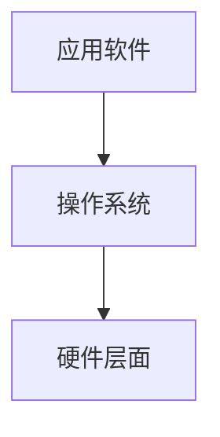

# 操作系统概述

## 一、什么是操作系统

操作系统是计算机硬件和软件之间的一层软件，是管理硬件的软件

- 方便我们使用硬件，如使用显存
- 高效的使用硬件，如开多个终端

管理哪些软件

单操作系统单机：CPU管理，内存管理，终端管理，磁盘管理，文件管理

多核：网络管理，电源管理，多核管理




## 二、操作系统基本概念

1. 打开电源，计算机做了什么

   计算机是怎么工作的？

   就是一个计算模型：图灵机（只能实现一种动作），通用图灵机（可以设置控制器动作）

   通用图灵机：载入一种控制动作，完成指定操作。比如将某一程序载入，可以完成相应功能

   冯诺依曼存储程序思想：将程序和数据存放到计算机内部的存储器中，计算机在程序的控制下一步一步的处理

   计算机五大组成部分：输入设备，输出设备，存储器，运算器，控制器

   ==计算机怎么工作：取指(PC指针指向的指令)执行==

2. 打开电源，计算机执行的第一句指令是什么

   刚打开电源时，第一个取的IP地址是什么？

   以x86 PC为例

   - PC刚开机时CPU处于实时模式
   - 开机时，CS=0xFFFF; IP=0x0000 (CS段地址，寻址CS:IP，CS左移4位+IP)
   - 寻址0xFFFF0(ROM BIOS映射区) (BIOS基本输入输出系统) (0XFFFF0，刚开机时这个地址是唯一有代码的地方)
   - 这段代码主要检查RAM，键盘，显示器，软件硬盘（如果这段代码执行不了，那么硬件可能存在问题）
   - 将磁盘0磁道0扇区读入0x7c00处（存放操作系统的引导扇区，操作系统的第一段代码）
   - 设置cs=0x07c0，ip=0x0000

   引导扇区

   - 引导扇区就是启动设备的第一个扇区
   - 启动设备信息就设置在CMOS中
   - 因此硬盘的第一个扇区存放着开机后执行的第一段我们可以控制的程序(bootsect.s汇编代码)

   bootsect代码做的事情：

   - 将操作系统的代码读入内存（首先将操作系统读入内存）
   - 读入setup
- 在屏幕中打出logo
   - 把操作系统也读入内存
   
   启动盘
   
   | boot扇区 | setup | setup | setup | setup | system模块...(OS代码) |
   | -------- | ----- | ----- | ----- | ----- | --------------------- |
   
   boot扇区执行完，开始转入setup扇区进行执行

## 三、操作系统启动

**setup模块**

- setup将完成OS启动前的设置，读了一些硬件参数

- 把system移到0处

- 执行的最后进入保护模式

  实时模式下：cs左移4+ip

  保护模式下：cs查表+ip

- 运用高级指令到0地址处执行程序

**system模块**

- 第一段代码(head.s)

system由许多文件编译而成

- 调用head.s

- 调用main.c，c程序在执行的过程中使用了系统栈

  进行一些初始化操作

  内存初始化，形成一个表格，用这个表格表示内存中哪些是使用的哪些是没使用过的

**操作系统启动总结**

| boot                     | setup                      | head             | main       |
| ------------------------ | -------------------------- | ---------------- | ---------- |
| 将操作系统从磁盘中读进来 | 设置硬件参数，启动保护模式 | 初始化了一些页表 | 初始化操作 |

合起来就是两步：

1. 将操作系统从磁盘读入内存
2. 完成初始化

## 四、操作系统接口(Interface)

**用户如何使用计算机？**

- 命令行
- 图形按钮
- 应用程序

**命令是什么？命令输入后到底发生了什么？**

- 命令行是一段程序

  shell也是一段程序，shell是始终执行的一段程序，始终等着用户输入命令

- 输入命令后，会执行命令程序，命令程序通常包含有一些特殊功能的函数，比如说一些进程操作

**什么是操作系统接口？**

- 命令行：命令程序
- 图形界面：消息框架程序+消息处理程序

- 应用程序：普通C代码+一些重要的函数（操作系统提供这样的重要参数）

  操作系统提供的重要函数就是操作系统提供的接口，接口表现为函数调用，又由系统提供，所以称为==系统调用==。

**一些重要的接口**

| 分类     | POSIX定义      | 描述                 |
| -------- | -------------- | -------------------- |
| 任务管理 | fork           | 创建一个进程         |
|          | execl          | 运行一个可执行程序   |
|          | pthread_create | 创建一个线程         |
| 文件系统 | open           | 打开一个文件或目录   |
|          | EACCES         | 返回值，表示没有权限 |
|          | mode_t st_mode | 文件头结构：文件属性 |

## 五、系统调用的实现

系统调用不能随意的进入到内核中访问（例如密码）

- 将内核程序和用户程序隔离！

  区分用户态（段）和核心态（段）

  内核段可以访问任何数据，用户段不能访问内核段数据

- 中断是进入内核的唯一方法

- 系统调用的核心

  1. 用户程序中包含一段包含int指令(int 0x80)的代码
  2. 操作系统写中断处理，获取想调程序的编号
  3. 操作系统根据编号执行相应代码

# 操作系统主要内容

==多进程图谱:==CPU、内存

==文件操作视图:==IO、磁盘、文件

==首先将操作系统读入内存，然后应用软件再通过系统调用展开功能。==

多进程视图：CPU管理、内存管理

文件视图：磁盘管理、终端设备管理

## 一、CPU管理的直观想法

操作系统在管理CPU的时候引出了多进程图像，通过多进程图像，操作系统管理明白了CPU

多道程序，交替执行

IO程序的速度要比CPU计算的速度慢6000000倍，为了有效利用CPU，当我们遇到IO程序时，我们可以先去执行其它的任务，等IO程序结束了会发出中断，使我们返回IO程序继续执行，所以CPU执行的规律是多道程序切来切去。

一个CPU上交替执行多个程序：==并发==（同时出发，交替执行）

如何让CPU有效的工作管理各个任务：并发

当运行一个程序，切到另一段程序再切回原程序时，为了避免对原程序之前的信息造成破坏，需要记录原程序信息。这也是运行的程序和静态程序的区别，静态程序在磁盘中不需要处理，但是如果一个程序在内存中，那么说明它正在运行，我们需要记录它的状态信息。

进程：进行中的程序（它和静态存放在磁盘中的程序不一样）

- 进程有开始，有结束，程序没有
- 进程会走走停停，走停对程序无意义
- 进程需要记录状态信息，程序不用

**操作系统如何使用CPU：取指执行，需要给CPU一个首地址，CPU会不断的向下执行。但是这样CPU的利用率很低，如果使CPU可以同时交替的执行多段程序，就需要多进程技术。**

高效的管理CPU的样子：操作系统让多个进程跑起来

## 二、多进程图像

**如何使用CPU：**让程序执行起来

**如何充分的使用CPU：**启动多个程序，交替执行

**启动了的程序就是进程，所以是多个程序推进**

操作系统只需要把这些进程记录好，要按照合理的次序推进（分配资源，进行调度）

就是多进程图像

- 多进程图像从启动到开始到关机结束

  main中的fork()创建了第一个进程（init执行了shell）

  shell再启动其它的进程，一个命令启动一个进程，返回shell再启动其它进程

- 如果计算机特变慢，可能是有些进程CPU利用率特别高，可以打开任务管理器，找一找哪一个进程CPU利用率高。

**操作系统多个系统是如何组织的**

多个进程管理的核心就是PCB（用来记录进程信息的数据结构）

多进程的组织：PCB+状态+队列

- 运行->等待；运行->就绪；就绪->运行......

多进程图像

```c
启动磁盘读写
Pcur.state = 'W'
将pCur放到DiskWaitQueue;
schedule();

schedule() {
	pNew = getNext(ReadyQueue);//调度
	switch_to(pCur,pNew);//括号中为PCB参数
}
```

- 操作寄存器完成切换
- 要写调度程序
- 要有进程同步合作
- 要有地址映射

## 三、用户级线程

进程＝资源（内存）＋指令执行序列（线程）

进程切换＝内存中资源的切换（映射表）＋线程切换（指令执行序列）

- 将资源和指令执行分开
- 一个资源+多个指令执行序列

**线程的优势：**保留了并发的优点，避免了进程切换代价。使得在进程切换时，只需要修改指针的指向而不需要改变映射表。

一个进程中包含了多个指令序列，每一个指令序列都比较轻巧，称之为是线程

**举例：一个网页浏览器**

- 一个线程用来从服务器接收数据
- 一个线程用来显示文本
- 一个线程用来处理图片
- 一个线程用来显示图片

线程中的资源是共享的，线程与进程的不同，进程每一次切换都涉及资源的切换，而线程共享资源，它们之间切换不涉及资源切换。

**创建线程同时出发**

- create

**切换线程**

- Yield

两个线程的样子：两个TCB、两个栈、切换的PC在栈中

## 四、内核级线程

