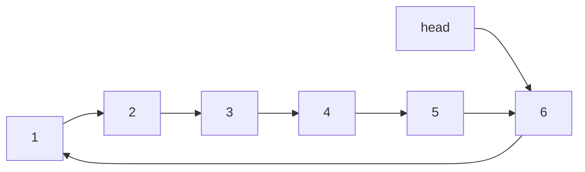
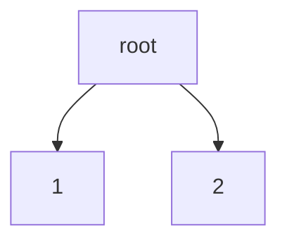
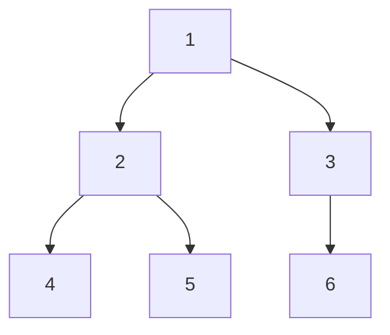

# 数据结构

==数据结构＝结构定义＋结构操作==

数据结构：定义一种性质并维护这种性质的结构

### 顺序表

> 具有连续的存储空间，可以存储任意数据类型

```c
size = 9  //开辟存储空间大小
length =5 //当前已知存储数据的大小
data_type = xxx //数据类型
```

- malloc 动态分配内存

 void *malloc ( size_t size )

> 头文件: stdlib.h
>
> 简单的说：malloc 函数其实就是在内存中：找一片指定大小的空间，然后将这个空间的首地址给一个指针变量，这里的指针变量可以是一个单独的指针，也可以是一个数组的首地址， 这要看malloc函数中参数size的具体内容。我们这里malloc分配的内存空间在逻辑上是连续的，而在物理上可以不连续。我们作为程序员，关注的 是逻辑上的连续，其它的，操作系统会帮着我们处理的。

> 每当动态分配内存空间后，一定要记得调用free，否则会造成[内存泄露问题](https://www.jb51.net/article/41215.htm)

- calloc

void *calloc(size_t num, size_t size);

> calloc多了一个参数size_t num,
>
> 还有一个就是calloc分配了内存之后会将所分配的内存空间置零。

- realloc

void *realloc (void *ptr, size_t new_size ); 

>  realloc函数用于修改一个原先已经分配的内存块的大小，可以使一块内存的扩大或缩小。当起始空间的地址为空，即*ptr = NULL,则同malloc。

执行过程：

> relloc开辟新的一段存储空间，如果空间可以开的下则直接接到原有数据后面，返回第一个数据的地址。

> 如果开不下，则会寻找一段新的空间，然后将原有数据拷贝一份到新的空间，原有空间被free掉。

> 如果没有一段足够大的新的空间，则返回NULL，这样造成的一个严重后果是原有数据可能因此被free掉。

解决办法：

> 可以在每次开辟存储空间时都判断realloc是否返回NULL，如果返回空则减小开辟的空间大小，直到到达可以开辟的大小。

示例代码：

```c
#include <stdio.h>
#include <stdlib.h>
#include <time.h>

typedef struct Vector {
    int *data;
    int size, length;
} Vector;

Vector *init(int n) {
    Vector *v = (Vector *)malloc(sizeof(Vector));
    v->data = (int *)malloc(sizeof(int) * n);
    v->size = n;
    v->length = 0;
    return v;
}

int expand(Vector *v) {
    int extr_size = v->size;
    int *p;
    while (extr_size) {
        p = (int *)realloc(v->data, sizeof(int) * (v->size + extr_size));
        if (p) break;
        extr_size /= 2;
    }
    if (p == NULL) return 0;
    v->size += extr_size;
    v->data = p;
    return 1;
}

int insert(Vector *v, int ind, int x) {
    if (v == NULL) return 0;
    if (ind < 0 || ind  > v->length) return 0;
    if (v->size == v->length) {
        if (!expand(v)) return 0;
        printf("expand Vector success = (%d)\n", v->size);
    }
    for (int i = v->length - 1; i >= ind; i--) {
        v->data[i + 1] = v->data[i];
    }
    v->data[ind] = x;
    v->length++;
    return 1;
}

int erase(Vector *v, int ind) {
    if (v == NULL) return 0;
    if (ind < 0 || ind >= v->length) return 0;
    for (int i = ind; i < v->length - 1; i++) {
        v->data[i] = v->data[i + 1];
    }
    v->length--;
    return 1;
}


void output(Vector *v) {
    printf("Vector(%d) = [", v->length);
    for (int i = 0; i < v->length; i++) {
        i && printf(", ");
        printf("%d", v->data[i]);
    }
    printf("]\n");
}

void clear(Vector *v) {
    if (v == NULL) return ;
    free(v->data);
    free(v);
    return ;
}

int main() {
    srand(time(0));
    Vector *v = init(1);
    #define max_op 20
    int op, ind, val;
    for (int i = 0; i < max_op; i++) {
        op = rand() % 4;
        ind = rand() % (v->length + 3) - 1;
        val = rand() % 100;
        switch (op) {
            case 0: 
            case 1:
            case 2:{
                printf("insert %d at %d to vector = %d\n", val, ind,
                       insert(v, ind, val));
                output(v);
                printf("\n");
            } break;
            case 3: {
                printf("earse elements at %d from Vector = %d\n", 
                      ind, erase(v, ind));
                output(v);
                printf("\n");
            } break;
        }
    }
    clear(v);
    return 0;
}
```

### 链表

程序内部＋内存内部

内存内部：每个节点都由两部分组成，一部分存数据（数据域），一部分为存储下一个节点地址的指针变量（指针域）

```c
typedef struct ListNode {
	int data;
	struct ListNode *next;
} ListNode;
```

程序内部：包括一个头指针和若干个节点

```c
typedef struct List {
	ListNode *head;
	int length;
} List;
```

单向循环链表



头指针指向6号节点，这样可以保证新节点插入的位置和head指针的位移一致。

```c
#include <stdio.h>
#include <stdlib.h>
#include <time.h>

typedef struct ListNode {
    int data;
    struct ListNode *next;
} ListNode;

typedef struct List {
    ListNode head;
    int length;
} List;

ListNode *init_node(int val) {
    ListNode *p = (ListNode *)malloc(sizeof(ListNode));
    p->data = val;
    p->next = NULL;
    return p;
}

List *init_List() {
    List *l = (List *)malloc(sizeof(List));
    l->head.next = NULL;
    l->length = 0;
    return l;
}

int insert(List *l, int ind, int val) {
    if (l == NULL) return 0;
    if (ind < 0 || ind > l->length) return 0;
    ListNode *p = &(l->head), *q = init_node(val);
    while (ind--) p = p->next;
    q->next = p->next;
    p->next = q;
    l->length++;
    return 1;
}

int erase(List *l, int ind) {
    if (l == NULL) return 0;
    if (ind < 0 || ind >= l->length) return 0;
    ListNode *p = &(l->head),  *q;
    while (ind--) p = p->next;
    q = p->next;
    p->next = q->next;
    free(q);
    l->length--;
    return 1;
}

void clear_node(ListNode *node) {
    if (node == NULL) return ;
    free(node);
    return ;
}

void clear_list(List *l) {
    if (l == NULL) return ;
    ListNode *p = l->head.next, *q;
    while (p) {
        q = p->next;
        clear_node(p);
        p = q;
    }
    free(l);
}

void output(List *l) {
    if (l == NULL) return ;
    printf("List(%d) = [", l->length);
    for (ListNode *p = l->head.next; p; p = p->next) {
        printf("%d -> ", p->data);
    }
    printf("NULL]\n");
}

int main() {
    srand(time(0));
    #define max_op 20
    int op, ind, val;
    List *l = init_List();
    for (int i = 0; i < max_op; i++) {
        op = rand() % 4;
        ind = rand() % (l->length + 3) - 1;
        val = rand() % 100;
        switch (op) {
            case 0:
            case 1:
            case 2: {
                printf("insert %d at %d to list = %d\n", 
                       val, ind, insert(l, ind, val));
                output(l);
                printf("\n");
                break;
            }
            case 3: {
                printf("erase elements at %d from list = %d\n",
                       ind, erase(l, ind));
                output(l);
                printf("\n");
                break;
            }
        }
    }
    clear_list(l);
    return 0;
}
```

### 队列

先进先出（FIFO）

**结构操作**

- 出队

改变头指针的位置

- 入队

改变尾指针的位置

- 队列的假溢出

当队列满时，它前面出队的位置上可能还为空。

这时需要循环队列，当尾指针到达队列尾部的时候，可以回到头部判断头部是否为空，如果为空，则还可以继续存储元素。头指针不一定会在尾指针的前面。

```c
typedef struct Queue {
	 int* data;
    int head, tail, length;
}
```

**队列示例代码**

```c
#include <stdio.h>
#include <stdlib.h>
#include <time.h>

typedef struct Queue {
    int *data;
    int head, tail, length, count;
} Queue;

Queue *init(int n) {
    Queue *q = (Queue *)malloc(sizeof(Queue));
    q->data = (int *)malloc(sizeof(int) * n);
    q->head = q->tail = 0;
    q->length = n;
    q->count = 0;
    return q;
}

int empty(Queue *q) {
    return q->count == 0;
}

int top(Queue *q) {
    if (empty(q)) return 0;
    return q->data[q->head];
}

int push(Queue *q, int val) {
    if (q == NULL) return 0;
    if (q->count == q->length) return 0;
    q->data[q->tail] = val;
    q->tail += 1;
    if (q->tail == q->length) q->tail -= q->length;
    q->count++;
    return 1;
}

int pop(Queue *q) {
    if (q == NULL) return 0;
    if (empty(q)) return 0;
    q->head++;
    if (q->head == q->length) q->head -= q->length;
    q->count--;
    return 1;
}

void clear(Queue *q) {
    if (q == NULL) return ;
    free(q->data);
    free(q);
    return ;
}

void output(Queue *q) {
    printf("Queue(%d) = [", q->count);
    for (int i = q->head, j = 0; j < q->count; j++) {
        j && printf(", ");
        printf("%d", q->data[(i + j) % (q->length)]);
    }
    printf("]\n");
}

int main() {
    srand(time(0));
    #define max_op 20
    Queue *q = init(5);
    int op, val;
    for (int i = 0; i < max_op; i++) {
        op = rand() % 4;
        val = rand() % 100;
        switch (op) {
            case 0:
            case 1:
            case 2: {
                printf("push %d to Queue = %d\n", val, push(q, val));
                output(q);
                printf("\n");
            } break;
            case 3: {
                int tmp = top(q);
                printf("pop %d from Queue = %d\n", tmp, pop(q));
                output(q);
                printf("\n");
            } break;
        }
    }
    clear(q);
    return 0;
}
```

### 栈

后进先出（FILO）

```c
size = 5
top = 3
data_type = xxx
```

- 入栈

栈顶指针向上移动一位

插入元素

```c
top++;
```

- 出栈

栈顶指针向下移动一位

```c
top--;
```

例题：括号匹配

先考虑一个括号

> 1. 在任意一个位置上，左括号数量 >= 右括号数量
> 2. 在最后一个位置上，左括号数量 == 右括号数量
> 3. 程序中只需要记录左括号数量和右括号数量即可

```c
bool isValid(char * s){
    int len = strlen(s);
    char *stack = (char *)malloc(sizeof(char) * len);
    int top = -1, flag = 1;
    while (s[0]) {
        switch (s[0]) {
            case '(' :
            case '[' :
            case '{' : stack[++top] = s[0]; break;
            case ')' : flag = (top != -1 && stack[top--] == '('); break;
            case ']' : flag = (top != -1 && stack[top--] == '['); break;
            case '}' : flag = (top != -1 && stack[top--] == '{'); break;
        }
        if (!flag) break;
        s++;
    }
    free(stack);
    return (flag && top == -1);
}
```

**栈示例代码**

```c
#include <stdio.h>
#include <stdlib.h>
#include <time.h>

typedef struct Stack {
    int *data;
    int top, size;
} Stack;

Stack *init(int n) {
    Stack *s = (Stack *)malloc(sizeof(Stack));
    s->data = (int *)malloc(sizeof(int) * n);
    s->top = -1;
    s->size=n;
    return s;
}

int empty(Stack *s) {
    return s->top == -1;
}

int top(Stack *s) {
    if (empty(s)) return 0;
    return s->data[s->top];
}

int push(Stack *s, int val) {
    if (s == NULL) return 0;
    if (s->top  + 1 == s->size) return 0;
    s->top++;
    s->data[s->top] = val;
    return 1;
}

int pop(Stack *s) {
    if (s == NULL) return 0;
    if (empty(s)) return 0;
    s->top--;
    return 1;
}

void clear(Stack *s) {
    if (s == NULL) return ;
    free(s->data);
    free(s);
    return ;
}

void output(Stack *s) {
    printf("Stack =[");
    for (int i = s->top; i >= 0; i--) {
        i != s->top && printf(" ");
        printf("%d", s->data[i]);
    }
    printf("]\n");
}

int main() {
    srand(time(0));
    #define max_op 20
    Stack *s = init(max_op);
    int op, val;
    for (int i = 0; i < max_op; i++) {
        op = rand() % 4;
        val = rand() % 100;
        switch (op) {
            case 0:
            case 1:
            case 2: {
                printf("push %d to stack = %d\n", val, push(s, val));
                output(s);
                printf("\n");
            } break;
            case 3: {
                int tmp = top(s);
                printf("pop %d from stack = %d\n", tmp, pop(s));
                output(s);
                printf("\n");
            } break;
        }
    }
    clear(s);
    return 0;
}
```

栈和队列的对比

|      栈      | 深度优先搜索dfs  |
| :----------: | :--------------: |
| 队列（循环） | 广度优先搜索bfs  |
|    单调栈    | 临近最大（小）值 |
|   单调队列   | 区间最大（小）值 |

### 单调队列

**解决问题：**求解滑动窗口区间内的最值问题

**问题引入**

> RMQ(x, y)就是询问数组[x, y]区间内部的最小值
>
> 例如：RMQ(0, 3) = 1, RMQ(3, 7) = 2
>
> 现在，固定询问区间的尾部，例如RMQ(x, 7)
>
> 请思考，如下序列中至少记录几个元素，就可以满足RMQ的任何需求

| 0     | 1     | 2     | 3     | 4     | 5     | 6     | 7      |
| ----- | ----- | ----- | ----- | ----- | ----- | ----- | ------ |
| ~~3~~ | ==1== | ~~4~~ | ~~5~~ | ==2== | ~~9~~ | ==8== | ==12== |

> 当考虑6号位置时，6号位置的元素小于7号位置的元素，所以需要存储
>
> 考虑5号位置元素，由于其比6号位置的元素大，当使用RMQ(5, 7)时，仍然返回8，故其对结果没有影响，不必存储
>
> 以此类推
>
> 可以得到一个单调队列
>
> 也就是说只需选取队列中的一些值，就可以满足RMQ的需求

> 这个新生成的单调队列需要满足以下两点要求
>
> 1. 当队列尾部增添元素时，应新增加尾部元素，并维护队列的单调性，因此需要从队列尾部向前删除比队尾大的元素
> 2. 当有元素从头部出队时，如果存在单调队列中的元素，则在单调队列中该元素也需出队

> ==一个单调递增的序列可以维护区间最小值，即头部元素==
>
> 一个单调递减的序列可以维护区间最大值，即尾部元素

**例题：**滑动窗口法求解区间极大极小值（oj271）

```c
#include <stdio.h>
#include <stdlib.h>
#include <iostream>
using namespace std;

#define max_n 300000
int a[max_n + 5];
int q[max_n + 5], head = 0, tail = 0;

int main() {
    int n, k;
    cin >> n >> k;
    for (int i = 0; i < n; i++) cin >> a[i];
    for (int i = 0; i < n; i++) {
        //取区间最小值，故维护队列q中应单调递增。当新增一个元素时，
        //判断末尾元素是否大于等于新加入元素，如果大于等于新元素则不满足单调性，需要删除
        while (tail - head && a[i] < a[q[tail - 1]]) tail--;
        q[tail++] = i;//当前元素下标入队列
        if (i + 1 < k) continue;//判断窗口内是否含有k个元素
        if (i - q[head] == k) head++;//判断窗口中元素是否溢出，溢出将前面的元素删掉
        i + 1 != k && cout << " ";//控制第一次输出元素时不输出空格
        cout << a[q[head]];
    }
    cout << endl;
    head = tail = 0;
    for (int i = 0; i < n; i++) {
        //取区间最小值，故维护队列q中应单调递减。当新增一个元素时，
        //判断末尾元素是否小于等于新加入元素，如果小于等于新元素则不满足单调性，需要删除
        while (tail - head && a[i] > a[q[tail - 1]]) tail--;
        q[tail++] = i;//当前元素入队列
        if (i + 1 < k) continue;//判断窗口内是否含有k个元素
        if (i - q[head] == k) head++;//判断窗口中元素是否溢出，溢出将前面的元素删掉
        i + 1 != k && cout << " ";//控制第一次输出元素时不输出空格
        cout << a[q[head]];
    }
    cout << endl;   
    return 0;
}
```

### 单调栈

**问题引入**

给定一个序列求序列中，每个元素左侧，第一个小于它的元素

类似单调队列，当从尾部添加元素时，它会依次干掉在它之前不符合单调性的元素

以这样的方式执行，当前元素在队列中的前一个元素，就是元素左侧第一个比它小的值

这种不从头部出的结构，称之为单调栈

把单调队列的头部堵死就变成了单调栈

- 单调队列

擅长维护区间的最值问题，最小值对应的是单调递增序列

- 单调栈

擅长维护最近大于小于关系

从左侧先入栈，就是维护左侧最近关系

从右侧先入栈，就是维护右侧最近关系

**例题：**求解矩形的最大面积

```c
#include <iostream>
using namespace std;

#define max_n 100000
int h[max_n + 5];
int l[max_n + 5];//代表左边第一个比当前矩形小的编号
int r[max_n + 5];//右边～～～
int s[max_n + 5], top = -1;//定义一个单调栈

int main() {
    int n;
    cin >> n;
    s[0] = s[n + 1] = -1;
    for (int i = 1; i <= n; i++) cin >> h[i];
    s[++top] = 0;
    for (int i = 1; i <= n; i++) {
        while (top != -1 && h[i] <= h[s[top]]) top--;
        l[i] = s[top];
        s[++top]=i;
    }
    
    top = -1;
    s[++top] = n + 1;
    for (int i = n; i >= 1; i--) {
        while (top != -1 && h[i] <= h[s[top]]) top--;
        r[i] = s[top];
        s[++top]=i;
    }

    int ans = 0;
    for (int i = 0; i <= n; i++) {
        ans = max(ans, h[i] * (r[i] - l[i] - 1));
    }
    cout << ans << endl;
    return 0;
}
```

**例题：双生序列**

```c
#include <iostream>
using namespace std;
#define max_n 500000
int a[max_n + 5], b[max_n + 5];

int main() {
    int n; 
    cin >> n;
    for (int i = 0; i < n; i++) cin >> a[i];
    for (int j = 0; j < n; j++) cin >> b[j];
    int p = 1, top1 = -1, top2 = -1;
    while (p < n) {
        while (top1 != -1 && a[p] <= a[top1]) top1--;
        while (top2 != -1 && b[p] <= b[top2]) top2--;
        if (top1 - top2) break;
        a[++top1] = a[p];
        b[++top2] = b[p];
        p++;
    }
    cout << p << endl;
    return 0;
}
```

- 例题leecode42


示例代码：

```c
int trap(int* height, int heightSize){
    int n = heightSize, ans = 0, top = -1;
    int *stack = (int *)malloc(sizeof(int) * n);//维护一个单调递减栈,存储的为柱子的下标
    for (int i = 0; i < n; i++) {
        while (top != -1 && height[i] >= height[stack[top]]) {//当遇到不符合单调递减的柱子时，这时证明会有积水的存在，计算积水的宽度d以及高度h
            int tmp = stack[top--];//到这里时，证明当前的stack[top]处为低洼处，进行填充
            if (top == -1) break;
            int d =  i - stack[top] - 1;//宽度i - 当前栈顶指向的下标 - 1
            int h = (height[i] > height[stack[top]] ? height[stack[top]] : height[i]) - height[tmp];//积水高度取两边较矮的减去低洼处高度
            ans += h * d;
            //printf("ans(%d) = %d\n", i, ans);
        }
        stack[++top] = i;
    }
    free(stack);
    return ans;
}
```

### 树与二叉树

非线性结构



**结构定义**

```c
typedef struct Node {
	int data;
	struct Node *next[2];//二叉树
} Node, *Tree;
```

- 数的深度，从根节点出发到最深的节点处的节点数
- 树的高度是从当前节点到最深节点的节点数，深度是从根节点到当前节点的节点数
- 节点的度等于它下面所接的节点数量
- 节点数量等于边数+1

##### 二叉树

**结构定义**

- 每个节点度最多为２
- 度为0的节点比度为２的节点多一个

> n1 + n0 + n2 = n1 + 0 + 2*n2 + 1
>
> n0 = n2 + 1



**遍历**

1. 前序遍历：根左右
2. 中序遍历：左根右
3. 后序遍历：左右根

**完全二叉树**

1. 编号为i的子节点

   左孩子编号：２* i

   右孩子编号：２* i + 1

2. 可以用连续空间存储（数组）

**广义表**

二叉树的表示形式

1. （）　　　　 空树
2.   A / A()  　　  只有一个根节点
3.   A(B, ) / A(B) 　有一个左孩子B
4.   A(B, C)　　　有左右孩子　

**示例代码**

```c
#include <stdio.h>
#include <stdlib.h>
#include <time.h>

typedef struct Node {
    int data;
    struct Node *lchild, *rchild;
} Node;

typedef struct Tree {
    Node *root;
    int n;
} Tree;

Node *init_node(int val) {
    Node *p = (Node *)malloc(sizeof(Node));
    p->data = val;
    p->lchild = p->rchild = NULL;
    return p;
}

Tree *init_tree() {
    Tree *tree = (Tree *)malloc(sizeof(Tree));
    tree->root = NULL;
    tree->n = 0;
    return tree;
}

Node *insert_node(Node *root, int val, int *flag) {
    if (root == NULL) {
        *flag = 1;
        return init_node(val);
    }
    if (root->data == val) return root;
    if (val < root->data) root->lchild = insert_node(root->lchild, val, flag);
    else root->rchild = insert_node(root->rchild, val, flag);
    return root;
}

void insert(Tree *tree, int val) {
    int flag = 0;//用于记录树中的节点个数
    tree->root = insert_node(tree->root, val, &flag);
    tree->n += flag;
    return ;
}

void outputNode(Node *root) {//打印广义表
    if (root == NULL) return ;
    printf("%d", root->data);
    printf("(");
    outputNode(root->lchild);
    printf(",");
    outputNode(root->rchild);
    printf(")");
    return ;
}

void output(Tree *tree) {
    printf("tree(%d): ", tree->n);
    outputNode(tree->root);
    printf("\n");
    return ;
}

void pre_orderNode(Node *root) {
    if (root == NULL) return ;
    printf("%d ", root->data);
    pre_orderNode(root->lchild);
    pre_orderNode(root->rchild);
    return ;
}

void pre_order(Tree *tree) {
    printf("pre_order : ");
    pre_orderNode(tree->root);
    printf("\n");
    return ;
}

void in_orderNode(Node *root) {
    if (root == NULL) return ;
    in_orderNode(root->lchild);
    printf("%d ", root->data);
    in_orderNode(root->rchild);
    return ;
}

void in_order(Tree *tree) {
    printf("in_order : ");
    in_orderNode(tree->root);
    printf("\n");
    return ;
}

void post_orderNode(Node *root) {
    if (root == NULL) return ;
    post_orderNode(root->lchild);
    post_orderNode(root->rchild);
    printf("%d ", root->data);
    return ;
}

void post_order(Tree *tree) {
    printf("post_order : ");
    post_orderNode(tree->root);
    printf("\n");
    return ;
}
void clear_node(Node *node) {
    if (node == NULL) return ;
    clear_node(node->lchild);
    clear_node(node->rchild);
    free(node);
    return ;
}

void clear_tree(Tree *tree) {
    if (tree == NULL) return ;
    clear_node(tree->root);
    free(tree);
    return ;
}

int main() {
    srand(time(0));
    #define max_op 10
    Tree *tree = init_tree();
    for (int i = 0; i < max_op; i++){
        int val = rand() % 100;
        insert(tree, val);
        output(tree);
    }
    pre_order(tree);
    in_order(tree);
    post_order(tree);
    clear_tree(tree);
    return 0;
}
```

### 排序

##### 稳定排序

1. 插入排序

时间复杂度：O(n^2^)

> - 将数组分为已排序区和待排序区
>
> - 将已排序区后面一个元素，向前插入到待排序区中
> - 直到待排序区没有元素为止

2. 冒泡排序

时间复杂度：O(n^2^)

> - 将数组分为已排序区和待排序区
> - 从头到尾扫描待排序区，若前面元素比后面元素大，则交换
> - 每一轮都会将待排序区中最大的放到已排序区的开头
> - 直到待排序区没有元素为止

优化小技巧：

- 当某一轮冒泡过程中没有任何交换操作的时候，结束整个冒泡排序过程

3. 归并排序

核心思想：分治

时间复杂度：O(n * log~2~n)

> - 将数据分为两个部分，对两部分分别进行排序
> - 对每一部分进一步分为两部分进行排序，直到只剩两个数
> - 对两部分分别排序好的部分进行合并

**稳定排序示例代码：**

```c
#include <stdio.h>
#include <stdlib.h>
#include <time.h>
#include <string.h>

#define swap(a, b) {\
    __typeof(a) __temp = a;\
    a = b; b = __temp;\
} 

#define TEST(arr, n, func, args...) {\
    int *num = (int *)malloc(sizeof(int) * n);\
    memcpy(num, arr, sizeof(int) * n);\
    output(num, n);\
    printf("%s = ", #func);\
    func(args);\
    output(num, n);\
    free(num);\
}

//插入排序
void insert_sort(int *num, int n) {
    for (int i = 1; i < n; i++) {
        for (int j = i; j > 0 && num[j] < num[j - 1]; j--) {
            swap(num[j], num[j - 1]);
        }
    }
    return ;
}

//冒泡排序
void bubble_sort(int *num, int n) {
    int flag;
    for (int i = 1; i < n; i++) {
        flag = 1;
        for (int j = 0; j < n - i; j++) {
            if (num[j] < num[j + 1]) continue;
            flag = 0;
            swap(num[j], num[j + 1]);
        }
        if (flag) return ;
    }
    return ;
}

//归并排序
void merge_sort(int *num, int l, int r) {
    if (r - l <= 1) {
        if (r - l == 1 && num[l] > num[r]) {
            swap(num[l], num[r]);
        }
        return ;
    }
    int mid = (l + r) >> 1;
    merge_sort(num, l, mid);
    merge_sort(num, mid + 1, r);

    int *temp = (int *)malloc(sizeof(int) * (r - l + 1));
    int p1 = l, p2 = mid + 1, k = 0;
    while (p1 <= mid || p2 <= r) {
        if (p2 > r || (p1 <= mid && num[p1] <= num[p2])) {
            temp[k++] = num[p1++];
        } else {
            temp[k++] = num[p2++];
        }
    }

    memcpy(num + l, temp, sizeof(int) * (r - l + 1));
    free(temp);
    return ;
} 

void randint(int *arr, int n) {
    while (n--) arr[n] = rand() % 100;
    return ;
}

void output(int *num, int n) {
    printf("[");
    for (int i = 0; i < n; i++) {
        printf(" %d", num[i]);
    }
    printf("]\n");
}

int main() {
    srand(time(0));
    #define max_op 20
    int arr[max_op];
    randint(arr, max_op);
    TEST(arr, max_op, insert_sort, num, max_op);
    TEST(arr, max_op, bubble_sort, num, max_op);
    TEST(arr, max_op, merge_sort, num, 0, max_op - 1);
    return 0;
}
```

##### 不稳定排序

1. 选择排序

> - 将数组分为已排序区和待排序区
> - 每一轮从待排序区中选择一个最小的元素放到已排序区的尾部
> - 直到待排序区没有元素为止

2. 快排

时间复杂度：O(nlogn)

核心思想：分治

> - 将开头元素当做基准值
> - 用两个指针指向数组的头部和尾部

> 优化：选中间值为基准值，递归改为循环减少调用函数所耗时间

**不稳定排序示例代码**

```c
#include <stdio.h>
#include <stdlib.h>
#include <time.h>
#include <string.h>

#define swap(a, b) {\
    __typeof(a) temp = a;\
    a = b; b = temp;\
}

#define TEST(arr, n, func, args...) {\
    int *num = (int *)malloc(sizeof(int) * n);\
    memcpy(num, arr, sizeof(int) * n);\
    output(num, n);\
    printf("%s = ", #func);\
    func(args);\
    output(num, n);\
    free(num);\
}

void select_sort(int *num, int n) {
    for (int i = 0; i < n - 1; i++) {
        int ind = i;
        for (int j = i + 1; j < n; j++) {
            if (num[j] < num[ind]) ind = j;
        }
        swap(num[i], num[ind]);
    }
    return ;
}

void quick_sort(int *num, int l, int r) {
    if (r < l) return ;
    int x = l, y = r, z = num[l];
    while (x < y) {
        while (x < y && num[y] >= z) y--;
        if (x < y) num[x++] = num[y];
        while (x < y && num[x] <= z) x++;
        if (x < y) num[y--] = num[x];
    }
    num[x] = z;
    quick_sort(num, l, x - 1);
    quick_sort(num, x + 1, r);
}


void randint(int *num, int n) {
    while (n--) num[n] = rand() % 100;
}

void output(int *num, int n) {
    printf("[");
    for (int i = 0; i < n; i++) {
        printf(" %d", num[i]);
    }
    printf("]\n");
}

int main() {
    srand(time(0));
    #define max_op 20
    int arr[max_op];
    randint(arr, max_op);
    output(arr, max_op);
    TEST(arr, max_op, select_sort, num, max_op);
    TEST(arr, max_op, quick_sort, num, 0, max_op - 1);
    return 0;
}
```

### 查找

##### 二分查找

时间复杂度nlog~2~n

- 特殊情况

> 111111000000  寻找最后一个1

- 特殊情况

> 000001111111 寻找第一个1

##### 三分查找

求解凹凸函数极值点问题

> m1是[L, R]的1/3处
>
> m2是[L, R]的2/3处

> 调整：
>
> - 如果f[m1] < f[m2], L=m1
> - 如果f[m2] < f[m1], R=m2
> - 如果|m1-m2| < exp, 找到结果


### 哈希表 

插入时间复杂度：O(1)

查找时间复杂度：接近O(1)，因为有可能在产生冲突的时候需要查找链表，链表又很长的情况下时间复杂度会增加

> - 哈希函数val % size
> - 16元素存放在下标为7的位置
> - 7元素存放在下标为7的位置
> 
> 由上面可以看出，7与16存放在同一个位置，即产生冲突

> 冲突处理方法
>
> 1.  开放定值法：产生冲突时，不断向后面的位置试探
>
> 2. 拉链法：映射到同一个位置时，采用链表进行存储
>
> 3. 再哈希法：当产生冲突时，继续利用哈希表进行存储
>
> 4. 建立公共溢出区：存储产生冲突的位置

```c
#include <stdio.h>
#include <stdlib.h>
#include <string.h>

typedef struct Node {//使用拉链法解决冲突
    char *str;
    struct Node *next;
} Node;

typedef struct Hashtable {
    Node **data;//其实哈希表的结构和顺序表一样，不过其中存放的是链表头指针的地址，即指向指针的指针
    int size;
} Hashtable;

Node *init_node(char *str, Node *head) {
    Node *p = (Node *)malloc(sizeof(Node));
    p->str = strdup(str);//先动态生成一段存储空间，拷贝字符串后返回存储空间首地址
    p->next = head;
    return p;
}

Hashtable *init_hashtable(int n) {
    Hashtable *h = (Hashtable *)malloc(sizeof(Hashtable));
    h->size = n << 1;//一般尺寸扩大两倍
    h->data = (Node **)calloc(h->size, sizeof(Node *));
    return h;
}

int BKDRHash(char *str) {
    int seed = 31, hash = 0;
    for (int i = 0; str[i]; i++) hash = hash * seed + str[i];
    return hash & 0x7ffffff;
}

int insert(Hashtable *h, char *str) {//haxihan
    int hash = BKDRHash(str);
    int ind = hash % h->size;
    h->data[ind] = init_node(str, h->data[ind]);
    return 1;
}

int search(Hashtable *h, char *str) {
    int hash = BKDRHash(str);
    int ind = hash % h->size;
    Node *p = h->data[ind];
    while (p && strcmp(p->str, str)) p = p->next;
    return p != NULL;
}

void clear_node(Node *node) {
    if (node == NULL) return ;
    Node *p = node, *q;
    while (p) {
        q = p->next;
        free(p->str);
        free(p);
        p = q;
    }
    free(q);
    return ;
}

void clear_hash(Hashtable *h) {
    if (h == NULL) return ;
    for (int i = 0; i < h->size; i++) clear_node(h->data[i]);
    free(h->data);
    free(h);
    return ;
}


int main() {
    int op;
    #define max_n 100
    char str[max_n + 5] = {0};
    Hashtable *h = init_hashtable(max_n + 5);
    while (~scanf("%d%s", &op, str)) {
        switch (op) {
            case 0:
                printf("insert %s to hashtable.\n", str);
                insert(h, str);
                break;
            case 1:
                printf("search %s from hashtable = %d.\n", str, search(h, str));
                break;
        }
    }
    #undef max_n
    clear_hash(h);
    return 0;
}
```

### 堆与优先队列

- 大顶堆

根节点始终是最大的

作用：获取一组元素的最大值

- 小顶堆

根节点始终是最小的
作用：获取一组元素的最小值

- 尾部插入调整

> 1. 在尾部插入一个数
> 2. 和根节点对比，不断进行调整

- 头部弹出调整

只能从堆顶弹出元素

> 1. 删除堆顶元素，将堆尾元素移动堆顶
> 2. 不断向下进行调整

**为什么叫优先队列**

堆的插入和删除操作符合FIFO操作，尾部插值，堆顶删除

优先体现在每次删除的都是最大或最小的

- 堆排序

> 1. 将堆顶元素与堆尾元素交换
> 2. 将此操作看做是堆顶元素弹出操作
> 3. 按照头部弹出以后的策略调整堆

大顶堆：从小到大的排序方式

小顶堆：从大到小的排序方式

**大顶堆示例代码**

```c
#include <stdio.h>
#include <stdlib.h>
#include <time.h>

#define swap(a, b) {\
    __typeof(a) __temp = a;\
    a = b; b = __temp;\
}

typedef struct priority_queue {
    int *data;
    int cnt, size;
} priority_queue;

priority_queue *init(int n) {
    priority_queue *q = (priority_queue *)malloc(sizeof(priority_queue));
    q->data = (int *)malloc(sizeof(int) * (n + 1));
    q->cnt = 0;
    q->size = n;
    return q;
}

int empty(priority_queue *q) {
    return q->cnt == 0;
}

int top(priority_queue *q) {
    return q->data[1];
}

int push(priority_queue *q, int val) {
    if (q == NULL) return 0;
    if (q->cnt == q->size) return 0;
    q->data[++(q->cnt)] = val;
    int ind = q->cnt;
    while (ind >> 1 && q->data[ind] > q->data[ind >> 1]) {
        swap(q->data[ind], q->data[ind >> 1]);
        ind >>= 1;
    }
    return 1;
}

int pop(priority_queue *q) {
    if (q == NULL) return 0;
    if (empty(q)) return 0;
    q->data[1] = q->data[q->cnt--];
    int ind = 1;
    while (ind << 1 <= q->cnt) {
        int tmp = ind, l = ind << 1, r = ind << 1 | 1;//|相当于+1
        if (q->data[l] > q->data[tmp]) tmp = l;
        if (r <= q->cnt && q->data[r] > q->data[tmp]) tmp = r;
        if (tmp == ind) break;
        swap(q->data[tmp], q->data[ind]);
        ind =tmp;
    }
    return 1;
}

void clear(priority_queue *q) {
    if (q == NULL) return ;
    free(q->data);
    free(q);
    return ;
}

int main() {
    srand(time(0));
    #define max_op 20
    priority_queue *q = init(max_op);
    for (int i = 0; i < max_op; i++) {
        int val = rand() % 100;
        push(q, val);
        printf("insert %d to the priority_queue\n", val);
    }
    for (int i = 0; i < max_op; i++) {
        printf("%d ", top(q));
        pop(q);
    }
    printf("\n");
    #undef max_op
    clear(q);
    return 0;
}
```

### 并查集

- 连通性问题

**Quick-find算法**

> 基于染色的思想，一开始所有点的颜色不同
>
> 连接两个点的操作，可以看成是将一种颜色染成另一种颜色
>
> 如果两个点颜色相同，证明联通，否则不连通
>
> 这种方法称为并查集的Quick-Find算法

连通判断：O(1)

合并操作：O(n)

例题：朋友圈问题

```c
#include <stdio.h>
#include <stdlib.h>

typedef struct UnionSet {
    int *color;//颜色标记
    int n;//并查集的空间大小
} UnionSet;

UnionSet *init(int n) {
    UnionSet *u = (UnionSet *)malloc(sizeof(UnionSet));
    u->color = (int *)malloc(sizeof(int) * (n + 1));
    u->n = n;
    for (int i = 1; i <= n; i++) {//初始化每个节点的颜色
        u->color[i] = i;
    }
    return u;
}

int find(UnionSet *u, int x) {
    return u->color[x];
}

int merge(UnionSet *u, int a, int b) {
    if (find(u, a) == find(u, b)) return 0;//如果a,b本来在一个集合，则不需要重新染色
    int color_a = u->color[a];//若不在一个集合，则把集合中所有和a相同的位置染成b的颜色
    for (int i = 1; i <= u->n; i++) {
        if (u->color[i] - color_a) continue;
        u->color[i] = u->color[b];
    }
    return 1;
}

void clear(UnionSet *u) {
    if (u == NULL) return ;
    free(u->color);
    free(u);
    return ;
}

int main() {
    int n, m;
    int a, b, c;
    UnionSet *u = init(n);
    scanf("%d%d", &n, &m);
    for (int i = 0; i < m; i++) {
        scanf("%d%d%d", &a, &b, &c);
        switch (a) {
            case 1: merge(u, b, c); break;
            case 2:  {
                printf("%s", find(u, b) == find(u, c) ? "YES" : "NO");
            } break;
        }
    }
    clear(u);
    return 0;
}
```

**Quick-Union算法**

连通判断：tree-height树高

合并操作：tree-height树高

极端情况下退化成一条链表，应按照节点的数量进行合并

```c
#include <stdio.h>
#include <stdlib.h>

typedef struct UnionSet {
    int *father;
    int n;
} UnionSet;

UnionSet *init(int n) {
    UnionSet *u = (UnionSet *)malloc(sizeof(UnionSet));
    u->father = (int *)malloc(sizeof(int) * (n + 1));
    u->n = n;
    for (int i = 1; i <= n; i++) {
        u->father[i] = i;
    }
    return u;
}

int find(UnionSet *u, int x) {
    if (u->father[x] == x) return x;
    return find(u, u->father[x]);
}

int merge(UnionSet *u, int a, int b) {
    int fa = find(u, a), fb = find(u, b);
    if (fa == fb) return 0;
    u->father[fa] = fb;
    return 1;
}

void clear(UnionSet *u) {
    if (u == NULL) return ;
    free(u->father);
    free(u);
    return ;
}

int main() {
    int n, m;
    int a, b, c;
    UnionSet *u = init(n);
    scanf("%d%d", &n, &m);
    for (int i = 0; i < m; i++) {
        scanf("%d%d%d", &a, &b, &c);
        switch (a) {
            case 1: merge(u, b, c); break;
            case 2:  {
                printf("%s", find(u, b) == find(u, c) ? "YES" : "NO");
            } break;
        }
    }
    clear(u);
    return 0;
}
```

**Weigthed Quick-Union算法**

联通判断：log(N)

合并判断：log(N)

在每次进行合并的时候，按节点数量进行合并，减少树高

```c
#include <stdio.h>
#include <stdlib.h>

typedef struct UnionSet {
    int *father;
    int n;
} UnionSet;

UnionSet *init(int n) {
    UnionSet *u = (UnionSet *)malloc(sizeof(UnionSet));
    u->father = (int *)malloc(sizeof(int) * (n + 1));
    u->n = n;
    for (int i = 1; i <= n; i++) {
        u->father[i] = i;
    }
    return u;
}

int find(UnionSet *u, int x) {
    if (u->father[x] == x) return x;
    return find(u, u->father[x]);
}

int merge(UnionSet *u, int a, int b) {
    int fa = find(u, a), fb = find(u, b);
    if (fa == fb) return 0;
    u->father[fa] = fb;
    return 1;
}

void clear(UnionSet *u) {
    if (u == NULL) return ;
    free(u->father);
    free(u);
    return ;
}

int main() {
    int n, m;
    int a, b, c;
    UnionSet *u = init(n);
    scanf("%d%d", &n, &m);
    for (int i = 0; i < m; i++) {
        scanf("%d%d%d", &a, &b, &c);
        switch (a) {
            case 1: merge(u, b, c); break;
            case 2:  {
                printf("%s", find(u, b) == find(u, c) ? "YES" : "NO");
            } break;
        }
    }
    clear(u);
    return 0;
}
```

**路径压缩**

连通判断：接近1

合并操作：接近1

最大程度上减少树的高度

### 哈夫曼编码

- 什么是编码

'a' = 97 = $ (0110\ 0001)_2$

'0' = 48 = $(0011\ 0000)_2$

注意：任何信息，在计算机中，都是二进制存储的

信息："aa00" = $01100001,01100001,00110000,00110000$

一台计算机传输到另外一条计算机，需要传输32bit位

假设计算机网络的带宽是32bit/s，所以用时1s

- 定长编码

统一编码形式，对于每一个字符，编码长度相同。比如ASCII编码,UTF-16

- 变长编码

对于每一个字符，编码长度不同。

按劳分配，出现概率大的字符编码为更简洁的形式，更大程度上减少编码位数。比如：UTF-8

- 平均编码长度

平均编码长度 $avg(l)= p1* l1 + p2 * l2 + ... +pn * ln = \sum_{i=1}^n{pi * li}$

$li$:第i种字符，编码长度

$pi$:第i种字符，出现概率

假设：平均编码长度为1.16，估算传输100个字符，需要传输116个bit位

**哈夫曼编码**

$E = \sum_{i=1}^n{pi * li}$

当pi比越大时，让其编码长度越小，最大程度上减少E

例如:a-z中e出现的概率大，则使e的编码长度最小

1. 首先，统计得到每一种字符的概率
2. 将n个字符，建立成一棵哈夫曼树
3. 每一个字符都落在叶子节点上
4. 按照左0右1的形式，将编码读取出来

**构造哈夫曼树**

1. 将所有字符按照概率从小到大排列
2. 每次从序列中取出概率最小的两个字符作为一个新节点N1的两个子节点
3. 将取出的两个字符从序列中取出，将新合成的节点插入，重复1,2步骤

````mermaid
graph TD
node3--0-->a
node3--1-->node2
node2--0-->0
node2--1-->node1
node1--0-->b
node1--1-->1
````

由于每一个字符都落在叶子节点上，所以不会出现前缀冲突。

> 字符出现频次：a:0.8 | b:0.05 | 0:0.1 | 1:0.05
>
> a:0 | b: 110 | 0: 10 | 1: 111

- 示例代码

```c++
#include <stdio.h>
#include <stdlib.h>

#define swap(a, b) {\
    __typeof(a) temp = a;\
    a = b; b = temp;\
}

typedef struct Node {
    char ch;
    double p;
    struct Node *lchild, *rchild;
} Node;

Node *getnewnode(char ch, double per) {
    Node *p = (Node *)malloc(sizeof(Node));
    p->ch = ch;
    p->p = per;
    p->lchild = p->rchild = NULL;
    return p;
}

Node *CombinNode(Node *a, Node *b) {
    Node *p = getnewnode(0, a->p + b->p);
    p->lchild = a;
    p->rchild = b;
    return p;
}

void pick_min(Node **arr, int n) {
    for (int j =  n - 1; j >= 0; j--) {
        if (arr[n]->p > arr[j]->p) {
            swap(arr[n], arr[j]);
        }
    }
    return ;
}

Node *getHaffmanTree(Node **arr, int n) {//构建哈夫曼树
    for (int i = 1; i < n; i++) {
        pick_min(arr, n - i);
        pick_min(arr, n - i - 1);
        arr[n - i - 1] = CombinNode(arr[n - i], arr[n - i - 1]);
    }
    return arr[0];//最后返回根节点
}

void clear(Node *root) {
    if (root == NULL) return ;
    clear(root->lchild);
    clear(root->rchild);
    free(root);
    return ;
}

void __output_encode(Node *root, char *str, int k) {
    str[k] = 0;
    if (root->lchild == NULL && root->rchild == NULL) {
        printf("%c %s\n", root->ch, str); //叶子节点为字符节点，输出编码
        return ;
    }
    str[k] = '0'; //遍历左子树时，先加入0
    __output_encode(root->lchild, str, k + 1);
    str[k] = '1'; //遍历右子树时，先加入1
    __output_encode(root->rchild, str, k + 1);
    return ;
}

void output_encode(Node *root) {//封装一层，为了获取字符的编码
    char str[100];
    __output_encode(root, str, 0);//0表示当前树高
    return ;
}

int main() {
    int n;
    Node **arr;
    scanf("%d", &n);
    arr = (Node **)malloc(sizeof(Node *) * n);
    for (int i = 0; i < n; i++) { //输入每个节点数据，包括字符及概率
        char ch[10];
        double p;
        scanf("%s%lf", ch, &p);
        arr[i] = getnewnode(ch[0], p);
    }
    Node *root = getHaffmanTree(arr, n); //构建哈夫曼树
    output_encode(root);
    clear(root);
    free(arr);
    return 0;
}
```

|数据结构|解决问题|
| :--: | :------------------: |
| 队列 | 树形结构层序遍历问题 |
| 栈   | 具有完全包含关系问题 |
| 单调栈 | 最近大于小于关系 |
| 单调队列 | 区间最值问题 |
| 并查集 | 连通性问题 |
| 字典树 | 文件索引问题 |
| AC机 | 多模匹配问题 |

### 二叉排序树（BS树）

- 性质

1. 左子树 < 根节点
2. 右子树 > 根节点
3. 中序遍历的结果是一个有序序列

- 用途

解决与排名相关的检索需求

- 插入操作

1. 插入的新节点一定会作为叶子节点
2. 插入操作要保持二叉排序树的性质

- 删除

1. 删除度为0的节点，直接删除
2. 删除度为1的节点，把孤儿子树挂到其父节点上面去
3. 删除度为2的节点，可以转换成删除度为1的节点，具体操作就是另其前驱节点代替它，然后删除其前驱节点

对于度为2的节点：

1. 前驱节点：左子树最大值
2. 后继节点：右子树最小值

插入顺序会影响最终的树型结构，不同树型结构，查找效率不同

**平均查找效率**：把所有节点的查找次数加和取平均$\frac{sum}{num}$

习题：leetcode110，leetcode669

- 示例代码

```c++
#include <stdio.h>
#include <stdlib.h>

#define KEY(n) (n ? n->key : 0)

typedef struct Node {
    int key;
    struct Node *lchild, *rchild;
} Node;

Node *getnewNode(int key) {
    Node *p = (Node *)malloc(sizeof(Node));
    p->key = key;
    p->lchild = p->rchild = NULL;
    return p;
}

int search(Node *root, int val) {
    if (root == NULL) return 0;
    if (root->key == val) return 1;
    if (val < root->key) return search(root->lchild, val);
    return search(root->rchild, val);
}

Node *insert(Node *root, int key) {
    if (root == NULL) return getnewNode(key);
    if (root->key == key) return root;
    if (key < root->key) root->lchild = insert(root->lchild, key);
    else root->rchild = insert(root->rchild, key);
    return root;
}

Node *predecessor(Node *root) {
    Node *temp = root->lchild;
    while (temp->rchild) temp = temp->rchild;
    return temp;
}

Node *erase(Node *root, int key) {
    if (root == NULL) return NULL;
    if (key < root->key) {
        root->lchild = erase(root->lchild, key);
    } else if (key > root->key) {
        root->rchild = erase(root->rchild, key);
    } else {
        if (root->lchild == NULL && root->rchild == NULL) {
            free(root);
            return NULL;
        } else if (root->lchild == NULL || root->rchild == NULL) {
            Node *temp = root->lchild ? root->lchild : root->rchild;
            free(root);
            return temp;
        } else {
            Node *temp = predecessor(root);
            temp->key = temp->key;
            root->lchild = erase(root->lchild, temp->key);
        }
    }
    return root;
}

void clear(Node *root) {
    if (root == NULL) return ;
    clear(root->lchild);
    clear(root->rchild);
    free(root);
    return ;
}

void output(Node *root) {
    if (root == NULL) return ;
    output(root->lchild);
    printf("(%d, %d, %d)\n", KEY(root), KEY(root->lchild), KEY(root->rchild));
    output(root->rchild);
    return ;
}

int main() {
    int op, val;
    Node *root = NULL;
    while (~scanf("%d%d", &op, &val)) {
        switch (op) {
            case 0: printf("search %d ,result : %d\n----------------", val, 
                           search(root, val)); break;
            case 1: root = insert(root, val); break;
            case 2: root = erase(root, val); break;
        }
        if (op) {
            output(root);
            printf("----------------\n");
        }
    }
    return 0;
}
```

- 扩展内容

1. 如何解决排名相关的检索需求
   - 修改二叉树的结构定义，增加size字段，记录每棵树的节点数量
   - $k = LS - 1$，根节点就是排名第k位的元素
   - $k <= LS$，排名第k位的元素在左子树中
   - $k > LS$, $search_k(root->rchild, k-LS-1)$

2. 解决Top-K问题

   输出前K个元素

   - 根节点是第K位元素的话，就把左子树的值全部输出出来
   - 第K位元素在左子树中，前K位元素均在左子树中
   - 第K位元素在右子树中，说明根节点和左子树中的元素，都是前K位元素里面的值

3. 二叉排序树和快排的关系

   - 二叉排序树是快速排序在思维结构层面的数据结构
   - 思考1：快排的时间复杂度和二叉排序树建树时间复杂度的关系
   - 思考2：快排算法和二叉排序树之间的关系
   - 程序=算法+数据结构

所谓算法设计及分析能力：分类讨论及归纳总结的能力

- 示例代码

```c++
#include <stdio.h>
#include <stdlib.h>

#define KEY(n) (n ? n->key : -1)
#define SIZE(n) (n ? n->size : 0)
#define L(n) (root ? root->lchild : NULL)

typedef struct Node {
    int key, size;
    struct Node *lchild, *rchild;
} Node;

Node *getnewNode(int key) {
    Node *p = (Node *)malloc(sizeof(Node));
    p->key = key;
    p->size = 1;
    p->lchild = p->rchild = NULL;
    return p;
}

int search(Node *root, int val) {
    if (root == NULL) return 0;
    if (root->key == val) return 1;
    if (val < root->key) return search(root->lchild, val);
    return search(root->rchild, val);
}

void update_size(Node *root) {
    root->size = SIZE(root->lchild) + SIZE(root->rchild) + 1;
}

Node *insert(Node *root, int key) {
    if (root == NULL) return getnewNode(key);
    if (root->key == key) return root;
    if (key < root->key) root->lchild = insert(root->lchild, key);
    else root->rchild = insert(root->rchild, key);
    update_size(root);
    return root;
}

int search_k(Node *root, int k) {
    if (root == NULL) return -1;
    if (SIZE(L(root)) == k - 1) return root->key;
    if (k <= SIZE(L(root)))  {
        return search_k(root->lchild, k);
    }
    return search_k(root->rchild, k - SIZE(L(root)) - 1);
}

Node *predecessor(Node *root) {
    Node *temp = root->lchild;
    while (temp->rchild) temp = temp->rchild;
    return temp;
}

Node *erase(Node *root, int key) {
    if (root == NULL) return NULL;
    if (key < root->key) {
        root->lchild = erase(root->lchild, key);
    } else if (key > root->key) {
        root->rchild = erase(root->rchild, key);
    } else {
        if (root->lchild == NULL && root->rchild == NULL) {
            free(root);
            return NULL;
        } else if (root->lchild == NULL || root->rchild == NULL) {
            Node *temp = root->lchild ? root->lchild : root->rchild;
            free(root);
            return temp;
        } else {
            Node *temp = predecessor(root);
            temp->key = temp->key;
            root->lchild = erase(root->lchild, temp->key);
        }
    }
    update_size(root);
    return root;
}

void clear(Node *root) {
    if (root == NULL) return ;
    clear(root->lchild);
    clear(root->rchild);
    free(root);
    return ;
}

void print(Node *root) {
    printf("(%d[%d], %d, %d)\n", KEY(root), SIZE(root), KEY(root->lchild), KEY(root->rchild));
}

void output(Node *root) {
    if (root == NULL) return ;
    output(root->lchild);
    printf("(%d[%d], %d, %d)\n", KEY(root), SIZE(root), KEY(root->lchild), KEY(root->rchild));
    output(root->rchild);
    return ;
}

void output_k(Node *root, int k) {
    if (root == NULL || k == 0) return ;
    if (k <= SIZE(L(root))) {
        output_k(root->lchild, k);
    } else {
        output(root->lchild);
        print(root);
        output_k(root->rchild, k - SIZE(L(root)) - 1);
    }
}

int main() {
    int op, val;
    Node *root = NULL;
    while (~scanf("%d%d", &op, &val)) {
        switch (op) {
            case 0: printf("search %d ,result : %d\n----------------\n", val, search(root, val)); break;
            case 1: printf("insert %d :\n", val); root = insert(root, val); break;
            case 2: printf("erase %d : \n", val); root = erase(root, val); break;
            case 3: printf("search k = %d, result :%d\n", val, search_k(root, val)); break;
            case 4:  {
                printf("output top-%d elements\n", val);
                output_k(root, val); 
                printf("--------------\n"); 
            } break;
        }
        if (op) {
            output(root);
            printf("----------------\n");
        }
    }
    return 0;
}
```

### 平衡二叉排序树（AVL树）

解决二叉排序树查找效率低的问题

查找效率在最差的情况下也是logn级别的

- 性质

  左子树和右子树的高度差不大于1，保证整棵树不会退化成链表

- 学习重点

  平衡条件以及平衡调整的相关学习

  平衡二叉排序树，本质上也是二叉排序树，所以拥有二叉排序树的所有性质

- 思考

  AVL树改进的是节点数量的下限，它是从树高的层次来降低查找效率


- 平衡操作

  - 左旋

    抓住当前根节点左旋，其右节点成为新的根节点，原来右节点的左孩子变为原根节点的右节点

    相当于平衡两侧树高，使原本较高的一层变得低一些，原本较低的一层变得高一些

  - 右旋

    抓住当前根节点右旋，其左节点成为新的根节点，原来左节点的右孩子变为原根节点的左节点

- 失衡类型

  LL、LR、RL、RR

- 平衡调整策略

1. 发生在回溯阶段的，第一个失衡节点处
2. 理解平衡调整策略的关键在于：分析清楚四种情况下，ABCD四棵子树树高之间的关系
3. LL 大右旋
4. LR 先小左旋，再大右旋
5. RL 先小右旋，再大左旋
6. RR 大左旋

- 代码演示

1. 插入和删除以后，重新计算树高字段
2. 引入了NIL节点，代替了NULL，NULL不可以访问，NIL是实际节点，可以访问

- 示例代码

```c++
#include <stdio.h>
#include <stdlib.h>
#include <time.h>

#define H(n) (n->h)
#define L(n) (n->lchild)
#define R(n) (n->rchild)

typedef struct Node {
    int key, h;
    struct Node *lchild, *rchild;
} Node;

Node __NIL;//替代空节点，虚拟空节点
#define NIL (&__NIL)
__attribute__((constructor))
void init_NIL() {
    NIL->key = 0, NIL->h = 0;
    NIL->lchild = NIL->rchild = NIL;
    return ;
}

Node *init(int key) {
    Node *p = (Node *)malloc(sizeof(Node));
    p->key = key;
    p->h = 1;
    p->lchild = p->rchild = NIL;
    return p;
}

void update_h(Node *root) {
    root->h =  ( H(L(root)) > H(R(root)) ? H(L(root)) : H(R(root)) ) + 1;
}

Node *left_rotate(Node *root) {
    Node *temp = root->rchild; //change the root node
    root->rchild = temp->lchild;
    temp->lchild = root;
    update_h(root);
    update_h(temp);
    return temp;
}

Node *right_rotate(Node *root) {
    Node *temp = root->lchild;
    root->lchild = temp->rchild;
    temp->rchild = root;
    update_h(root);
    update_h(temp);
    return temp;
}

Node *maintain(Node *root) {
    if (abs(H(L(root)) - H(R(root))) <= 1) return root;
    if (root->lchild->h > root->rchild->h) {//LR or LL
        if (root->lchild->lchild->h < root->lchild->rchild->h) { //小左旋LR
            root->lchild = left_rotate(root->lchild);
        }
        root = right_rotate(root);//大右旋
    } else {// RL or RR
            if (root->rchild->rchild->h < root->rchild->lchild->h) {//小右旋RL
                root->rchild = right_rotate(root->rchild);
            }
        root = left_rotate(root);
    }
    return root;
}

Node *insert(Node *root, int key) {
    if (root == NIL) return init(key);
    if (root->key == key) return root;
    if (key < root->key) {
        root->lchild = insert(root->lchild, key);
    } else {
        root->rchild = insert(root->rchild, key);
    }
    update_h(root);
    return maintain(root);
}

Node *predecessor(Node *root) {
    Node *temp = root->lchild;
    while (temp->rchild) temp = temp->rchild;
    return temp;
}

Node *erase(Node *root, int key) {
    if (root == NIL) return NIL;
    if (key < root->key) {
        root->lchild = erase(root->lchild, key);
    } else if(key > root->key) {
        root->rchild = erase(root->rchild, key);
    } else {
        if (root->lchild == NIL || root->rchild == NIL) {
            Node *temp = root->lchild != NIL ? root->lchild : root->rchild;
            free(root);
            return temp;
        } else {
            Node *temp = predecessor(root);
            root->key = temp->key;
            root->lchild = erase(root->lchild, temp->key);
        }
    }
    update_h(root);
    return maintain(root);
}

void clear(Node *root) {
    if (root == NIL) return ;
    clear(root->lchild);
    clear(root->rchild);
    free(root);
    return ;
}

void print(Node *root) {
    printf("(%d[%d], %d, %d)\n", root->key, root->h, root->lchild->key, root->rchild->key);
}

void output(Node *root) {
    if (root == NIL) return ;
    print(root);
    output(root->lchild);
    output(root->rchild);
    return ;
}

int main() {
    int op, val;
    Node *root = NIL;
    while (~scanf("%d%d", &op, &val)) {
        switch (op) {
            case 0: root = erase(root, val); break;
            case 1: root = insert(root, val); break;
        }
        output(root);
        printf("-------------\n");
    }
    return 0;
}
```

### 红黑树

- 五个条件（背）

1. 每个节点非黑即红
2. 根节点是黑色节点
3. 叶子节点（NIL）是黑色
4. 如果一个节点是红色，则它的两个节点都是黑色的
5. 从根节点出发到所有叶子节点路径上，黑色节点数量相同

限制条件：根据4、5条可以推断红黑树最长边和最短边是2倍的关系，本质上红黑树也是通过树高来控制平衡的；其控制条件比AVL更松散，在发生插入和删除操作时，调整的概率更小。

- 调整策略

1. 插入调整站在**祖父节点**向下看

2. 删除调整站在**父节点**看

3. 插入调整，主要是为了解决双红的情况

4. 把每一种情况想象为一棵大的红黑树中的局部子树

5. 局部调整的时候为了不影响全局，调整前后每条路径下黑色节点的数量相同

6. 插入调整的情况

   - 插入黑色节点会影响路径上黑色节点的数量，所以必然会发生调整

   - 插入红色节点可能会引起父子节点间的冲突，所以可能需要调整

     所以新插入的节点一定是红色，需要调整的概率小一些

- **插入策略**

 1. 情况一

    叔叔节点为红色的时候，修改三元组的小帽子，改成红黑黑

 2. 情况二

    叔叔节点为黑色的时候，参考AVL树的失衡情况，分成$LL,LR,RL,RR$，先参考AVL树的旋转调整策略，然后再修改三元组的颜色，有两种调整策略：红色上浮，红色下沉。

    处理方法：大右旋，然后进行调整，保证每条路径下黑色节点数量相同

    红色上浮：红黑黑    红色下沉：黑红红

- 代码演示
  - 插入调整发生在递归的回溯阶段
  - 插入代码中，使用了goto语句将8行代码变成了四行
  - 处理根节点一定是黑色的，通过使用代码封装，强制把根节点染成黑色
- 红黑树比AVL树在调整上更有效率，在插入节点时很多情况下红黑树不需要进行旋转操作，而只需要改变节点的颜色即可

- **删除调整**

  **前提：**

  - 删除红色节点不会影响红黑树的平衡，只有删除黑色节点才会影响红黑树的平衡

  		- 度为1的黑色节点的唯一子孩子一定为红色，根据红黑树的性质五可知
  		- 删除度为1的黑色节点，不会产生删除调整
  		- 删除度为0的黑色节点，会产生一个双重黑的NIL节点
  		- 删除调整，就是为了干掉双重黑节点

1. 情况一

   双重黑节点的兄弟节点是黑色，兄弟节点下面的两个子节点也是黑色。

   处理方法：父节点增加一重黑色，双重黑与兄弟节点减少一重黑色。

2. 情况二

   兄弟节点是黑色，并且兄弟节点中有红色子节点

   - R(兄弟)R(兄弟节点的右子节点为红色)：左旋，新根节点改成原根节点的颜色，将新根的两个子节点改成黑色
   - R(兄弟)L(兄弟节点的右子节点为黑色，左子节点为红色)：先小右旋，对调新根与原根的颜色，转换为RR类型进行调整
   - LL，LR同理

3. 情况三

   兄弟节点是红色，通过旋转，转换为兄弟节点是黑色的情况

- 示例代码

```c++
#include <stdio.h>
#include <stdlib.h>

typedef struct Node {
    int key;
    int color; //0:red, 1:black, 2:double black
    struct Node *lchild, *rchild;
} Node;

Node __NIL;
#define NIL (&__NIL)
__attribute__((constructor))//先于主函数执行，用于做
void init_NIL() {
    NIL->key = 0;
    NIL->color = 1;
    NIL->lchild = NIL->rchild = NIL;
}

Node *getnewnode(int key) {
    Node *p = (Node *)malloc(sizeof(Node));
    p->key = key;
    p->color = 0;
    p->lchild = p->rchild = NIL;
    return p;
}

int has_red_child(Node *root) {
    return root->lchild->color == 0 || root->rchild->color == 0;
}

Node *left_rotate(Node *root) {
    Node *temp = root->rchild;
    root->rchild = temp->lchild;
    temp->lchild = root;
    return temp;
}

Node *right_rotate(Node *root) {
    Node *temp = root->lchild;
    root->lchild = temp->rchild;
    temp->rchild = root;
    return temp;
}

Node *insert_maintain(Node *root) {
    if (!has_red_child(root)) return root;
    int flag = 0;
    if (root->lchild->color == 0 && root->rchild->color == 0)  goto insert_end;//the first case
    if (root->lchild->color == 0 && has_red_child(root->lchild)) flag = 1; //L
    if (root->rchild->color == 0 && has_red_child(root->rchild)) flag = 2; //R
    if (flag == 0) return root; //not appear conflict
    if (flag == 1) {
        if (root->lchild->rchild->color == 0) {//LR
            root->lchild = left_rotate(root->lchild);
        }
        root = right_rotate(root);
    } else {
        if (root->rchild->lchild->color == 0) {
            root->rchild = right_rotate(root->rchild);
        }
        root = left_rotate(root);
    }
    insert_end:
    root->color = 0;
    root->lchild->color = root->rchild->color = 1;
    return root;
}

Node *__insert(Node *root, int key) {
    if (root == NIL) return getnewnode(key);
    if (root->key == key) return root;
    if (key < root->key) {
        root->lchild = __insert(root->lchild, key);
    } else {
        root->rchild = __insert(root->rchild, key);
    }
    return insert_maintain(root);
}

Node *insert(Node *root, int key) { //instead of the root node's color as black
    root = __insert(root, key);
    root->color = 1;
    return root;
}

Node *predecessor(Node *root) {
    Node *temp = root->lchild;
    while (temp->rchild != NIL) temp = temp->rchild;
    return temp;
}

Node *erase_maintain(Node *root) {
    if (root->lchild->color != 2 && root->rchild->color != 2) return root;
    //站在父节点向下看，无双重黑节点
    if (has_red_child(root)) {
        //case3双重节点的兄弟节点是红色
        int flag = 0;
        root->color = 0;
        if (root->lchild->color == 0) {
            root = right_rotate(root);
            flag = 1;
        } else {
            root = left_rotate(root);
            flag = 2;
        }
        root->color = 1;
        if (flag == 1) root->rchild = erase_maintain(root->rchild);
        //右旋后，双重黑节点将挂在新的根节点的右子树上
        else root->lchild = erase_maintain(root->lchild);
        return root;
    }
    if ((root->lchild->color == 2 && !has_red_child(root->rchild)) || 
        (root->rchild->color == 2 && !has_red_child(root->lchild))) {
        root->lchild->color -= 1;
        root->rchild->color -= 1;
        root->color += 1;
        return root;
    }
    if (root->lchild->color == 2) {//R型
        root->lchild->color -= 1;
        if (root->rchild->rchild->color != 0) {//RL
            root->rchild->color = 0;
            root->rchild = right_rotate(root->rchild);
            root->rchild->color = 1;
        }
        root = left_rotate(root);
        root->color = root->lchild->color;
        //左旋以后新根节点的颜色要和原根节点的颜色一致，原根节点经左旋下沉到左子树
    } else {//L型
        root->rchild->color -= 1;
        if (root->lchild->lchild->color != 0) {//LR
            root->lchild->color = 0;
            root->lchild = left_rotate(root->lchild);
            root->lchild->color = 1;
        }
        root = right_rotate(root);
        root->color = root->rchild->color;
    }
    root->lchild->color = root->rchild->color = 1;
    return root;
}

Node *__erase(Node *root, int key) {
    if (root == NIL) return NIL;
    if (key < root->key) root->lchild = __erase(root->lchild, key);
    else if(key > root->key) root->rchild = __erase(root->rchild, key);
    else {
        if (root->lchild == NIL || root->rchild == NIL) {
            Node *temp = root->lchild != NIL ? root->lchild : root->rchild;
            temp->color += root->color; //删除度为0或1的节点
            free(root);
            return temp;
        } else {
            Node *temp = predecessor(root);
            root->key = temp->key;
            root->lchild = __erase(root->lchild, temp->key);
        }
    }
    return erase_maintain(root);
}

Node *erase(Node *root, int key) {
    root = __erase(root, key);
    root->color = 1;
    return root;
}

void clear(Node *root) {
    if (root == NIL) return ;
    clear(root->lchild);
    clear(root->rchild);
    free(root);
    return ;
}

void print(Node *root) {
    printf("(%d| %d, %d, %d)\n", 
           root->color, root->key, 
           root->lchild->key, 
           root->rchild->key
    );
}

void output(Node *root) {
    if (root == NIL) return ;
    print(root);
    output(root->lchild);
    output(root->rchild);
}

int main() {
    int op, val;
    Node *root = NIL;
    while (~scanf("%d%d", &op, &val)) {
        switch (op) {
            case 1: root = insert(root, val); break;
            case 2: root = erase(root, val); break;
        }
        output(root);
        printf("-----------\n");
    }
    clear(root);
    return 0;
}
```

### 线段树

一、问题背景

1. 单点修改、区间查询（基础版）在统计区间和值的时候高效

   单点修改：logn 区间查询：logn

2. 区间修改、区间查询（进阶版）

3. 单点修改、单点查询（用不着线段树）

4. 区间修改、单点查询（是第二种情况的特例）

二、基础版线段树

1. 线段树是对于一维序列的一种维护结构
2. 采用分治的思想，将总区间分成左右两部分一直进行下去直到区间中只剩下一个节点为止
3. 线段树的叶子节点代表了原序列中的单个位置的值
4. 如果采用完全二叉树的话，最起码需要开辟4n的存储空间
5. 当面对区间修改的时候，基础版的线段树效率上还不如直接在一维序列上修改
6. 只适用于单点修改，区间查询

三、进阶版线段树

1. 可以用于区间更新，区间查询
2. 增加了一个懒标记，达到区间更新的目的
3. 懒标记是需要向下下沉的
4. 标记下沉发生在递归之前，向上更新发生在具有修改操作的递归之后

- 基础版线段树

```c++
#include <iostream>
#include <vector>
#include <set>
#include <climits>
#include <cstdio>
using namespace std;

#define MAX_N 10000

struct tree{
    int max_num;
    int l, r;
} tree[MAX_N * 4];

int arr[MAX_N + 5];

void update(int ind) {
    tree[ind].max_num = max(tree[ind << 1].max_num, tree[ind << 1 | 1].max_num);
    return ;
}

void build_tree(int ind, int l, int r) {
    tree[ind].l = l, tree[ind].r = r;
    if (l == r) {//单点
        tree[ind].max_num = arr[l];
        return ;
    }
    int mid = (l + r) >> 1;
    build_tree(ind * 2, l, mid);
    build_tree(ind * 2 | 1, mid + 1, r);
    update(ind);
    return ;
}

void modify(int ind, int k, int val) {
    if (tree[ind].l == tree[ind].r) {
        tree[ind].max_num = val;
        return ;
    }
    int mid = (tree[ind].l + tree[ind].r) >> 1;
    if (k <= mid) {
        modify(ind << 1, k, val);
    } else {
        modify(ind << 1 | 1, k, val);
    }
    update(ind);
    return ;
}

int query(int ind, int x, int y) {
    if (tree[ind].l >= x && tree[ind].r <= y) {
        return tree[ind].max_num;
    }
    int ans = INT_MIN;
    int mid = (tree[ind].l + tree[ind].r) >> 1;
    if (mid >= x) {
        ans = max(ans, query(ind << 1, x, y));
    } 
    if (mid < y) {
        ans = max(ans, query(ind << 1 | 1, x, y));
    }
    return ans;
}

int main() {
    int n, m, a, b, c;
    scanf("%d%d", &n, &m);
    for (int i = 1; i <= n; i++) {
        scanf("%d", arr + i);
    }
    build_tree(1, 1, n);//构建一棵线段树,传入起始节点和起始区间
    for (int i = 0; i < m; i++) {
        scanf("%d%d%d", &a, &b, &c);
        switch (a) {
            case 1: modify(1, b, c); break;//单点修改
            case 2: {//区间查询
                if (b > c) {
                    cout << "-2147483648" << endl;
                    break;
                }
                cout << query(1, b, c) << endl;
            } break;
        }
    }
    return 0;
}
```

### 字符串匹配

**单模匹配**

##### **1.暴力匹配算法**

- 单模匹配问题，顾名思义，只有一个模式串
- 依次对齐模式串和文本串中的每一位，直到匹配成功

- 时间复杂度O(n*m)

```c++
#include <iostream>
#include <cstdio>
#include <string>
using namespace std;

int brute_force(const char *s, const char *t) {
    for (int i = 0; s[i]; i++) {
        int flag = 1;
        for (int j = 0; t[j]; j++) {
            if (s[i + j] == t[j]) continue;
            flag = 0;
            break;
        }
        if (flag) return i;
    }
    return -1;
}

int main() {
    char s[100], t[100];
    while (scanf("%s%s", s, t) != EOF) {
        printf("match(%s, %s) = %d\n", s, t, brute_force(s, t));
    }
    return 0;
}
```

##### **2.KMP算法**

- 时间复杂度O(n+m)

>  next[i]数组代表在第i个位置匹配成功，在第i+1个位置失配的这种情况下，能够匹配的最长前缀的下标。

- 获取next数组

```c++
void getNext(const char *t, int *next) {
    next[0] = -1;
    int j = -1;//j指向的是上一位next数组指向的值
    for (int i = 1; t[i]; i++) {
        while (j != -1 && t[j + 1] != t[i]) j = next[j];
        if (t[j + 1] == t[i]) j += 1;
        next[i] = j;
    }
    return ;
}

/*
j指向的是上一位next数组指向的值
当t[j + 1] =- t[i]情况下：
next[i] = next[i - 1] + 1
当t[j + 1] != t[i]情况下：根据kmp原理
0 1 2 3 4 5 6 7 8 9 10 11
a e a d a e a d a e a `e`				     //当判断最后一位e时
	    a e a d a e a `d` a e a e     	     //j=next[6]=2使用kmp思想，不需要一次一次的比较
		        a e a `d` a e a d a e a e		//再次比较仍不相等,j=next[2]=0
		  			a `e` a d a e a d a e a e	//比较t[j+1]=t[i],则最终j+=1,返回next[i]=1
//判断i=11这个位置时，此时上一个位置能匹配到的最长前缀下标为6，如果此时t[j+1]!=t[i]的话，证明到此位置时，最长前缀并不能增加1了，这时需要继续找最长前缀下标，在此过程中，又像是一个字符串匹配的过程，只不过是该字符串的前半部分子串与后半部分子串的匹配。
为了方便理解，在上图中我们固定后半部分子串，然后让前一部分子串不断右移，当第7位e与d不匹配时，这时需要将前半部分子串不断向右推，直至与后半部分子串匹配为止。但是如果一个一个的向右推效率很慢，我们需要使用kmp的策略，即发生不匹配时，如何高效的移动，就是继续寻找前半段的最长前缀然后直接对齐，即j=next[j],中间跳过了一系列不匹配的情况。不断循环这个过程，直到t[j+1]=t[i]或者j=-1停止。

a e a `d` a e a d a e a e			
    a `e` a d a e a d a e a e
//判断d与e是否匹配时，发现不匹配，那么下一步进行匹配时，就需要将下面序列向右推，继续推的时候必须保证与此时的a匹配，所以返回j=next[j],此时返回-1,结束循环
*/
```

- 示例代码（获得next数组与使用next数组）

```c++
#include <iostream>
#include <cstdio>
#include <stdlib.h>
#include <cstring>
using namespace std;

void getNext(const char *t, int *next) {
    next[0] = -1;
    int j = -1;//j指向的是上一位next数组指向的值
    for (int i = 1; t[i]; i++) {
        while (j != -1 && t[j + 1] != t[i]) j = next[j];
        if (t[j + 1] == t[i]) j += 1;
        next[i] = j;
    }
    return ;
}

int kmp(const char *s, const char *t) {
    int n = strlen(t);
    int *next = (int *)malloc(sizeof(int) * n + 1);
    getNext(t, next);
    for (int i = 0, j = -1; s[i]; i++) {
        while (j != -1 && t[j + 1] != s[i]) j = next[j];//j代表当前匹配成功了模式串的第j位
        if (s[i] == t[j + 1]) j += 1;
        if (t[j + 1] == 0) return i - n + 1;
    }  
    free(next);
    return -1;
}

int main() {
    char s[100], t[100];
    while (scanf("%s%s", s, t) != EOF) {
        printf("kmp_match(%s, %s) = %d\n", s, t, kmp(s, t));
    }
    return 0;
}
```

##### 3.Sunday算法

- 时间复杂度O(n/m)

- 核心：黄金对起点位，是在文本串中的匹配尾部，一定会出现在模式串中的字符
- 应该和模式串中最后一位出现该字符的位置对齐
- 第一步：预处理每一个字符在模式串中最后一次出现的位置
- 第二步：模拟暴力匹配算法过程，失配的时候，文本串指针根据预处理信息向后移动若干位

```c++
#include <iostream>
#include <cstdio>
#include <string.h>
#include <cstdlib>
using namespace std;

int sunday(const char *s, const char *t) {
    int offset[256]; //存储模式串中每个字符属于倒数第几位
    int n = strlen(t), m = strlen(s);
    for (int i = 0; i < 256; i++) offset[i] = n + 1;
    for (int i = 0; t[i]; i++) offset[t[i]] = n - i;
    for (int i = 0; i  + n <= m; i += offset[s[i + n]]) { //s串剩余长度要比模板串长
        //offset[s[i+n]]黄金对起点位，就是访问匹配末尾处的下一个文本串的位置，
        //然后以此确定模式串需要向后跳几步
        int flag = 1;
        for (int j = 0; t[j] && flag; j++) {
            flag = flag && (s[i + j] == t[j]);
        }
        if (flag) return i;
    }
    return -1;
}

int main() {
    char s[100], t[100];
    while (scanf("%s%s", s, t) != EOF) {
        printf("sunday_match(%s, %s) = %d\n", s, t, sunday(s, t));
    }
    return 0;
}
```

##### 4.shift-and算法

- 时间复杂度:O(n)只需要遍历一遍文本串就可以

- 模式串：aecaed

为模式串进行二进制编码，d[a]代表在模式串中有a的位置为1，没有a的位置为0，后续匹配的过程中和模式串没有关系

|| a    | e    | c    | a    | e    |d|
|:--:| :--: | :--: | :--: | :--: | :--: |:---:|
| d[a] | 1 | 0 | 0 | 1 | 0 |0|
| d[e] | 0 | 1 | 0 | 0 | 1 |0|
| d[c] | 0 | 0 | 1 | 0 | 0 |0|
| d[d] | 0 | 0 | 0 | 0 | 0 |1|

- p意义：以s当前位置为结尾，能成功匹配t的哪几位，p当中同时记录着多个状态

$p_i=(p_{i-1}<<1|1)\&d[s[i]]$

p代表的是以文本串的第i位作为结尾，能成功匹配模式串的前几位

> 例：
>
> ==注意：字符串的顺序与编码的顺序相反==
>
> p:0100100代表可以匹配到模式串的前两位以及前四位，此数代表18
>
> p:1000000代表可以匹配到模式串的第一位

> eg:
>
> 文本串：aecaeaecaed

| a      | e        | c        | ==a==     | ==e==      | a      | e    | c    | a    | e    | d            |
| ------ | -------- | -------- | --------- | ---------- | ------ | ---- | ---- | ---- | ---- | ------------ |
| p~0~=1 | p~1~=010 | p~2~=001 | p~3~=1001 | p~4~=01001 | p~5~=1 | ...  | ...  | ...  | ...  | p~10~=000001 |

若p~4~可以匹配到第2位和第4位，那么我们在计算p~i~时，就需要比较是否可以匹配到模式串的第2位和第5位，

即`ae`和`aecae`，那么就需要$p_{i-1} << 1$，$|1$代表每次也需要计算当前位是否可以匹配到模式串的第1位，综合来看，$p_{i-1} << 1|1$代表将$p_{5}$是否可以匹配到字符串的第1、3、6位，即判断第6位的a是否与模式串中的1\3\6位匹配，结果是a==a\a!=c\a!=d。$\&d[s[i]]$便是匹过程，$d[s[i]]$代表的是文本串中第i位字符在模式串中的所在的位置编码。

- 示例代码

```c++
#include <iostream>
#include <cstdio>
using namespace std;

int shift_and(const char *s, const char *t) {
    int d[256] = {0}, n = 0;
    for (int i = 0; t[i]; i++, n++) d[t[i]] |= (1 << i);//为模式串编码
    int p = 0;
    for (int i = 0; s[i]; i++) {
        p = (p << 1 | 1) & d[s[i]];
        if (p & (1 << (n - 1))) return i - n + 1;
    }
    return -1;
}

int main() {
    char s[100], t[100];
    while (scanf("%s%s", s, t) != EOF) {
        printf("match(%s, %s)=%d\n", s, t, shift_and(s, t));
    }
    return 0;
}
```

- 解决多模匹配

可以匹配模式串正则表达式

> 给出一个正则表达式，形如：(a|b|c)&(c|d)&e&(f|a|b)
>
> 由于shift-and匹配和模式串的表现形式无关，只需将模式串编码即可，故shift-and擅长解决多模匹配的问题

### 字典树（Trie）

作用：单词查找，字符串排序

- 时间复杂度O(n)

- 字典树字符串排序

```c++
#include <stdio.h>
#include <stdlib.h>
#include <string.h>

#define BASE 26

typedef struct Node {
    int flag;
    struct Node *next[BASE];
} Node;

Node *getNewNode() {
    Node *p = (Node *)malloc(sizeof(Node));
    p->flag = 0;
    memset(p->next, 0, sizeof(p->next));
    return p;
}

void insert(Node *p, const char *s) {//将字符串s插入到p中
    for (int i = 0; s[i]; i++) {
        int ind = s[i] - 'a';//首先将s[i]还原为该字符26条路径的第几条路径
        if (p->next[ind] == NULL) p->next[ind] = getNewNode();
        //如果这条路径上无节点，插入新节点
        p = p->next[ind];//插入新节点后，开始处理下一个节点
    }
    p->flag = 1;//该字符结束，将结尾位置标记为1
    return ;
}

void clear(Node *root) {
    if (root == NULL) return ;
    for (int i = 0; i < BASE; i++) {
        clear(root->next[i]);
    }
    free(root);
    return ;
}

void output(Node *root, int k, char *s) {//遍历字典树中所有路径的字符串
    s[k] = 0;//每次递归s循环的是当次递归过程中的字符串,k为树高，也就是字符串中的第几位
    if (root->flag) {//当遍历到字符串结尾，输出该字符
        printf("%s\n", s);
    }
    for (int i = 0; i < BASE; i++) {//按顺序循环每一条路径,将该路径字符依次存放到s中
        if (root->next[i] == NULL) continue;
        s[k] = 'a' + i;
        output(root->next[i], k + 1, s);//依次向下递归输出字符串
    }
    return ;
}

int main() {
    int n;
    char str[100];
    scanf("%d", &n);
    Node *root = getNewNode();
    for (int i = 0; i < n; i++) {
        scanf("%s", str);
        insert(root, str);
    }
    output(root, 0, str);
    clear(root);
    return 0;
}
```

### AC自动机

主要解决问题：多模问题下的字符串匹配效率问题

结构：在字典树上加上了等价关系指针

每次从文本串中取出一个字符输出到AC自动机上，AC自动机在接收一个字符后就发生一个状态跳转。

匹配过程：先在当前状态下找这个字符，如果找不到的话就跳到等价关系指针下去找，当找到一个完整单词（标标红节点）就视为匹配到了一个单词。